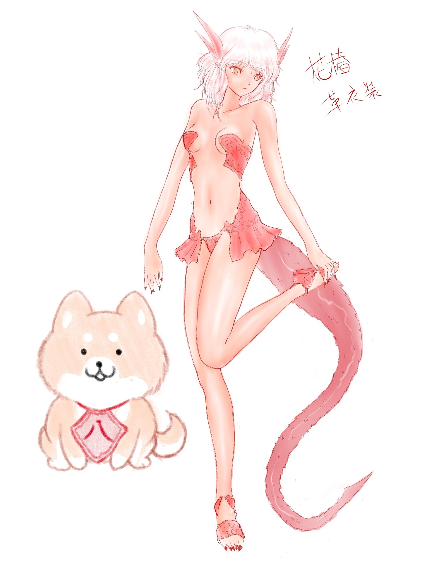

[TOC](../readme.md)&nbsp;&nbsp;&nbsp;&nbsp;&nbsp;&nbsp;[Prev](section_0018.md)&nbsp;&nbsp;&nbsp;&nbsp;&nbsp;&nbsp;

# 75 To Tokyo

"This is the new equipment!"  
"...Yep."  
Yaeko's smug look as she said that, and the apologetic faces of her
subordinates carrying the equipment behind her, were particularly
striking.  
Some of Yaeko's subordinates were clearly older than her, but they
seemed more like artisans than technicians? They didn't seem very
interested in the mundane world to begin with and seemed to dislike the
trouble of being in charge. I see... her former boss was free to do what
he wanted with his corruption!  
  
"The kids' are over here."  
As Yaeko gestured to the container while puffing out purple smoke,
Jennifer frowned at the smell, but the children took the equipment.  
"It doesn't look much different."  
"The leather was dyed black, so the impression probably won’t change
much."  
The children's equipment didn’t look much different. It was natural that
the clothing parts, which were still made of the same chemical fibers as
before, hadn’t changed, but the protectors worn over them were now made
of giant beast leather, and Yaeko explained that their cut resistance
and impact resistance had increased considerably.  
The equipped children didn't seem to feel particularly uncomfortable,
and it felt like the presence and "aura" of the children wearing the
leather armor had increased by a level compared to before.  
Yeah, it's good that their survivability has improved. But―  
"............"  
"That's Tsubaki-chan's new equipment!"  
  
This is... armor? Somehow... isn't it smaller compared to the
children's?  
After changing in the dressing room with Yaeko's help and going outside,
the men who saw me froze for a moment and averted their eyes.  
"Is this really okay!?"  
"No, no, it's not that different from what Tsubaki-chan was wearing."  
I was only wearing fur around my chest and waist, so that's true!  
  
My new equipment, or rather new armor, looks like a leather bikini no
matter how you look at it. ...No, a swimsuit? Barely a one-piece?  
The top and bottom were barely connected at the sides and back, but only
covered my waist and chest. There were sandals attached as a token
gesture, but that's really it.  
There's a frilly part like a mini-skirt around the waist, which makes it
feel even more like a swimsuit. No, the color is bright red, so it's
like...  
"...It's like a goldfish."  
"Yaeko made it, right!?"  
The color is red and it's frilly, so it looks like a goldfish to me
now.  
"It suits you, Tsubaki!"  
"Thank you, Jennifer..."  
I'm not sure if she's comforting me, or if she thinks so because she
doesn't have any knowledge of that kind of thing.  
It certainly suits me... I think. The bright red leather bikini suits my
coloring, and unlike the previous primitive style, it feels like I'm
actually wearing something and doesn't feel out of place against my
skin.  
  
"The color wasn't up to me, but it's what happened when I used
Tsubaki-chan's blood. The children's is the same."  
"Eh, really?"  
"Besides, if you're going to grow scales on your arms and legs, there's
no point in covering your whole body, right?"  
Well, that's true...  
During combat, my biceps and thighs are covered in scales, and it's
better to have my back open so I can sprout wings. Even so, why is it
not a complete one-piece, and the part around my navel is also open?  
"It's stronger than the kids's, and covering your stomach would hinder
your movements."  
"Heeh..."  
She's thinking about various things for me.  
"And the rest is just because I like that sort of thing."  
"Ah, I see..."  
  
Even so, are the mini-skirt-like frills on the waist necessary? While
pinching the skirt part with my finger, I glanced at Yaeko, and she
seemed to understand my intention and nodded slowly.  
"That armor was designed to compensate for what Tsubaki-chan was
lacking."  
"Lacking...?"  
What could it be? It's certainly easier to move around in than the fur I
used to wear, which was prone to falling off, but what is it that I'm
lacking...?  
  
"Girl power."  
"Girl power!?"  
  
I was dumbfounded by the unexpected statement. I, I'm properly hiding my
chest and waist, and I'm properly taking care of myself! Yaeko, hearing
my flustered response, began to spin her words.  
"It's not fair that you're young and you don't take care of your skin
and you show it off, and your hair is unkempt but shiny, and somehow you
look put together... I mean, it's fine now, but you'll have a hard time
later. You're an existence that would normally be eliminated, but you're
accepted because you're cute, but if you don't train your femininity
now, you'll become a hopeless woman. I thought about various things and
decided to raise Tsubaki-chan's femininity levels even a little bit, out
of my parental love as an adult."  
Having said that, Yaeko lit a cigarette and exhaled a cloud of purple
smoke.  
"...Girl power."  
Is it that low!?  
I feel like I was just told some terrible things, but if that's the
reason, I guess there's nothing I can say... right?  
  
***"Wafun!"***  
"Hachibei is in a good mood..."  
Hachibei, who was brought as the children's source of healing, also
received new equipment.  
When they took Hachibei's blood, they used a thick syringe, so he
resisted a lot, and he was wary of coming here, but he seems to have
forgotten it because he got his favorite cabbage.  
  
Well, even if it's equipment, I was wondering if Hachibei, who doesn't
have the habit of wearing clothes, could wear armor or anything, but
Hachibei's equipment was a "bib."  
If you were asked what it was like, the "knowledge" I had in my mind
told me that it was the clothes worn by the protagonist of a fairy tale
called Kintaro. There was a big *8*in the center.  
Is it kanji? Katakana? Well, either way it's cute so it doesn't
matter.  
  
In addition, the children were also provided with steel spears and
weapons tailored to their physique. I also tried using a steel spear,
but it couldn't withstand my "heat" and melted.  
"What's going on with that spear of yours?"  
"Who knows...?"  
In the end, only the antler spear could withstand my strength and
heat.  
It was originally a giant deer's antler, but it had become incredibly
strong, perhaps because I've been using it for over a year.  
"I made this, juust in case."  
"A knife?"  
In place of the lost tusk knife, she seemed to have made a knife out of
a giant lion's fang, using a diluted version of my blood. Apparently she
tried making bigger ones, but it was difficult to process the bones into
weapons, so she could only make a small one.  
It's still not as good as the tusk knife I was using, but if I use it,
it’ll turn red and the strength will increase on its own.  
  
That's how we were preparing, including the equipment. The children were
having mock battles with me and Hachibei, and occasionally going outside
to hunt giant animals.  
"Tsubaki, is this okay...?"  
"Yeah, you're doing well."  
When I praised Jennifer, who had brought bit-sized pieces of meat cut
from a giant serow that she had killed, she blushed and turned away.  
"T-this much is only natural!"  
"Yeah, yeah."  
"Mouu!"  
When I smiled and stroked her head, Jennifer ran away angrily.  
  
Giant creatures cause aversion in ordinary humans and other living
things, and even if they become pieces of meat, they don’t decay for a
long time because even microorganisms avoid them. It’s difficult for
ordinary people to process the meat, and Yaeko and the others had to
rely on the children to harvest the fangs.  
However, once it’s completely dried or cooked, its properties change,
making it edible for ordinary living things.  
The children were making smoked meat that could be eaten by the people
in the shelter and could be preserved. This wasn't the first time, and
when they brought it back last time, they handed it directly to the
people in the town, so the relationship had improved considerably.  
Perhaps because of that, when we returned to the shelter, we saw the
children of the unit we had left behind playing with the children of the
town, along with Hachibei, who had also been left behind.  
  
"Tsubaki... is it really okay for us to come back here?"  
A sight never seen before.  
Jennifer, who was staring blankly at the children playing normally, had
a slightly glistening light in her eyes.  
"Yeah... So make sure you come back safely."  
I have to make sure these children come back alive...  
  
And so, the day of the operation arrived, and it was time to depart.  
The residents were not informed of the details of the operation, so
there was no large send-off, but the food staff who had become friends
with us and Yaeko and the others came to see us off.  
"Tsubaki, you better come back too."  
"Yeah..."  
"And while you're at it, find me usable cosmetics and cigarettes."  
"Yaeko..."  
Give me back the moment of emotion.  
  
"Let's move!"  
The leader of the special forces raised his voice, and dozens of
soldiers and technicians got into the vehicles all at once.  
Jennifer and the others also got into an armored truck, and I got in
last, turning my eyes to the direction we were heading.  
To the ruins of Tokyo. Without knowing what awaited us there...  
  
  

------------------------------------------------------------------------

  
*Tsubaki and Hachibei received new costumes.*  
*It's a rough sketch, but it's something like this.*  

---
[TOC](../readme.md)&nbsp;&nbsp;&nbsp;&nbsp;&nbsp;&nbsp;[Prev](section_0018.md)&nbsp;&nbsp;&nbsp;&nbsp;&nbsp;&nbsp;

