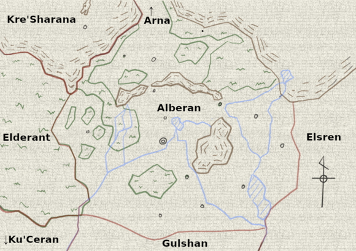
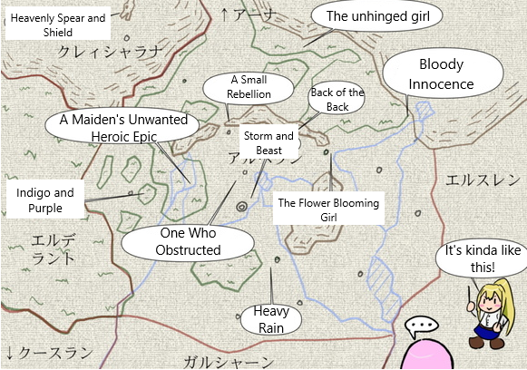
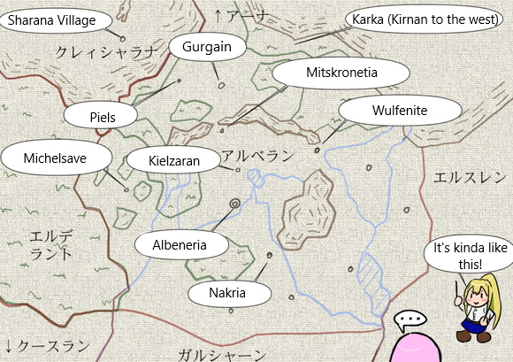
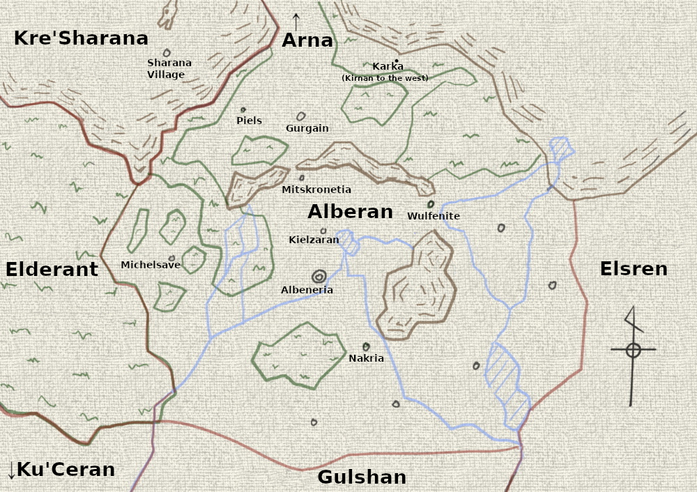

[TOC](../readme.md)&nbsp;&nbsp;&nbsp;&nbsp;&nbsp;&nbsp;[Prev](Section0028.md)&nbsp;&nbsp;&nbsp;&nbsp;&nbsp;&nbsp;[Next](Section0030.md)

## Chapter 339: ※Map of the Area Around Alberan

*AN:*  
*The book version of "The Girl's Unwanted Heroic Tale" is now on
sale!*  
  
*To celebrate the New Year, I'm releasing the in-story map I made.*  
  
*Most of the locations mentioned in the story should be
recognizable...!*  
  

------------------------------------------------------------------------

・Map (Basic)  
This version omits text information.  
Circles represent major cities, roughly 100,000 people each.  
  
  
・Map (Battlefields)  
Approximate locations of battlefields.  
Battlefields are grouped together, such as the Hopeless Hunting Grounds
(Hilkintos battle) and "The Maiden's Unwanted Heroic Epic."  
The names are purely personal preference.  
*(TN: It's the names of the chapters where things took place. Sorry for
the lack of artistry on the map.  
1: The Unhinged Girl  
23: Bloody Innocence  
60: A Small Rebellion  
70: The Back of the Back  
102: Storm and Beast  
110: One Who Obstructed  
152: Heavenly Spear and Shield  
187: Heavy Rain  
197: Indigo and Purple  
213: The Flower Blooming Girl  
241: A Maiden's Unwanted Heroic Epic)*  
  
・Map (Cities)  
Approximate locations of cities.  
Most cities appearing in the story are included here.  
  
・About the Alberan Kingdom.  
The scale isn't perfectly accurate, so it's a rough approximation, but
the land area is about 500,000 square kilometers (approximately 600km
long and 800km wide), slightly smaller than modern-day France.  
While the setting is loosely defined, I avoid giving specific numbers,
but considering real-world comparisons, the population is set in the
pre- to mid-Medieval period.  
I vaguely thought it was around 3-4 million people before, but
reconsidering the population and soldier ratio, it feels more natural to
have around 5 million, so that's what I'm currently using.  
There are many forests, so the population is fairly concentrated in
urban areas.  
Thanks to magic, the harvests are good, and it's a relatively prosperous
and relaxed country.  
  
In terms of population:  
Elsren \> Gulshan \> Alberan \> Elderant \> Arna  
In terms of land area:  
Elsren \> Gulshan \> Alberan ≈ Elderant \> Arna  
  
This isn't relevant to the story's entertainment value, but it's just a
general idea! Please use it as a reference.  

------------------------
*TN: I put together the countries/cities*  

  

---
[TOC](../readme.md)&nbsp;&nbsp;&nbsp;&nbsp;&nbsp;&nbsp;[Prev](Section0028.md)&nbsp;&nbsp;&nbsp;&nbsp;&nbsp;&nbsp;[Next](Section0030.md)

