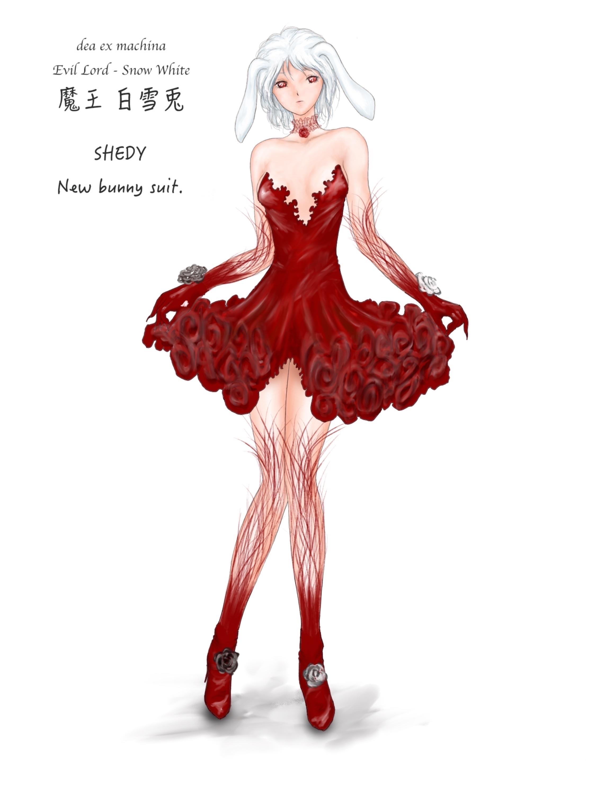

[TOC](../readme.md)&nbsp;&nbsp;&nbsp;&nbsp;&nbsp;&nbsp;[Next](section_0002.md)

# The Summoned Girl: Part 1

*It's been a while since the last update of a side story.*  
*First, it begins with a world and people unrelated to Shedy or
Yggdrasia.*  

------------------------------------------------------------------------

"Welcome, heroes from another world!"  
  
The familiar classroom scene of my everyday life suddenly changed, and
what jumped into my eyes was a sight like that of a foreign castle, and
a king-like figure who addressed us, surrounded by many soldiers.  
"...Eh?"  
At my voice, which I unintentionally let out, the soldiers reacted
sensitively, turning the sharp tips of their spears towards us. At that,
a few girls let out stifled screams, and gazes that seemed to reproach
my carelessness were directed at me from those who were intelligent and
trying to grasp the situation.  
  
"Very well. The heroes must be perplexed. I shall have meals and drinks
prepared to help them calm down... but first, would you listen to what I
have to say?"  
At the words of the king-like person who spoke in a gentle tone, there
were various things I wanted to ask and know, but because I had
carelessly made a sound and caused the spears to be pointed at us,
everyone decided to silently listen to what he had to say for the time
being.  
  
First, the king-like person was indeed a king, and the highest authority
in this country called the Holy Horlos Kingdom.  
According to King Horlos, this world is different from the Earth we
lived on, and currently, this world is being threatened by the
appearance of *monsters*, beings of a different form, and the peace of
the people is being threatened.  
The people of this world have also fought against them, but apparently,
some monsters are so strong that even a hundred soldiers cannot defeat
them, and he said that several villages and towns have fallen victim to
the monsters.  
The place where the monsters appear is at the foot of the most sacred
*Sacred Mountain* in the center of this continent, and in order to
reclaim that place, the priests of this Holy Horlos Kingdom, the largest
nation in the region where the monsters appear and the most beloved by
the gods, offered prayers to the three pillar goddesses who protect this
world, and through the power of those goddesses, *summoned* us as
*heroes* to defeat the monsters.  
  
"Um, may I speak?"  
After the King finished his story and paused for a moment as if to gauge
our reaction, a boy who was at the center of the class raised his
hand.  
"Hmm, hero. If you have anything you wish to ask, feel free to do so. We
shall respond with sincerity."  
"Thank you. Well then, first... will we be able to return to our
original world?"  
"Once you have defeated the monsters and reclaimed the Sacred Mountain,
your return shall be granted by the power of the Goddesses. Of course,
if you wish to remain in this world, we shall prepare a noble title and
rewards."  
At the king's words, smiles finally appeared on our faces.  
"Also... why us? We’ve never fought before. I don't know if we can live
up to your expectations..."  
  
That's certainly true. We‘re a class of second-year high school students
at a prestigious school in Tokyo, and none of us have ever fought
risking our lives. Perhaps because it's a prestigious school, there are
only twenty people in our class, and among them, I'm probably the least
capable of fighting... no, I'd probably be a hindrance.  
Perhaps because I was born early in the year, I'm short and often
mistaken for a junior high school student. I've never killed any living
creature, let alone an insect, myself, and being timid, I hadn't even
spoken properly to my classmates even after several weeks of being
promoted to the next grade.  
There's no way I can fight. But the king, as if anticipating that
question, slowly nodded and curved the mouth beneath his white beard
into a smile.  
  
"That is a valid concern, hero, but there is no need to worry. The
heroes who have been summoned by the power of the goddesses are bestowed
with the goddesses' *blessing*."  
  
The three pillar goddesses of this world.  
Astoria, the goddess of love and beauty who loves people.  
Thorseria, the war goddess who protects people and dispels darkness.  
Melarose, the goddess of fertility who cherishes people.  
  
We were summoned by the power of the sister goddesses who protect
humans, and we’re granted the rare *blessing* of the goddesses in this
world, and we gain the *courage* to protect people.  
The power of that blessing varies depending on the person who receives
it, and even abilities that don't seem suitable for combat can be used
to advance the battle for allies, or production-type abilities that give
power to soldiers, all of which he told us are powerful.  
"Now then, we shall confirm the blessings of the heroes."  
When the king finished speaking, one of the priests came forward and
began to investigate our blessings with a magical crystal ball said to
have been given by the goddesses.  
  
"Oh, Lord Yuuki's blessing is *Hero*!"  
Yuuki-kun, the boy who raised his hand first, was informed of his
blessing, and a faint murmur escaped from the soldiers and priests in
the castle at that blessing.  
Among us, who are called heroes from another world, the *Hero* blessing
is apparently exceptional, equipped with strong attack power and
protection, and is said to be the most beloved existence by the
goddesses.  
In addition, Kenshi-kun, Yuuki-kun's best friend and a member of the
kendo club, had the *Sword Saint* blessing.  
Kouya-kun, a delinquent-like boy in the class, had the *Flame Warrior*
blessing.  
Minami-san, the most glamorous and beautiful girl among the girls, had
the *Saint* blessing.  
Ayaya-san, the bespectacled girl who was said to be the best in academic
tests, had the *Magic King* blessing.  
In addition to that, abilities that seemed convenient even if they
weren't suitable for battle, such as *Clairvoyance*, *Complete
Appraisal*, and *Magic Sword Creation*, were spoken from the mouth of
the priest who investigated.  
  
"Now then, finally... Lady Kanako."  
"Y-yes."  
My name was called, and I unintentionally became flustered. It was
decided that names would be unified, so I was being called by my first
name, but as I wasn't used to it, I became flustered, and because it had
already taken quite a bit of time, I was pierced by arrow-like gazes
from my classmates who were being made to wait.  
I hurriedly touched the crystal ball with my hand, and the tired priest,
with a slightly irritated voice, admonished me to "calm down," and
somehow killing my heart and concentrating, my blessing was finally
projected onto the crystal ball.  
"...Lady Kanako's blessing is *Summoning*."  
"Summoning?"  
  
My blessing is Summoning, and it seems I can summon *necessary beings*
from other worlds or this world.  
Originally, it seems that I was supposed to summon creatures suitable
for battle, and use them to fight, but I, who abhor killing or making
living things fight, could only summon relatively safe creatures that
live in this world... *livestock* that resemble chickens and pigs.  
  
"What are you going to do by summoning animals? We can't all go home
unless we fight!"  
"Are you going to summon our meals? If you're not useful, be a decoy or
something."  
"Can't you do anything unless you're told? That's why gloomy kids
are..."  
  
No smartphones. No internet. In this world with few easily obtainable
sweets or entertainment, my classmates, who were accumulating stress,
began to direct their irritation towards me from that day on, and I
began to be subjected to various acts of bullying.  
Yuuki-kun and Minami-san, who were central figures in the class, did
stop them, but it didn't seem like they were actively stopping them.  
Perhaps they valued the harmony of the class more than me personally.
Even so, they did stop them to some extent, but because of that, the
bullying surrounding me changed to something more insidious that didn't
come to the surface.  
I wasn't given rations or told about necessary information.  
My meals were intentionally cleared away, and my few belongings were
thrown away.  
Once they realized that I was hesitant to use the summoned animals as
decoys, they began to capture harmless animals that couldn't even be
used as food and force me to kill them.  
  
In this world, not being able to kill is a bad thing. I, who couldn't
properly use my blessing, had no choice but to endure whatever was done
to me.  
Perhaps because my blessing was Summoning, I never got used to killing
living things, and I couldn't have the *courage* to kill others that
everyone else had.  
  
In this world, monsters are "evil." But is that really the case?  
I had felt a sense of discomfort ever since I first fought a monster.  
Creatures I had seen in books and games. Unicorns, Pegasus, Griffons,
Dragons, and other beings called *mythical beasts* aren’t monsters.  
Am I the only one who thinks it's strange?  
In this world, the mythical beasts that are called monsters are hunted
and used as materials for weapons and accessories. At first, my
classmates, who had grimaced at the sight of a beautiful Pegasus being
killed, began to kill living creatures as if they were fascinated by the
stress of being in this world and the *blessing* that allowed them to
easily kill living creatures, and they became happy when new weapons
were made.  
Even now, the sight of a unicorn whose horns were cut off and turned
into meat remains in my mind.  
Perhaps that's why my classmates gradually lost their aversion to
killing living creatures and began to enjoy killing, and my heart
gradually drifted away from them, who still couldn't abandon my modern
ethics.  
  
I couldn't shake off the feeling of discomfort, so I decided to
investigate history in the library in the castle.  
I had time. If I showed my face at meals or gatherings, I would be
frowned upon, so I was able to use that time to investigate.  
But from a certain point in time, the details became vague, and feeling
something intentional, I used a rat that I had summoned to investigate
the books in the library, discovered hidden writings in the back, and
came to know the truth.  
  
The beings called monsters, the mythical beasts, were originally beings
revered by humanity.  
But those who did not approve of this... those who worshiped the
goddesses at the time, and the powerful who sought the materials of the
mythical beasts, took the time to change people's perception of the
mythical beasts into *monsters* who were evil.  
Perhaps... this is just my speculation, but the goddesses who summoned
us to kill the mythical beasts who resisted them are also involved in
this.  
The mythical beasts possessed great power and high intelligence, and in
the past, people revered them as gods, and they also protected the
people with their power. Considering that the worship of mythical beasts
rapidly declined in just a few hundred years and changed to the worship
of goddesses, the power of the goddesses may have been used to change
perception on a global scale.  
  
I thought about whether I should flee from this country. I think my way
of thinking is heretical. It would be nothing more than a religious war,
but I didn't think it was right to kill even harmless mythical beasts,
treating one side as evil. But—  
Bang!  
"Hero Kanako. You are hereby detained as a traitor to humanity!"  
  
I was seized by the soldiers who burst into the room as if kicking down
the door, and taken out to the castle square where the execution
platform was located.  
I don't know where they found out, but if the maids in the castle were
my surveillance, then that was understandable.  
  
"Kanako... It's a shame. When the class was trying to work together to
defeat the monsters and return, for you to defect like this."  
"The monsters may be pitiful, but it's more important for us to go home,
right? Who cares about the living things in a world we're leaving
behind?"  
Yuuki-kun and Minami-san, who had heard the story and gathered, looked
at me with eyes as if they were looking at filth.  
"I read a book and..."  
"That's what's wrong. I can't forgive you for disrupting the harmony of
the class. I wish you could have grown up a little more."  
"Even if some ethnic group is being oppressed on Earth, there's nothing
we high school students can do about it, right? It's better to go with
the flow."  
  
My eyes widened at their whispered words.  
Yuuki-kun and the others knew everything? Knowing it, they were killing
intelligent living things because it was another world anyway?  
My classmates, who had unknowingly been dyed by this world, joined in
and blamed me and threw stones at me. Several stones hit my body, and in
front of me, who had become unable to move at the feet of the soldiers
who didn't stop them, that king appeared with a grimace.  
  
"To think that there would be someone among the heroes who was charmed
by monsters. Betrayal to people is not something that can be forgiven.
That soul will not ascend to heaven after death, but will fall into
eternal hell by the goddesses. However—"  
The king said that and had the soldiers bring in a huge mythical beast
in a cage.  
"Traitorous hero, stand up right now and kill this monster. And once
again beg the goddesses for mercy. If you do, I will grant you a
painless death. ...Is that alright?"  
"Yes, Your Majesty. We apologize for the inconvenience."  
"Truly, we understand that it's unavoidable."  
Yuuki-kun and Minami-san easily nodded at the king's words, and the
other classmates also looked down at me with similar eyes.  
  
"..."  
Did everyone change? Or was I too childish?  
But even if I understand now, it's already too late.... I'm going to die
soon, aren't I?  
The mythical beast in the cage was looking at me with mysterious eyes.
...I'm sorry, I couldn't save you. As a last resort... maybe I can set
you free.  
"...*Summon*..."  
  
*‘--!?’*  
The people in the castle gasped at the sudden event.  
The figure of the dying mythical beast in the cage disappeared, and an
emerald-colored, wounded, slender dragon was looking down at me, as if
looking down at me prostrate on the ground.  
"...Beautiful..."  
A smile involuntarily leaked out at that divine figure. Its figure was
badly wounded, but its eyes, which held high intelligence, were still
looking at me.  
I was afraid and couldn't summon them, but I still can't think of them
as evil. Run away quickly... I tried to move my lips to say that, but at
that moment—  
  
*‘Gaaaaaaaaaaaaaaaaaaaaaaaaaaaaaaaaaaaaaaaaaaaaaaaaaa!!’*  
  
*‘Hiii!?’*  
Just before the dragon completely turned into a monster, it roared, and
the people who heard that voice screamed in fear. I don't know why I
suddenly became able to use my power, but if this is the case, then I
should be able to escape. But at that moment, the dragon grabbed the
dying me in its mouth and soared into the sky.  
  
"D-Don't let it get away! Archers!"  
The king, who was the first to come to his senses, shouted, and the
soldiers fired a large number of arrows. But even as a monster, the
dragon did not release me even as it took the arrows, and carried me
away into the sky and took me to the Sacred Mountain where the monsters
live.  
From that time on, I was no longer a hero who would save humanity, but
was called the *Demon Lord of Beasts* who betrayed the people, and
became someone pursued by humanity.  
  
For about half a year since then, I had continued to flee and fight.  
I can't kill people. All the fighting was to protect the mythical
beasts. The mythical beasts I summoned listened to me and fought to save
their comrades.  
  
Many things had become clear since then. In the depths of the Sacred
Mountain, where the dragon had taken me, there was a Manticore-like
mythical beast who spoke the language of humans, and it supplemented my
lack of knowledge.  
The reason why the mythical beasts had become weak and hunted was the
Goddess' curse.  
The three pillar sister goddesses knew that as long as there were
mythical beasts who were close to and revered by the people, they would
never be worshiped by humans.  
The mythical beasts were administrators who adjusted the souls of this
world, and the goddesses plotted to usurp that role as well, in order to
leave behind only the souls that were convenient for them, along with
faith.  
That's why they cast a curse. Even changing people's perceptions, so
that they would become enemies of humanity.  
  
But even if I told the human country about it, nothing would change. The
materials of the mythical beasts had already become indispensable
resources for the people of this world. Seeking things like fangs and
scales that were as light as a feather and harder than steel, magic
stones that contained strong mana, supple yet strong adamantite, and so
on, the powerful people sought them and tacitly approved of the
goddesses' actions.  
  
We were deceived by the goddesses and summoned. We were told to save
people, but we were made to help the goddesses destroy the mythical
beasts, and we were made to carry the palanquin for the kings of the
nations to enrich themselves.  
My voice probably won't reach my classmates anymore.  
Some people prioritized their own goals because it was another world,
and others accepted the reason of the people of this world and indulged
in the pleasure of trampling on others.  
  
I was a child who didn't know anything, and I hurt them without being
able to do anything.  
Even after learning the truth, I caused the gentle mythical beasts who
protected me and gave me food to die.  
I was a child who couldn't do anything. I couldn't even join people's
circles myself, and I had just lived my life as I was carried along.  
But I won't run away anymore.  
The mythical beasts I summoned had been released from the Goddess'
curse. For the sake of the mythical beasts who died to protect me, I
summoned them many times, sacrificing my life, and released them from
the Goddess' curse.  
There must be a reason why I came to this world.  
There must be a reason why my ability was *Summoning*.  
There is definitely a reason why my ability has not yet been taken away
by the goddesses.  
I probably won't be able to live much longer.  
This Sacred Mountain is filled with a primordial power that is different
from the goddesses, and I absorbed that power and tried to make the
final summons, burning my life to the fullest.  
But—  
  
"Kanako, let's end this. This battle will end with humanity's
victory."  
  
Finally, the heroes have invaded the depths of the Sacred Mountain,
which is our last stronghold.  
Kenshi, who has the blessing of the Sword Saint, cuts off the head of
the dragon that took me away.  
Ayaya, who has the blessing of the Magic King, shoots down the Pegasus
with blades of ice.  
Kouya, who has the blessing of the Flame Warrior, chases after the small
fairies who are fleeing in fear while laughing, and burns them to death
with flames.  
The mythical beasts who were protecting me and my companions have been
killed. The only mythical beasts left in this area were the larvae of
mythical beasts in the cave behind me.  
  
"This is the end!"  
The spear of light that Minami, who has the blessing of the Saint, threw
pierces my chest, along with the fairies who were protecting me while I
was performing the final summons.  
Ah... please...  
  
"...Help me..."  
  
At that moment, pure white snow swirled and blew away the approaching
heroes.  
They came....  
That person responded to my last summons, which I bet my life on.  
  
The pure white snow turns into mist and forms the shape of a pure white
girl.  
Hair as clear as melting snowflakes.  
Jewel-like crimson eyes that see through the heart.  
A mini dress the color of blood and heeled boots.  
The heteromorphic bunny girl, shaking the pure white drooping rabbit
ears that were the same color as her hair, held the dying me and gently
stroked my cheek with emotionless eyes.  
  
A demon from another world.  
A mediator who was entreated by the world and manifested to save the
world.  
The goddess of the Great Tree World Yggdrasia, Dea Ex Machina.  
  
  
"...Demon King... Snow White Rabbit..."  
  
  
  
\[Shedy\] \[Race: Bunny Girl\] \[Joker\]  
・Dea Ex Machina. An artifical goddess born in cyberspace, possessing
the right hand  
of a \[Demon\] to destroy all, and the left hand of a \[Goddess\] to
save all.  
\[Magic Points: 670,000/670,000\]  
\[Total Combat Power: 737,000/737,000\]  
\[Unique Skill:《Causality Alteration》《Dimension
Manipulation》《Consumption》《The Divine Language》\]  
\[Racial Skill:《Fear》《Mist Form》\]  
\[Wonderful Appraisal\] \[Deification (Precious)\] \[Subspace
Storage\]  
\[Evil Lord・Snow White Rabbit\] \[Goddess of Yggdrasia\] \[Mediator\]  
  
  
  

------------------------------------------------------------------------

  
*Happy New Year, everyone. May you all have the protection of the Golden
God and the White Snow Rabbit...*  
  
*I have updated "Demon Princess II" and "Apotheosis of a Demon"*  
  
*With that said, I bought a stylus and couldn't resist drawing Shedy's
new outfit, so I'm sharing it. Please forgive the various amateurish
aspects, such as my unfamiliarity with the software and its poor
compatibility with PS.*  
  

---
[TOC](../readme.md)&nbsp;&nbsp;&nbsp;&nbsp;&nbsp;&nbsp;[Next](section_0002.md)

