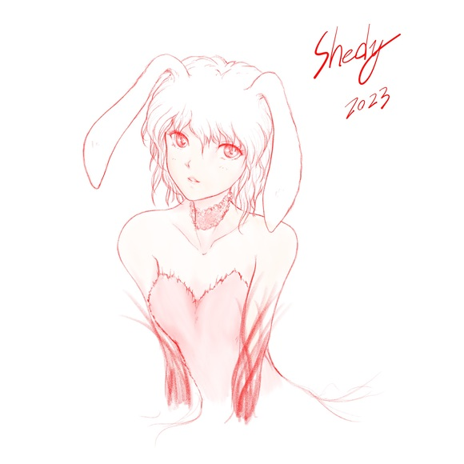

[TOC](../readme.md)&nbsp;&nbsp;&nbsp;&nbsp;&nbsp;&nbsp;[Prev](section_0003.md)&nbsp;&nbsp;&nbsp;&nbsp;&nbsp;&nbsp;

# Epilogue Single Story: Rabbit-san

*Happy New Year.*  
*Thank you for your support this year as well. It's short, but since
it's the Year of the Rabbit...*  

------------------------------------------------------------------------

  
I nestle against the World Tree and dream.  
About this world seen by the saplings of the World Tree. And about other
worlds...  
In this world, great destruction has occurred, and people, both humans
and demi-humans, share the blessings of the saplings and live together
in harmony.  
Occasionally, a race appears that tries to take the blessings for
themselves, but there is no need for the "Goddess (myself)" to settle things.  
People know their own foolishness and realize that the world is not just
theirs. Therefore, when problems arise, they cooperate to address them,
fearing that disaster will strike again.  
And this world does not belong to humans alone.  
When problems arise, monsters and mythical beasts... dragons stand in
the way of those who desire the world as a threat, protecting the World
Tree and this world.  
  
So I dream in my slumber.  
Until a great evil appears that the inhabitants of this world cannot
deal with.  
Until salvation is sought from other worlds through the World Tree...  
  
But...  
"...Hmm?"  
Someone was shaking my shoulder in the "dream" while I was dozing.  
"What's wrong?"  
In the inner world of the World Tree, there are 99 souls who are my
"family."  
The children who lost their lives in the midst of schemes became the
souls of the saplings. Some are enjoying the local scenery as saplings,
and others are connected to other worlds and watching their information,
so not all of them are here, but many souls have gathered in this
place.  
That's why, in this way, souls who used to be young children and are
bored sometimes beg me to play with them.  
  
This time, it was three of the youngest children, who looked about ten
years old, who came to wake me up.  
They were collecting images and videos of kittens until recently, so I
wonder if baby animals were born near the saplings again?  
Among the three, a girl with jet-black hair wearing a loose-fitting
ethnic costume sat on my lap and projected an image into space.  
  
"Is this... Earth?"  
Our home... a place where I have no good memories, but still a place I
can't forget, whether it's love or hate.  
The scenery in the video looks like a place I don't know. Everyone is
Asian with black hair like the girl, so it must be an East Asian
country. Everyone is wearing thick clothes, so it seems to be winter,
but it's quite lively.  
"What about this place?"  
When I asked that, the black-haired girl took out a paper like a card.  
It seems that in that country, there’s a custom of sending cards to
friends in winter. Is it like a Christmas message card? A little bigger
though.  
"Do you want to make this?"  
At my words, the three children nod with beaming smiles, and when the
black-haired girl got off my lap, the other children took out something
like an old-fashioned camera.  
  
*"Smile, Shedy."*  
  
"...Eh?"  
\*Click\*  
  
...It seems this year is the Year of the Rabbit.  
  

------------------------------------------------------------------------

  
  
It's been so long since I've drawn that the style changes every time I
draw (lol).  
I want to rewrite this story someday.  
  
Also, "The Heroine of an Otome Game is the Strongest Survivor" Volume 5
is now on sale.  
"The Devil Princess" Book 2 will be released on February 2nd, and the
first volume of the comic adaptation will also be released on January
6th, so please look forward to it!  
  
  

---
[TOC](../readme.md)&nbsp;&nbsp;&nbsp;&nbsp;&nbsp;&nbsp;[Prev](section_0003.md)&nbsp;&nbsp;&nbsp;&nbsp;&nbsp;&nbsp;

