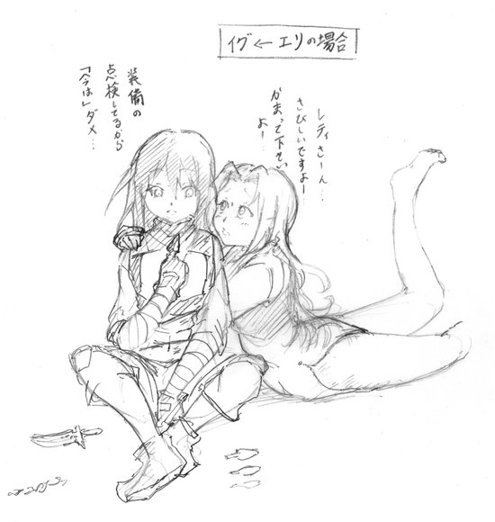
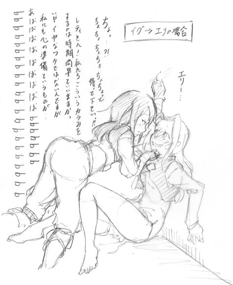

[TOC](../readme.md)&nbsp;&nbsp;&nbsp;&nbsp;&nbsp;&nbsp;[Prev](index_split_002.md)&nbsp;&nbsp;&nbsp;&nbsp;&nbsp;&nbsp;[Next](index_split_004.md)

## Fanart 1

Although the series is ongoing, I am honored to have received fan art,
so I would like to publish it here.

The artist is Momijizaki Momiji-sama. They are a multi-talented creator
who also writes novels themselves.

They give me feedback almost every time, and they really support this
series, but to receive an illustration as well is truly more than I
could ask for!

And, the first illustration I received is this!!

It really captured the atmosphere between the two of them, and I was so
impressed and happy, I felt like dancing.

And the second one is, here!

...Yeah, I think this kind of development is still quite a ways off,
right?

I received an illustration that perfectly matches my vision of how
things might turn out when that kind of development happens!!

I truly feel like this person really understands the story of "Does the
Assassin Girl Dream of the Mana Doll?"... I couldn't be more grateful.

I hope to continue creating works that you will continue to support!!!

---
[TOC](../readme.md)&nbsp;&nbsp;&nbsp;&nbsp;&nbsp;&nbsp;[Prev](index_split_002.md)&nbsp;&nbsp;&nbsp;&nbsp;&nbsp;&nbsp;[Next](index_split_004.md)

