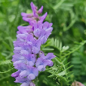
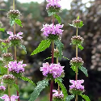

[TOC](../readme.md)&nbsp;&nbsp;&nbsp;&nbsp;&nbsp;&nbsp;[Prev](index_split_097.md)&nbsp;&nbsp;&nbsp;&nbsp;&nbsp;&nbsp;

## Chapter 121: Cordor’s Grassland Wisteria

※ The "Grassland Wisteria" is not a real plant (probably). It is a
fictional plant inspired by flowers like "Vicia cracca" and "Phlomis
tuberosa."

They’re very lovely flowers, so if you’re interested, it might be nice
to search for them.¹

------------------------------------------------------------------------

"Heeey, are things alright over here? Bring a cart and a few of the
strong guys over. We've got these guys all tied up, so we're bringing
them back."

Dominique returned, looking as nonchalant as if she hadn't just
unleashed some fierce sword techniques. It seemed Letty was remaining
behind to watch over the prisoners and ensure they didn't escape.

"Ah, yes, we're fine. Um, but, is Letty-san over there all by herself?"

"Yeah, none of them can move, I don't think, but just in case."

"Um, then, just to be safe, can I go over there first?" The hint of
desperation in Ellie's voice caused Dominique to raise a light eyebrow.

“Hmm?” She flashed a mean-spirited, knowing grin. "Oh, sure, I don't
mind. Go on."

"Thank you!" Responding almost instantly, Ellie dashed off.

Dominique observed her receding figure while cackling gleefully. "Geez,
the wife’s such a worrywart. She should know better than anyone that
there aren't many people who could actually lay a hand on her
'husband'."

"Hah, no kidding!" The strong men who had gathered around Dominique
nodded, laughing without reservation. In the few days they had been
traveling, they seemed to have completely accepted the pair's
relationship.

"Um, husband?” However, there was someone else present. The confused
newcomer opened her mouth hesitantly, “But the person who went over
there just now looked like a woman..."

Dominique glanced over. Standing there was a woman clad in Cordor-style
clothes prioritizing ease of movement. She looked to be in her late
teens, about the same age as Letty, or perhaps a little younger.

Her long, glossy black hair flowed smoothly, framing a face that looked
both intelligent and possessed a strong will. Her slightly tanned skin,
coupled with her slightly slanted eyes, gave her the impression of
someone rather active.

"Well, it's just a nickname for those two lovebirds. The one who just
ran off is the busybody and jealous wife. The unfriendly tomboy who was
roughhousing with me over there is the husband. Though I don't know how
far along they are in their relationship, actually."

"Is that so... I guess they’re quite progressive..."

"Er, well, I don't know if they are or not," Dominique replied lightly
while observing the girl.

Her clothes were certainly of high quality. Even though they prioritized
mobility, the fabric was excellent, and the stitching was solid, no
doubt done by a skilled artisan. Most importantly, the crest embroidered
on her collar and cuffs was...

"Ah, is that not Princess Tseren!?" A voice closer to a shriek pierced
the air—it was the merchant who had taken refuge in the carriage
earlier.

The girl turned to him with a gentle smile and replied, "Ah, yes, I am
Tseren Batbayar Cordor. Thank you for recognizing me."

"N-not at all! It is an honor to meet you!" He hastily dropped to his
knees.

Dominique sheepishly turned to the surrounding guards struggling to
follow the conversation, "In short, she's a princess of Cordor. So,
everyone, you're being disrespectful. Bow your heads!"

"Just kidding," she quietly added under her breath, though she still
knelt. The guards quickly followed suit, lowering their heads.

"Oh, no, everyone, please look up, please stand. You are my saviors, so
please relax. It may not be common in Valandia, but that is the Cordor
way." Tseren hurriedly corrected them, causing the guards some
confusion. The merchant and Dominique stood up, though they still
maintained a respectful posture.

"Then, Princess Tseren, we gratefully accept your offer. It is an honor
to have saved your life," The merchant replied eloquently, bowing
courteously... in Cordor’s unique style. Dominique was inwardly
impressed; *He really is a protégé of that guild leader.*

"Oh, no, no, not at all. I am truly grateful. Thanks to you, I narrowly
escaped death!" Her dazzling smile caused both the merchant and guards
to visibly blush.

Dominique was perhaps the only one who could calmly assess the
situation. *Is this what they call charisma? No wonder they call her
Cordor’s Grassland Wisteria...* She was a girl who was both refined and
delicate, yet exuded a strength that felt grounded.

"If you don't mind, could you pass on those feelings to the two over
there? They’re the ones who contributed the most," Dominique followed
up, her voice carrying a tone bordering on flippancy.

Asking a noble, a member of a royal family at that, for words of thanks
would be unconscionable in both Valandia and Jurastin. The guards'
thoughts were transparent: *Is that okay?!* But Tseren herself didn't
seem to mind at all.

"Yes, it is only proper to thank one's benefactors, so I will gladly do
so. And... if we speak of major contributors, does that not include you
as well? I thank you truly, from the bottom of my heart. ...Your sword
skills were magnificent, like an art form..." She trailed off dreamily,
clearly enraptured.

*Oh?* Dominique’s interest was piqued. The sparkle in the eyes staring
at her was unmistakable.

"Aha, well I am truly honored. Also, Princess Tseren, I apologize for my
disrespectful remarks earlier, though I spoke them in ignorance. I
humbly ask for your forgiveness." Even Dominique was careful with her
speech in the face of royalty. The way she thoroughly masked her inner
bewilderment could be attributed to her years of experience.

However, Dominique's efforts were about to be in vain.

"There is no need to be so formal. Please, just call me Tseren, the
title of ‘Princess’ is not necessary. And, um, if you don't mind, may I
ask your name?"

*Oh, this is quite a pickle*, Dominique muttered to herself. But she
couldn't afford to dodge the question. "My name is Dominique. As I am a
commoner, I have no surname."

"I see, Dominique-sama... that is a lovely name." Tseren was visibly
delighted.

Lovely. It was the first time she'd ever been called that. She wondered,
*Could this also be due to the different cultural sphere of Cordor?*

"Thank you, Princess Tseren²," Dominique responded respectfully. *Well,
this has certainly gotten interesting*, she thought as her lips curled
in bemusement.

\*\*\*

"...Hey, Ellie."

"Yes?"

"The others *are* coming, right?"

"Yes, that’s what Dominique-san said... I wonder if something’s
happened."

Meanwhile, Letty and Ellie were left standing idly among the many men
sprawled on the ground.

------------------------------------------------------------------------

Modestly, yet proudly, it blooms in full glory.

The words of the Grassland Wisteria are somehow bright and light.

Those left behind are confused, while those who join in are amused.

Up Next: A Conversation that Blooms Like a Flower

One of the flower's many meanings is "intoxicated with love."

------------------------------------------------------------------------

TN:

¹Flower pictures… Vicia cracca (left) and Phlomis tuberosa (right)

²Dominique still calls her Tseren-sama. Translating it properly might be
like ‘Lady’ or ‘Miss’ rather than Princess, but… :’)

---
[TOC](../readme.md)&nbsp;&nbsp;&nbsp;&nbsp;&nbsp;&nbsp;[Prev](index_split_097.md)&nbsp;&nbsp;&nbsp;&nbsp;&nbsp;&nbsp;

