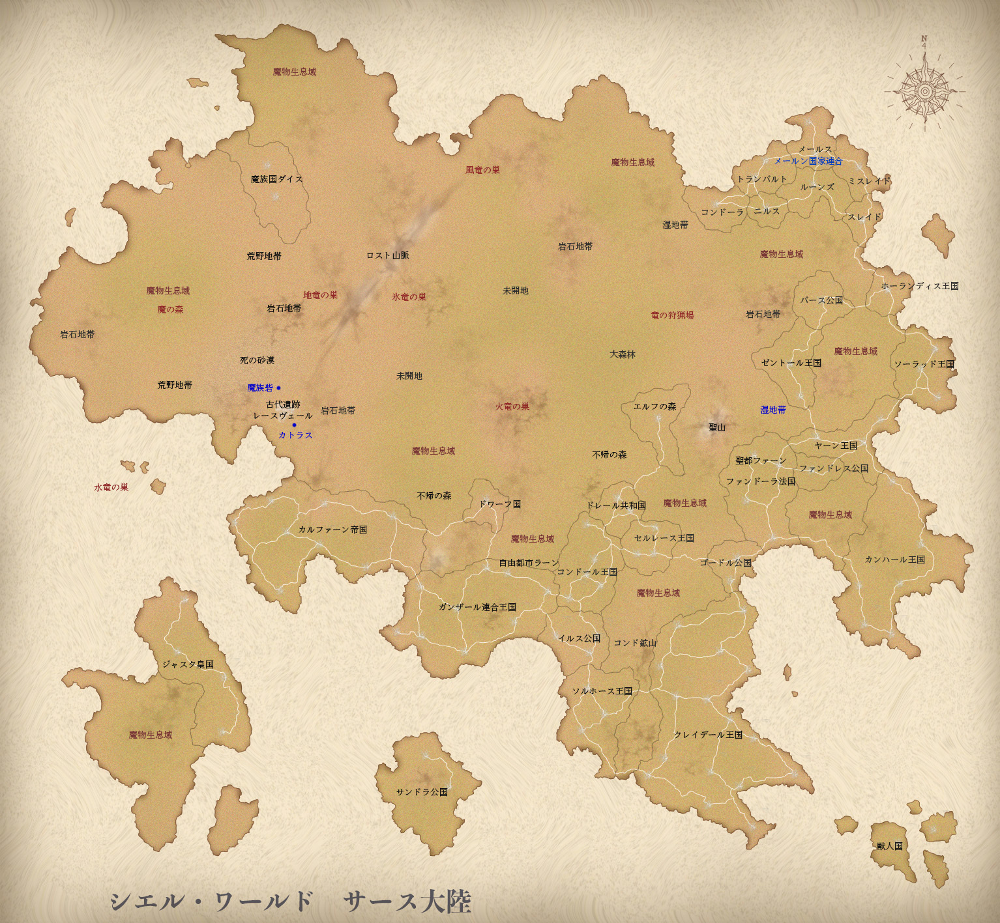

[TOC](../readme.md)&nbsp;&nbsp;&nbsp;&nbsp;&nbsp;&nbsp;[Prev](chapter0281.md)&nbsp;&nbsp;&nbsp;&nbsp;&nbsp;&nbsp;[Next](chapter0283.md)

## 282 The Way of the Heart

"The Hero wishes for you to come to the Holy Church's main temple. To
just show up and then summon you, I wonder who they think they are...
Alia, is the "promise" still valid?"  
  
Elena used the word "promise" and stared intently at Alia.  
I don't know what happened between the two of them, but does it mean
that using it can avoid the Hero's summons?  
Is it a secret just between the two of them...? It's a little annoying,
but it can't be helped. Because it's Alia. For her to keep such a
"promise" with me, that's truly like Alia.  
But, as Elena said, to unilaterally decide to make Alia a comrade and
then summon her, that's just ridiculous.  
  
"No, it's not necessary."  
But Alia gently shook her head at Elena's offer.  
"It's not that desperate yet. Besides, it would probably be more
troublesome if the Hero came to the Kingdom of Claydale."  
"That's... probably true."  
Elena looked troubled by Alia's words.  
  
Indeed, that possibility is high. If the Hero comes, probably important
people from the Holy Kingdom will also come, and then it might become
difficult for the country to refuse.  
If their promise was for the royalty to protect Alia, Elena would be
taking a considerable risk.  
  
"Why not just ignore them?"  
When I said that in a teasing way, Elena also smiled a little.  
"I'd like to. If the messenger who brought this message was from the
Fandora Theocracy, it wouldn't be strange for them to "disappear"
without a trace, but that messenger is the new Temple Head in this Royal
Capital."  
  
The former Temple Head, a noble of the robe, retired taking
responsibility for his grandson's various misdeeds.  
In reality, it's probably more the mental strain of his grandson being
possessed and killed by a demon, rather than responsibility. How
tough.  
I haven't met the new Temple Head, but if they've been entrusted with
such an important mission as a messenger, instructed by the main temple
via a long-distance magic tool, they might be overly enthusiastic and
publicizing it more than necessary.  
  
In that case, we certainly can't make it seem like "there was no
messenger from the start." While we were seriously discussing
eliminating the messenger with straight faces, the earnest Dalton, with
a frown, closed his eyes and pretended not to hear.  
  
"Jokes aside, it really depends on the "Hero's" personality. Even if
they don't intend to, there's a possibility they're just being swayed by
the Holy Church's opinion. In the end, we won't know until we meet
them."  
Saying that, Elena's blue eyes briefly met mine.  
Our response will change depending on whether the Hero is "just a person
with power" or "just a fool consumed by power."  
There's also the possibility that "a pure and upright person, worthy of
being a Hero, genuinely invites Alia, wishing for world peace," but this
might be the most troublesome scenario.  
Even then, "my" response wouldn't change, though.  
  
"Anyway, I'll see the person for myself once. If it's going to be
troublesome whether we go to them or welcome them, it's better to meet
them there."  
"Alia..."  
If the Holy Church people come with authority, that's still better. If
the Hero is serious about resorting to violence, there's no telling how
much damage there will be.  
  
"―Surely, you're not planning to go alone?"  
At that, Dalton, who had been silently listening, murmured in a low
voice, and Alia turned back without changing her expression.  
"That's the plan."  
"Kitty-chan and I are coming with you."  
As I said that, following Alia's words, a faint growl could be heard
from Alia's shadow, as if affirming it.  
But―  
"No, even just you two is no good."  
Dalton firmly objected to our declaration of intent.  
"But, in the worst case..."  
"That's what I'm saying is wrong. If you two break with the Hero, you'll
manage somehow, whether by escaping or disappearing. You probably think
you can handle fighting the Hero, but don't underestimate the Holy
Church."  
"Then what do we do?"  
  
If we end up opposing the Hero, we'll be wanted criminals on this
continent.  
As Dalton paused, I interrupted with a faint smile, and Dalton glared at
Alia and me with a furrowed brow.  
  
"You two, since childhood, have made extraordinary efforts and gained
experience, becoming powerful individuals among the strongest on this
continent, but you are still "children" who haven't even reached
adulthood. Can "adults" silently watch you, as children, become
entangled in adult affairs and return to living in the underworld? We
adults will stand on the front lines. This is a decision. No objections
allowed."  
Having declared that, Dalton crossed his arms and leaned back into the
sofa, as if he wouldn't listen to any other opinions.  
  
Both Alia and I are aware that we've acted freely with power exceeding
that of adults.  
While there were circumstances where we wouldn't have survived
otherwise, having chosen to live that way, we interact with adults and
trust them, but we don't truly rely on them deep down.  
To us, who have lived with the belief that we decide our own life and
death, Dalton said that as adults, they would protect children.  
Even us... no, even me, does he mean I can live in the light?  
  
"...Understood."  
Alia, who had been listening intently to his words, nodded at Dalton's
statement.  
I don't know what "answer" she came to, but I'll follow you.  
Alia... You can live in the light.  
Even if your hands are covered in blood, they are not stained by
blood.  
I'm fine being your "shadow."  
Because you are my "light"...  
  
That day's secret meeting with Elena concluded.  
Since the Hero's character, and even more so the Holy Church's
intentions, were unknown, it was ultimately decided to leave the final
judgment to Alia personally.  
As "Rainbow Blade," they would respect Alia's opinion, and in case of a
break, Dalton and the other adults would stand on the front lines, they
told us.  
  
"What do you think, Snow?"  
Still, Alia seemed to be troubled, and while shopping for a long journey
in the Royal Capital, she uncharacteristically murmured that.  
For Alia, who had always relied on no one but herself, and even when
with someone, fundamentally acted and decided alone, she must not be
used to being under someone's protection.  
"Do whatever you like."  
At my somewhat dismissive tone, Alia showed a slightly displeased
expression. ...She's a little cute.  
"Besides, how could I, who has lived even more freely than you,
understand a way of life that relies on someone else?"  
"...Well, that's true."  
It stings a little to be agreed with so readily there.  
"Alia, you should truly do whatever you like. If problems arise from
that, you can just deal with them as usual, so nothing will change,
right?"  
That's how we've lived until now. It's just that the scope of the
problem is a bit larger.  
It might cause trouble, but if you eliminate all problems, there will be
no problems.  
"I see..."  
At my outrageous logic, Alia seemed to have realized something, and
showed a slight smile.  
  
You should do whatever you like. It's alright. Because your shadow is
here for that.  
  

------------------------------------------------------------------------

We're going on a journey abroad. Next is the Fandora Theocracy.  
I'll put up a map for the first time in a while, it's quite far.  

---
[TOC](../readme.md)&nbsp;&nbsp;&nbsp;&nbsp;&nbsp;&nbsp;[Prev](chapter0281.md)&nbsp;&nbsp;&nbsp;&nbsp;&nbsp;&nbsp;[Next](chapter0283.md)

