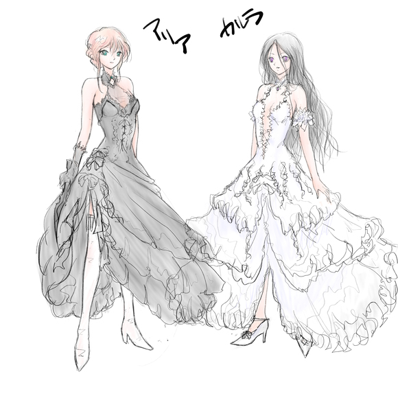

[TOC](../readme.md)&nbsp;&nbsp;&nbsp;&nbsp;&nbsp;&nbsp;[Prev](section_0027.md)&nbsp;&nbsp;&nbsp;&nbsp;&nbsp;&nbsp;[Next](section_0029.md)

# 256 Graduation Event "Ritual"

"——tsu!"

Elena-sama, who was watching Aria fight above the temple far away from
the destroyed hall's large window of the royal castle, involuntarily
ducked from the shockwave that suddenly attacked from that direction.

"Are you safe!?"

As the shockwave passed and Elena-sama raised her face to the barely
audible voice of Sera, the royals present were protected by the shields
of the royal knights, and Elvan and Clara were also embracing each other
protectively, with no one injured.

The battlefield had moved from the royal castle to the royal capital,
but the royals had not yet evacuated. Elena-sama, helped to her feet by
a handmaiden, widened her eyes at the sight visible from the window.

 
"The royal capital... is burning."

 
\*\*\*

 
"AAAAAAAAGGGGH!!"

From Colette's body, crumbling and scattering as it was burned by the
holy flames, a black mist-like substance burst out, and the face
floating in the mist screamed.

Even though her mana had been greatly depleted and her power weakened,
the nightmare, which had been raging until now, tried to use a "curse"
as a last resort.

The demon's "song" is not magic, but a curse. Karla, who was bathed in
the scream at close range, unleashed her right arm, still burning with
holy flames, towards the nightmare - and the royal capital.

 
"――――――――――――――"

The nightmare vanished along with the curse it had released, unable to
even scream -

"Karla!"

I jumped in front of the spreading flames, deploying a 【Mana Shield】
as if to shield myself. However, the flames split apart as if to avoid
me and my shield, scattering greatly in six directions.

What is she planning? Karla, noticing me glaring at her, gave the same
smile as always, and then I saw pillars of fire rising from behind
her—no, from six directions in the royal capital.

"...What did you do?"

"Surely, Aria, you didn't think I'd leave burning the royal capital to
someone else, did you?"

 
Pillars of fire rise up as if surrounding the royal capital... but
judging from the color of the flames, which are mixed with white light,
those six flames are "holy flames."

It is a combined spell of fire and light that is highly effective
against undead creatures and demons, but unlike ordinary fire magic, the
spreading damage as flames is low. If that's the case, then those flames
themselves are not intended as an attack, but as a stepping stone to
destroying the royal capital?

Six pillars... a hexagram? Hexagrams are also used in magic circles for
summoning demons, as a magic amplification technique for mana and magic.
Why would Karla, who can use infinite mana, need such a technique...?

"...Could it be?"

Karla closed her eyes for a moment at my murmured words, and quietly
narrowed them.

 
"Even for me, Rank 8 (........) fire magic is difficult without any
assistance."

 
Rank 8 - something that humans can no longer handle, a realm of legends
and myths. If such a thing exists, the royal capital will certainly
collapse.

 
"Karla!!"

"Come, Aria."

Karla responded cheerfully as I leapt out as if kicking off the sky.

 
"——【Fire Javelin】——"

"——【Mana Shield】——"

Crack——

The mana shield shattered as if hearing a hallucination of breaking
glass as it received Karla's fire javelin. Using the remnants of the
shattered mana as a distraction, I jumped in and kicked, but Karla used
acrobatics to evade as if leaning back.

"——【Splash】——"

A lump of water suddenly appeared in front of me. I instantly slashed it
with my black knife infused with mana, and through the scattering
droplets of water, I saw Karla, having regained her posture, pointing a
finger at me.

"——【Ice Storm】——"

The water attached to me instantly froze in the directional ice storm.

"Ha!"

I kicked up with my leg as if shattering the ice clinging to the hem of
my dress, and with the recoil I escaped out of the range of the ice
storm, and threw the knife I pulled out from the slit in my skirt.

"——【Ice Whip】——"

Karla's ice whip, immediately produced, struck down the flying knife.

"——【Dark Gimlet】——"

At that moment, the Dark Gimlets I released appeared around Karla, and
multiple Dark Gimlets attacked Karla simultaneously.

"——【Lightning Strike】——"

The electric shock that Karla unleashed as if wrapping around herself
blew away the Dark Gimlets.

At that moment, I jumped in and kicked while fluttering the hem of my
dress, and Karla's hem of her dress, fluttering greatly as if kicking
up, caught my leg as if wrapping around it.

"Haaaaaa!!"

I relied on my enhanced body and forcefully kicked through.

"——tsu"

Karla jumped back, unable to bear it. But seeing that her fingertips
were pointed at me as I tried to pursue, I also pointed my fingertips at
Karla.

 
"——【Phantom Pain】——"

 
The phantom pain burst forth with killing intent, and the excruciating
pain caused me and Karla to momentarily lose control of our magic, and
landed on the temple, which was still burning and had its upper half
blown away.

"…………"

We stared at each other in silence amidst the sea of flames.

I am also reducing my mana, but Karla, being a magician, must be
reducing it even more.

Why doesn't Karla use her 【Gift】? Perhaps Karla is close to her limit.
I, who received Karla's 【Phantom Pain】, know best that she is still in
intense pain.

 
"What do you intend to do with the royal capital?"

When I spoke first, Karla smiled slightly.

"You know, don't you? I wanted to inscribe the people who messed up my
fate with it. Their sin. Despair... That I had lived."

Karla sought atonement from those who made her body unable to live
properly due to her father's experiments, and all those who acknowledged
it.

For Karla, who was destined to die, whether they knew or didn't know,
all the people who were happily laughing on her corpse were targets.

 
"It was worth luring the battle with the demons all the way to the royal
capital. I had to ignite the hexagram in an instant, but even with
infinite mana, my 'vessel' can't yet ignite and activate it at the same
time."

"…………"

To simultaneously amplify and use magic, she used miasma as an
oil-soaked fuse, and activated it using holy flames?

Did Karla not move from the royal capital in order to summon a demon to
scatter the miasma that would become the fuse? I realized that the
battle with the faceless demon, and the battles with Amor and the
nightmare in the royal capital, were all for this.

 
"Is this what Karla wanted...?"

Does she want to get revenge so badly that she would go this far? Karla
closed her eyes slightly at my question.

"That's right... is what I'd like to say, but in truth, I don't care
anymore."

Karla gently placed her hand on her chest as I narrowed my eyes as if
glaring at her at those words.

"Aria... if I can fight you, I don't care about this country, or this
world anymore."

Karla slowly moved her gaze around and continued to speak.

"You gave me 'light,' to me, who had no choice but to die in despair.
Saying that you would kill me was the only hope I had."

"...I remember."

The promise we made when we first met. And the oath I made in the
dungeon.

Karla smiled happily at my muttered words.

"I wanted to make that certain. That promise was the only thing I could
cling to. So I assembled the magic only from the descriptions I read in
the forbidden books. I couldn't completely reproduce it, and it was
almost like a suicide magic, but it was just right."

Karla slightly lowered her eyebrows as if giving a wry smile at that
time.

"From the moment I activate my Gift, the hexagram will absorb and
activate my mana, using the flames surrounding this royal capital as a
medium. With this..."

Karla paused for a moment there, looked straight at me, and gave a full
smile.

 
"With this, you absolutely have to kill me, right?"

 
If I don't kill Karla, Rank 8 fire magic will activate.

"Karla..."

Karla must have noticed. That there was an atmosphere of getting used to
each other with me, who wanted death and was supposed to grant it,
without even realizing it herself...

Karla was afraid of accepting that and dying with nothing left.

She seeks death to that extent...

This is not just a killing match to die.

Like celebrating the birth of a person, like mourning the death of a
person, this was a "ceremony" for Karla to engrave the proof that she
lived into the world.

We will kill each other. In the "stage" called the royal capital
enveloped in flames, where Karla will perform the ceremony to engrave
her life -

"...I'm going."

"Yes, come."

We simultaneously increased our mana and jumped out onto the fiery
stage.

 
"——【Iron Rose】——"

"——【Soul Thorn】——"

 
——Until "death" do us part——

 
------------------------------------------------------------------------

Next time, "Clash"

What kind of conclusion will the two's fates see?

 
Aria and Karla's final battle costumes (rough sketch)... I'm sorry for
those who are not fond of it.

I hope it will help to supplement your inner image.

The image is Aria as a female knight and Karla as a white rose.

The coloring is like the first Pr○cure...

---
[TOC](../readme.md)&nbsp;&nbsp;&nbsp;&nbsp;&nbsp;&nbsp;[Prev](section_0027.md)&nbsp;&nbsp;&nbsp;&nbsp;&nbsp;&nbsp;[Next](section_0029.md)

