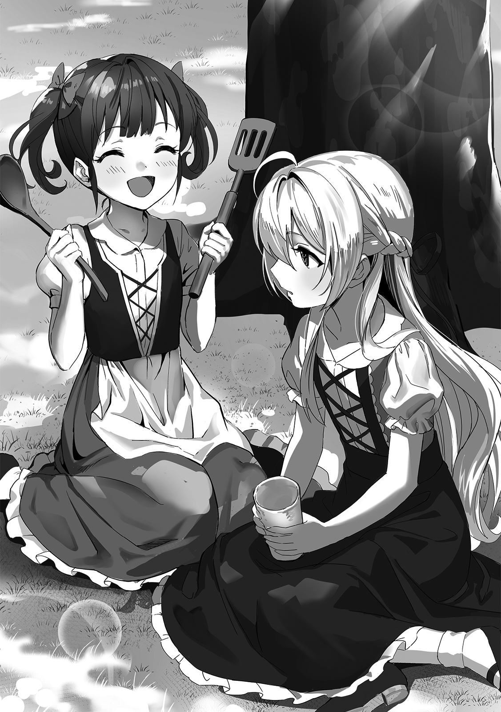

[TOC](../readme.md)&nbsp;&nbsp;&nbsp;&nbsp;&nbsp;&nbsp;[Prev](0001_Vol_1_Ch_1_The_Wish_of_the_Witch.md)&nbsp;&nbsp;&nbsp;&nbsp;&nbsp;&nbsp;[Next](0003_Vol_1_Ch_3_Ill-Boding.md)

# Chapter 2 – Shatia the Villager

Shatia had a single childhood friend, a girl her own age named Moffy.
She could be characterized by her chestnut hair tied in twin tails and
large, perfectly round eyes. She was always sticking close to Shatia’s
side.

Due to the village’s naturally small scale, there were few children. In
such an environment, a friend of the same age was a more precious
existence to a child than anything else. However, that was only the case
for an ordinary child; from the perspective of Shatia—a former witch
whose inner self was already over a hundred years old—Moffy was nothing
more than an annoying existence with inferior intellect.

“Hey, Shatia, let’s play, let’s play!!”

“…Moffy. I am currently reading a book. I would appreciate it if you did
not disturb me.”

One day at noon, Shatia was reading a book given to her by her tutor in
the shade of a tree. While she had been able to cram most knowledge
regarding magic, she still knew nothing of the daily lives of humans.
Therefore, Shatia had asked her tutor to lend her a book that described
things like living in the royal capital. The studious Shatia was trying
to read it in a field, but unfortunately for her, Moffy kept inviting
her to play and interrupting her reading.

“But Shatia, all you do is read! I’m boooored~”

“For me, this is extremely valuable study… *Haah*, good grief. Very
well. Let us play something.”

Since Moffy would only get increasingly bothersome if she were ignored
any longer, Shatia decided to give in and play with her.

To avoid being outed as a former witch, Shatia spent her days in the
village pretending to be an ordinary human girl as much as possible.
Though that was merely based on her own perception. While she had no
issues in her daily life, she made no effort to hide her nature when it
came to magecraft. Far from it, she displayed a brilliance and deep
spirit of inquiry that shocked even a former court mage.

But even Shatia, who had become something of a minor celebrity in the
village, was no match for the pure-hearted Moffy. And so, she was often
half-dragged into playing house. This time would be no exception.

“Hey, why’s Shatia only reading hard books?” In the middle of their
play, Moffy suddenly asked this, seemingly curious.

With a wooden toy cup in hand, Shatia responded, “This is a book written
about the royal capital. It is my principle to thoroughly study
everything that catches my interest.”

“Then, does Shatia wanna go to the capital?” Moffy pressed with a slight
pout.

*I wonder, do I truly desire to go to the royal capital?* Shatia
pondered. It was true that she was interested in the magic of humans.
However, that was merely an interest; she didn’t know if she actually
wanted to go to the place itself.

“Who knows? Rather, my inherent interest lies in the magic used there.
Therefore, the royal capital itself is not a place of particular
importance.”

There were plenty of ways to learn magic without going all the way to
the capital. Shatia believed this village had sufficient value in that
regard and was satisfied with the status quo. Besides, there was no way
her mother would allow her, a young child, to travel far.

Upon hearing her response, Moffy appeared genuinely relieved. “That’s
good~”

“Hmm? For what reason?”

“Um, because if Shatia went away, I wouldn’t have anyone to play with.
So I’m happy!”

It seemed she had been anxious that her only friend her age might leave
her. Shatia figured that once they became adults, there would be no need
to fixate on a childhood friend anyway, but unfortunately, she lacked a
proper understanding of human emotions. She could only offer a
half-hearted, “I see…”

The two continued playing house after that, but eventually, perhaps
getting bored, Moffy suggested they take a short walk. Shatia thought
that moving one’s body was also important foundational training for
magic, so she readily consented.

“Moffy, that is the forest they say is off-limits.”

After walking for a while, the two reached the outskirts of the village.
There stood a forest enclosed by a fence; it was a forbidden forest that
even the village adults seldom attempted to approach.

It was said that monsters appeared there. Unlike normal animals,
monsters were vicious creatures that possessed magical abilities, so no
one dared to enter unless they had absolute confidence in their skills.

“It’ll be fine! The other day, Uncle Rob, the one who’s always drinking,
was in here too! Just a little should be ok!”

“…Is that so? Well, I won’t stop you.”

Shatia surmised that the uncle had probably snuck in to hide the alcohol
his wife had forbidden him from having, but she didn’t care much and
didn’t bother to stop Moffy. In truth, Shatia herself had entered this
forest several times to investigate its ecology. Her curiosity had won
out. Besides, she was confident that even if they encountered a monster,
her own magecraft would be enough to handle it.

The two stepped into the forest without fear, venturing deeper and
deeper. As for Moffy, she acted as if she were an explorer and had a
somewhat giddy expression.

“Waow, amazing! Look Shatia! A cool bird!”

“That is a Phantasmal Flame Bird. It is a monster, so it’ll breathe fire
at you. Be careful.”

Though Moffy thoughtlessly pointed at the cool bird she was seeing for
the first time, it was a still full-fledged monster. It was fortunate
she had Shatia with her, though Shatia found herself troubled by Moffy’s
excessively carefree attitude. Still, she recognized the parallels
between the girl brimming with curiosity, and herself. She would likely
want to wander the forest until she was satisfied, so Shatia decided to
accompany Moffy until she had her fill.

Suddenly, Shatia came to a stop. There were unfamiliar footprints on the
ground. They didn’t belong to a monster; they were the tracks of a human
wearing boots.

“Hmm… humans pass through here as well? Does that mean it is one of
those ‘Adventurer’ types I have heard rumors of? I doubt anyone from the
village would attempt to traverse the forest this casually.”

Shatia’s mind considered the possibilities as she traced the footprint.
Among the villagers, the only ones who could enter this forest were the
village chief or her tutor, the mage. However, the chief had stopped
entering recently due to his age, and the tutor made no attempt to enter
either. That meant these footprints belonged to an outsider.

When Shatia was a witch, people called adventurers would sometimes come
to her mansion. Apparently, they belonged to an organization called a
‘Guild’ and worked by taking requests from people. There was the
possibility of the tracks belonging to a traveler or merchant, but it
was unlikely they would wander into a monster-infested forest.
Therefore, Shatia deduced an adventurer was the most likely candidate.

*I would like to meet one if possible*, Shatia thought as she brushed
the dirt off her hands. Among adventurers, some used magic perfected
through self-study, some used magic passed down from ancient times, and
some used forbidden arts; Shatia was interested in the magecrafts
accumulated and refined through battle.

“Kyaaaaaaaaaaaaaah!!!”

Suddenly, Moffy’s scream echoed through the forest. Shatia realized that
the girl who was supposed to be beside her just a moment ago was gone.
She rushed toward the direction of the scream.

When Shatia reached the source, she found herself in a slightly open
clearing. Moffy had fainted and collapsed, and before her stood the form
of a giant bear. Naturally, it was no ordinary bear. It was a monster
that possessed mana.

“Moffy…!”

“Grrrrr…”

Though it was on the verge of attacking, it appeared Moffy had simply
fainted from shock upon accidentally encountering the bear monster; it
hadn’t attacked yet. Shatia felt a moment of relief that she was safe,
and then turned her gaze toward the bear. Fortunately, the bear monster
took more interest in Shatia than the fainted Moffy, letting out a low
growl as drool dripped from its jaws.

“A Grimbear, is it… How unusual. Do your kind show your faces even in a
forest like this? Should you not be hiding inside a cave?”

Identifying the bear as a monster called a Grimbear, Shatia looked
surprised. In fact, Shatia had encountered Grimbears back when she was a
witch and had even researched their ecology. At that time, the
Grimbears—feared for their ferocity—had hidden in their caves out of
fear of the witch Shatifahl. However, with Shatia looking as she did now
in the form of a young girl, the bear obviously felt no such fear; it
let out a bold roar and bared its fangs.

Faced with a Grimbear reacting differently than the ones she had once
studied, Shatia simply placed her hand on her neck with pure, genuine
curiosity. Her eyes were not those of someone looking at a monster, but
rather the cold, emotionless eyes of someone seeing a precious
experimental subject.

“Grrrroaaaaaaaaarrr!!”

“What is the matter? Your kind were supposed to be much cleverer back
then…”

As a witch, Shatia was someone who would walk up to Grimbears and even
train them, but naturally, the Grimbear before her now couldn’t possibly
know that. For the one before its eyes now was not the witch Shatifahl,
who had captured and subjugated many of its kind, but merely Shatia, an
unremarkable, weak little girl. The Grimbear felt angered by Shatia’s
impudent attitude and raised its arm to swing its claws.

“Sit.”

But in the next instant, as Shatia uttered that command, an intense
gravity weighed down upon the Grimbear’s body. It wasn’t something like
pressure or bloodlust. It was something much more tangible, like a
physical shockwave. Precisely because it was a monster possessing mana,
the Grimbear understood instinctively: This was magic. Moreover, it was
a powerful magic imbued with an amount of mana that it could never hope
to rival.

Before it knew it, the Grimbear had collapsed to the ground and was
sitting hunched over as if bowing its head to Shatia. Seeing this,
Shatia wore a look of satisfaction.

“Yes, yes. It is better for your kind to be well-behaved like this. I
happen to like both monsters and animals. Pray, do not make me resort to
violence.”

Shatia stroked the Grimbear’s head affectionately. It was the powerless
petting of a delicate girl, but to the Grimbear, it felt as though a
demon had gripped its throat. How could such a small body release such
an intense presence? The Grimbear wondered, but Shatia merely laughed
innocently.

“grrr…”

“From now on, ensure you do not attack this girl either. She is my
childhood friend, after all. It would cause me various troubles if she
were to disappear.”

*…The adults would all make a fuss,* is something Shatia decided to keep
to herself as she firmly warned the Grimbear. Although it couldn’t
understand human speech, the Grimbear understood through instinct and
nodded its head.

“Then, off you go. Take care not to be discovered by that tutor.”

*Pat, pat*, with a light pat on its back from Shatia, the Grimbear
retreated into the depths of the forest. After confirming the massive
body had vanished into the thicket, Shatia approached her unconscious
childhood friend and began poking her soft cheek.

“Now then… wake up, Moffy. Will you not wake?”

“Mmm… hwa, HYAAH!? Shatia, the bear!? The big bear mister!?”

“What are you talking about? You simply tired yourself out from walking
and fell asleep.”

Since explaining was a bother, Shatia provided a shallow explanation to
Moffy as she scrambled to her feet. Thinking that since she was just a
child anyway it wouldn’t be unreasonable to get away with a flimsy
excuse, Shatia convinced Moffy of the simple story she had fabricated.
Moffy looked around in confusion, but when she realized the Grimbear was
nowhere to be seen, she let out a long, relieved sigh.

“…Eh? Was that it? Really?”

“It is. Now, come, let us return quickly. You must have had your fill by
now, surely. If the adults see us in a place like this, we’ll be scolded
severely.”

“Wha-wha-what, that would be bad!”

When Shatia said that, Moffy finally seemed to realize the situation she
had created and began rushing back the way they came. Shatia followed
behind her with a sigh.
   
 
 
In the end, the fact that Shatia and Moffy had entered the forest
remained undiscovered, but Moffy ended up being scolded by her mother
for getting her clothes covered in dirt. In a rare moment of
self-reflection, Shatia admitted her own oversight, thinking that she
should have warned her about that when she woke up after fainting.

---
[TOC](../readme.md)&nbsp;&nbsp;&nbsp;&nbsp;&nbsp;&nbsp;[Prev](0001_Vol_1_Ch_1_The_Wish_of_the_Witch.md)&nbsp;&nbsp;&nbsp;&nbsp;&nbsp;&nbsp;[Next](0003_Vol_1_Ch_3_Ill-Boding.md)

