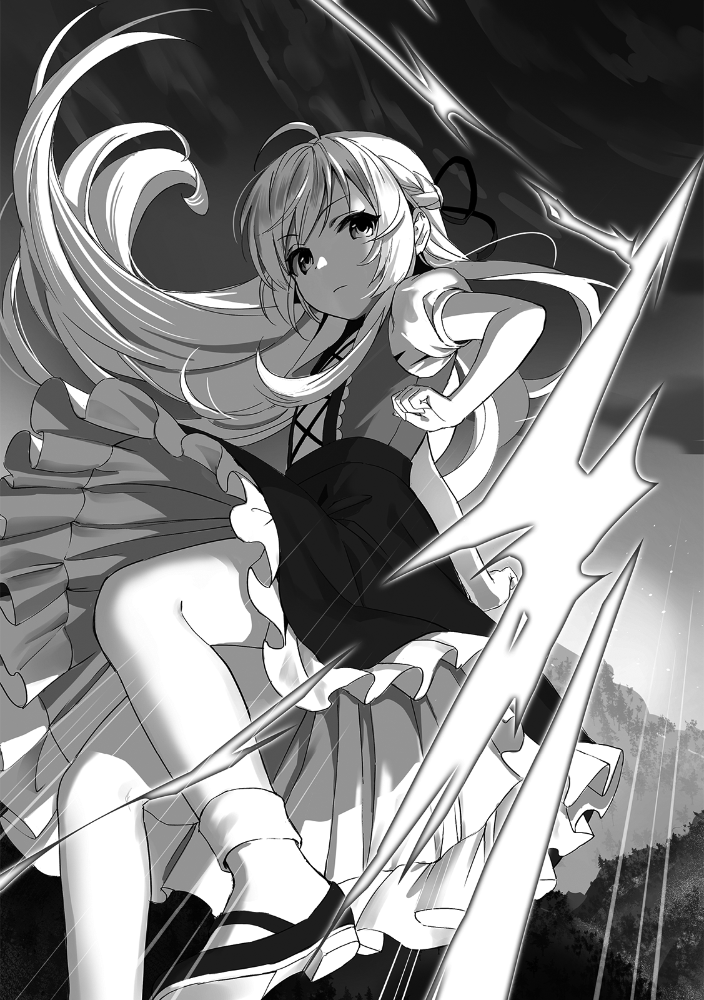

[TOC](../readme.md)&nbsp;&nbsp;&nbsp;&nbsp;&nbsp;&nbsp;[Prev](0002_Vol_1_Ch_2_Shatia_the_Villager.md)&nbsp;&nbsp;&nbsp;&nbsp;&nbsp;&nbsp;[Next](0004_Vol_1_Ch_4_Battle_against_the_Skeletons.md)

# Chapter 3 – Ill-Boding

The Witch of Wisdom. She was the leader who united the Seven Witches,
the worst witch of all, and the one who resisted the Hero to the bitter
end.

With a swing of her arm, the heavens would split; with a stomp of her
foot, the earth would rend. She was a terrifying existence possessing
immense amounts of mana and many mysterious sorceries. While she lived,
she resided in a manor deep within the Land of Mist. It was said she
would tempt travelers who wandered near, using them as experimental
subjects to further her research.

“…And that’s Shatifahl, the Witch of Wisdom. Scary, isn’t it~?”

As Shatia was spending her time reading in her room, Moffy—reading aloud
from the book she had borrowed from her—muttered her impressions. In her
hands, she clutched a book titled *The Seven Terrifying Witches*. Upon
hearing Moffy’s thoughts, Shatia’s expression clouded with a look of
subtle discomfort.

“Who knows? The existence of one already dead is a matter of no
consequence,” Shatia responded dismissively with a tilt of her head.

Moffy looked back at her with half-closed eyes, appearing exasperated.
“Ah~, that’s so like you, Shatia. Always so blunt about these kinda
things.”

For Shatia, this was her own past life, making it difficult to formulate
a simple opinion; the complexity of it left her at a loss for words.
Furthermore, most of what was written in the book was fiction made up by
humans, and what Shatia wanted more than anything was to point out all
the inaccuracies. “I certainly performed magical experiments, but I did
not use humans,” she muttered to herself, making sure Moffy couldn’t
hear.

“Is it not so? The Hero has already defeated the witches. What meaning
is there in talking about the dead at this point?”

“There isn’t any, but… but still~…”

When Shatia stared at Moffy with a raised eyebrow as if to ask, “Do you
have an objection?” the girl mumbled unclearly with a troubled look and
hung her head.

Strictly speaking, it wasn’t that there was no meaning. Rather, it would
be better to discuss it under the pretext of forming countermeasures.
Proof being that a reincarnation of a witch like Shatia was right there.

Moreover, since the other witches besides Shatia were all highly
eccentric and troublesome, there was a possibility they had survived
through their own means. That was how anomalous the existence of a witch
was. While Shatia believed this, she also understood that talking to
Moffy wouldn’t yield anything fruitful, so she just quietly turned away.

“Well, if they are alive… I wonder how the others are faring,” Shatia
quietly tapered off as she watched the scenery outside through the
window from atop her bed.

Every one of them was an eccentric who wouldn’t die for nothing. It
wouldn’t be strange if there were those harboring a grudge against the
Hero, or those seeking to exact retribution on humanity. However, the
fact that there had been no anomalies even after five years… meant that,
at the very least, there were no problems yet.

Just as Shatia reached that conclusion and settled into a pensive mood,
she suddenly noticed the villagers were in an uproar. Everyone was
coming out of their houses and heading toward the village entrance. She
knit her brows at the sight.

“Hmm… the village seems rather noisy.”

“Ah, you’re right~! Everyone’s heading to the entrance. Did something
happen~?”

Moffy also straightened her back in interest and peered down from the
window. Since such a commotion rarely occurred, not only the curious
Moffy but also Shatia—the witch whose spirit of inquiry never
tired—immediately went downstairs, opened the front door, and headed
toward the village entrance.

As expected, a crowd of villagers had gathered. Navigating through the
crowd by weaving between people’s legs, the young Shatia and Moffy made
their way into the center of the circle, finally reaching the source of
the anomaly.

There lay a man dressed as a knight. He looked to be around the same age
as Shatia’s father, and his face bore scars suggesting he had survived
countless battles.

Shatia spared a quick glance at the man’s armor. It wasn’t the rugged
armor one might procure from a common blacksmith, but beautifully
polished armor that, despite its damage, was clearly well-maintained.
From the coat of arms engraved upon it, she discerned that this man was
a knight of some nation.

Just then, Moffy’s father appeared. Moffy spared no time jumping toward
him as he approached. “It’s Papa! Papa, what on earth happened?” 

“Hmm? Oh, Moffy.” Apparently, it was Moffy’s father who discovered the
man; while on his way back from working the fields, he had seen the
knight from a distance heading toward the village.

He continued, “This knight person suddenly appeared… He was saying
something about a mission, and that the northern valley is dangerous…
After that, he passed out, so I don’t know the rest.”

Since the village chief also arrived late, Moffy’s father relayed
exactly what the knight had told him as an explanation. However, because
it was too fragmentary and the knight’s identity was unknown, it was
difficult to judge what to make of the situation. The village chief
looked at the fallen knight with a troubled expression, then began
issuing instructions to the villagers while stroking his long beard.

“For the time being, let us take this man to my house. He appears to be
injured; tend to his wounds, please.”

“Is that all right, Chief?”

“It won’t be a problem… Besides, the winds feel unsettling.”

Because his identity was unknown, the villagers were reluctant to bring
the knight into the village, but they ultimately obeyed the village
chief’s command. Shortly after, Shatia’s tutor also rushed to the scene,
and it took two villagers working together to carry the knight to the
chief’s house. Rumors and chatter stirred as many followed behind.

All save for one person. Shatia—the girl with the clear, discerning
eyes.

“Hmm hmm… The northern valley… was it?” Shatia crossed her arms, her
mind beginning to turn. She mulled over the knight’s warning, attempting
to discern the truth behind the rapidly unfolding situation.

The northern valley was located a short distance from the village.
Unlike the forbidden forest, it wasn’t a particularly dangerous place;
some villagers even went there to fish. For such a place to be
“dangerous”… did that mean some kind of intruder or perhaps a
disaster-like entity had appeared?

“Shall I go and see?” Speculating that some kind of foreign presence had
likely appeared in the northern valley, Shatia made her decision.

Fortunately, everyone was preoccupied with the knight, so it likely
wouldn’t be discovered if she left the village for a short while. With
that in mind, Shatia immediately departed for the northern valley.
Chanting a flight spell, she soared freely through the air and out of
the village. Taking care to blend into the clouds so as not to be seen
by anyone, Shatia reached the valley in no time at all.

Lush trees grew on the verdant land, illuminated by sunlight filtering
through the gaps, and the flowing river sparkled brilliantly. It was a
perfectly peaceful and beautiful sight. However, as Shatia landed on a
rock, she narrowed her eyes as if something was bothering her.

“…How odd. There’s a lack of essence throughout the valley… Why?” Shatia
sat down and muttered to herself while touching the rock with her hand.

Essence was like a lifeblood that dwelled within all things. Magic could
be considered the ability to convert this essence into mana, and
subsequently, the ability to wield immense amounts of energy. For there
to be a lack of essence meant, in other words, that things in the valley
were approaching death.

At that moment, a tremendous roar rang out from behind Shatia.
Simultaneously, the rock she had been sitting on exploded, and her small
body was thrown into the air. Despite being shrouded in smoke, Shatia
reoriented herself and managed to land on the ground. When she looked
toward the spot where she had been just moments ago, there stood a
skeleton draped in a black robe. Shatia sharpened her gaze as she turned
to confront it.

“…!! A Sorcerer Skeleton!”

“Gigigigigi…!” The Sorcerer Skeleton’s jaw rattled as it leaked wordless
noise, raising its voice as if hurling some sort of curse at Shatia.

In one hand it held a black wooden staff, from which sparks like
electricity were crackling. It was likely being used as a catalyst.
After a moment, it swung its staff to release a lightning strike. Shatia
immediately thrust out one hand to create a barrier, blocking the
attack.

“So, you are the reason the knight said the valley was in danger…? For
what purpose would a dead one such as yourself be draining the essence
from the mountains?”

After completely blocking the lightning with one hand and lightly
shaking her arm to disperse the smoke, Shatia posed her question as if
nothing had happened. The Sorcerer Skeleton was shocked that the young
girl before it had blocked its strike, and its shoulders trembled. 

However, it quickly tightened its grip on its staff and swung it again,
releasing a lightning strike even more potent than the last. Even in the
face of this, Shatia thrust out one hand just as before and blocked it
completely.

“There is someone giving orders, isn’t there? You skeletons always have
a leader. To issue a command to absorb the essence of the mountain… is
it a human?”

“Gigii…!!”

Since it was unlikely a fellow skeleton would give such a command,
Shatia surmised the one giving orders was human. She didn’t know what
they intended to do by having the skeletons gather essence, but she
couldn’t stand idly by and watch the ecological balance be destroyed
like that. Shatia loved nature and animals; to her, this was an
abominable act. So, she took a step forward, closing the distance.

Shocked that its strike had been blocked twice, the Sorcerer Skeleton
showed visible bewilderment toward the unidentified enemy before it. It
instinctively felt that it would be too late if it didn’t kill her now;
thus, the Sorcerer Skeleton channeled even more mana into its staff.

“Giaaaaaaaaaaaa!!”

The skeleton let out a shriek and raised its staff, unleashing countless
bolts of lightning. Like scattering sparks, the lightning flowed at high
speed, obliterating the surrounding rocks. Shatia immediately used
flight magic to lift off the ground and take refuge in the air.

“Good grief, what a hassle. And I wanted to avoid wasting energy…”

Even as a reincarnation of a witch, she was still in the form of a
child. Shatia wanted to avoid excessive use of magic for the sake of her
future growth where possible. However, to make the enemy before her
behave, she had to use a certain level of magic. After all, the opponent
was a Sorcerer Skeleton, a high-ranking existence among skeletons.
Normally, even a court mage would struggle against the amount of mana it
possessed.

*To think there is a human who has subjugated such a thing… how
terrifying*, Shatia thought, smiling somewhat forlornly. Then, while
spreading her hands in mid-air, Shatia spoke: “Very well. I shall show
you a small taste of the magecraft of the Witch of Wisdom.”

In the next instant, she lunged at the Sorcerer Skeleton with a speed
faster than the eye could follow. The skeleton raised its staff in an
attempt to shoot her down with lightning, but despite moving at high
speed, Shatia dodged it elegantly. She closed the distance and released
an impact spell right before its eyes. The skeleton’s bony body was
blown back and its robe was torn to shreds, but it barely held on.

“Giaaaaaaa!!” With a roar, the Sorcerer Skeleton released a pulse of
mana into its surroundings.

“—Oh dear.”

Recognizing instantly that it was a mana pulse, Shatia evaded with
flight magic. 

“Good grief, a spell that would kill an ordinary human in an instant
doesn’t seem to have much effect on a skeleton with a body of bone,” She
then grumbled while clenching and unclenching her hands to check the
sensation.

Because Shatia wasn’t particularly fond of combat, she didn’t know how
to hold back. Consequently, even when interacting with monsters and
animals, she couldn’t restrain herself and would end up inadvertently
exerting pressure; no matter how much Shatia desired to be on equal
footing, a master-servant dynamic always emerged.

The magic Shatia had just released was enough to defeat an ordinary
human in one hit. However, physical damage seemed to have little effect
on a skeleton moved by magic. She shook her head in annoyance.

“Then, how about this?”

Pointing her palm downward and thrusting out her arm, Shatia channeled
her power. Suddenly, a tremendous weight began to bear down upon the
Sorcerer Skeleton. Though it wasn’t supposed to be able to feel pain, it
let out a scream under the overwhelming pressure, feeling as if it were
being flattened by a massive boulder.

The sound of bones cracking and splintering echoed, and eventually, the
Sorcerer Skeleton was unable to even stand, let alone hold its staff. It
pressed its hands to the ground, desperately enduring the crushing
weight.

“Giah… Gaaaa…!!?”

“Ohoh, you’re putting up quite a fight, aren’t you? Good, good, keep it
up!”

While the Sorcerer Skeleton lay prostrate on the ground, Shatia landed
leisurely on a rock with her hand still extended, looking down at the
suffering skeleton. When she lowered her hand slightly, the gravity
intensified even further. The Sorcerer Skeleton shrieked again, and
finally, the sound of its bony arm snapping could be heard.

“…Well, I suppose it’s about this much then.”

Realizing it had reached its limit, Shatia swept her arm and canceled
the magic. The injured Sorcerer Skeleton collapsed to the ground and
stopped moving as if it were dead. Strictly speaking, skeletons don’t
die… nor are they alive to begin with. Right now, it was simply unable
to move due to severe injuries from the excessive gravity magic.

Shatia descended from the rock to the ground and slowly approached. She
nudged its arm with her foot to check its condition. As expected, it had
exhausted its strength and didn’t even twitch.

“Now then, what to do? I’m not particularly good at brainwashing magic…
but then again, it’s not as if I can have a conversation with a
skeleton…” Shatia tilted her head and crossed her arms, looking
troubled.

Even if she wanted to find the culprit who was controlling the skeleton,
it seemed difficult to extract any information from it in its current
state. That said, she had no other means since she wasn’t skilled in
brainwashing magic, so she racked her brain.

She considered simply taking it to the knight, but then she would be
questioned about how she defeated it. *Just what should I do…?* Shatia
clutched her head.

“…Hmm?”

While deep in thought, a strange sound reached Shatia’s ears. The sound
of approaching footsteps. And multiple pairs at that.

At that moment, Shatia recalled the village chief’s words: “*—The winds
feel unsettling.”*

The chief’s hunches were often right. From his character, Shatia had
discerned that he was someone with such an ability. And it seemed that
this time, too, he was correct.

“My, my… so you had friends with you as well?”

Many Sorcerer Skeletons began to gather around Shatia. There were
roughly twenty of them; a clearly abnormal number.

Uncharacteristically, Shatia’s cheek twitched, and a self-deprecating
smile surfaced on her face.

---
[TOC](../readme.md)&nbsp;&nbsp;&nbsp;&nbsp;&nbsp;&nbsp;[Prev](0002_Vol_1_Ch_2_Shatia_the_Villager.md)&nbsp;&nbsp;&nbsp;&nbsp;&nbsp;&nbsp;[Next](0004_Vol_1_Ch_4_Battle_against_the_Skeletons.md)

