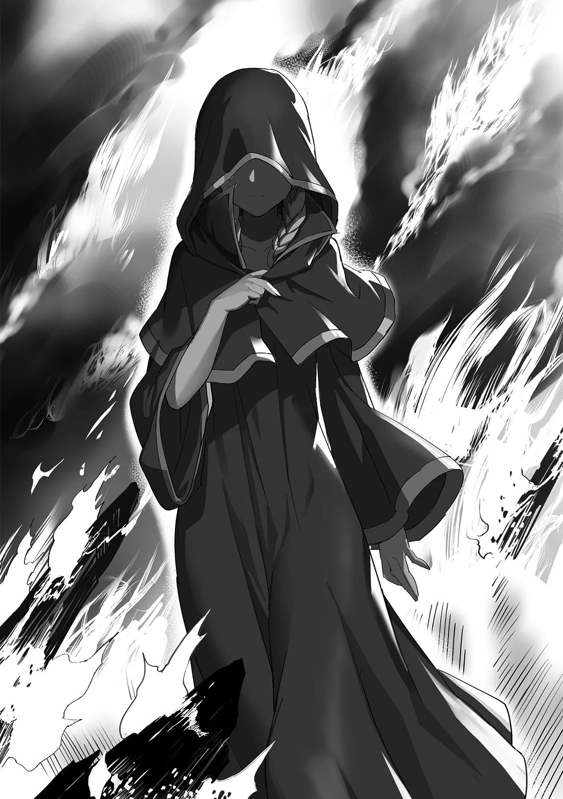

[TOC](../readme.md)&nbsp;&nbsp;&nbsp;&nbsp;&nbsp;&nbsp;[Prev](0007_Vol_1_Ch_7_An_Encounter_With_a_Sage.md)&nbsp;&nbsp;&nbsp;&nbsp;&nbsp;&nbsp;[Next](0009_Vol_2_Ch_9_Searching_the_Forest.md)

# Chapter 8 – The Witch of Purity

**Part 2: The Resurrected Witches**

------------------------------------------------------------------------

Possession magic. Magic that allows one’s soul to inhabit the body of
another or an object.

Like reincarnation magic, it’s classified as a taboo. It’s also an
exceptionally difficult magic that, if a common mage were to even
attempt to cast it, it would fail to activate and trigger intense
backlash. Moreover, possession magic carries stringent conditions: one
cannot possess anything unless they have a deep connection with the
subject, or if it’s an item they’ve kept close to their person at all
times. Should it fail, the soul risks being extinguished forever.

One person chose to invoke this forbidden magic in their final moments
of life.

The result was the loss of her original body and the destruction of her
new vessel.

Flesh was torn, the body was twisted, and the flow of mana was warped.
But. Even as her body became a blood-stained wreck, she forced her
fibers to move through sheer hatred and obsession, standing up while
weeping tears of blood.

Her name was Emerald, the Witch of Purity.

A beautiful girl with the purest heart among all the witches.

\*\*\*

“Guhahahaha!! This village is all minee!!!”

A village was being consumed by fire. Atop the highest roof, a man
loudly proclaimed his victory. He was a rugged man with tanned skin and
shoulders adorned with the skulls of monsters. He was the leader of a
group of bandits, and today, they were raiding a village by the
riverside.

“Boss! This brat’s got somethin’ weird!!”

“Stop it! Give it back!! That’s my precious treasure!!”

A scrawny bandit dragged a boy over by the collar, snatched a
dagger-like object from him, and tossed it up to the leader on the roof.
The leader caught the dagger, and as he stared at it intently, his face
lit up in realization.

“Well, well, well, ain’t this a blessed item?! This’ll fetch a good
price!!”

“Give it back!! It’s a memento from my dad… Give. It. Baaaack!!”

Among weapons, armor, and accessories, there were those said to be
blessed. These tools possessed special abilities, sometimes warding off
evil or protecting the wearer from curses simply by being equipped.
Since such items commanded exorbitant prices among merchants, they were
true jackpots for bandits.

The boy, now robbed of his father’s memento, pleaded through his tears.
With a grotesque smirk, the bandit leader hopped down from the roof and
approached him, grabbing his cheek firmly.

“Listen up, kid. This world’s survival of the fittest. If you wanna take
this back, grow strong and come find me. That is, if you’re still alive
by then. Guhahahahaha!!”

The leader tossed the boy aside and spat on the ground. The boy’s small
body landed with a *thud*, and he cried out in frustration, causing the
surrounding bandits to let out filthy peals of laughter.

“*H-Hic*, why, why…”

“Someone… please, someone save us…”

The villagers lined up against the fence let out agonizing pleas.

All the men had been killed, their village was in flames, and all their
valuables had been taken. It was a scene of total despair. The boy,
still sprawled on the ground, tried to delude himself, muttering over
and over that this must be a dream.

It was then that a girl emerged from the flames. She walked straight
down the village road, unbothered by the fire as she continued her
steady pace. She wore a pure white robe with a hood pulled low, hiding
her face. Curiously, her legs visible beneath the robe were bare; she
was walking the path without shoes. Her gait was somewhat weak, and
occasionally she dragged one foot, but the bandits paid no mind to such
details, approaching her without a hint of caution.

“Well well, lookie here, a little lady. A survivor? If you don’t wanna
die, you’d better line up over here.”

One of the bandits approached the girl, brandishing a knife. However,
the robed girl did not respond to the bandit’s command; she simply stood
there in silence. Whether she was frightened or confused was impossible
to tell, as her face remained hidden by the hood.

“…Hu… are…” The girl muttered something quietly, but the words were far
too faint to be heard.

“Huh? You say somethin’?” The bandit leaned in, and with an intimidating
tone, demanded she speak up. In the next instant, his body was blown
away.

“Why… why must you humans be so FILTHY!!!”

A gust of wind—no, a blast—was unleashed. The bandit’s body flew through
the air, hurtling across the village until he was impaled on the roof of
a house. The bandits and villagers collectively stared in a daze, their
minds unable to process the fact that this was the girl’s doing.

Her hood fell back, revealing her face for the first time. She was
startlingly beautiful, with golden hair tied into two bunches at the
back and sea-blue eyes that sparkled like jewels. She had a round face
with a small nose and mouth, exuding the innocent air of a small animal.
However, the girl’s face was horribly distorted. Most shocking of all,
that beautiful face was, somehow, riddled with cracks.

“W-What are you…?! That face, what on earth…”

“Ahh, I hate it. How I loathe it, humanity…! Yes, you humans are always
like this. Killing your own kind without a thought, plundering without
hesitation… Ahh, how vile!!”

Ignoring the bandits, the girl with the cracked face spat out her words
in a frenzy, her bangs disheveled. Her eyes were clearly stained with
madness, marking her as abnormal. Terrified by her frightening
appearance, the bandits instinctively readied their weapons.

“It’s futile!!”

Seeing the bandits with their weapons drawn, the girl swung her arm.
Another blast was unleashed, just as before. The bandits standing nearby
were blown away instantly, their forms broken. The ones remaining
immediately shrieked and turned to flee. However, the leader and his
closest subordinates didn’t run. Realizing immediately that the girl was
a mage, they each gripped their weapons tighter.

“You… you’re a mage! Damn it, kill her!!”

The bandits flanking the leader drew their swords and lunged at the
girl. Perhaps bolstered by blessed equipment, their movements were
blindingly fast. They thrust their swords without hesitation, piercing
the girl’s body hidden beneath her robe. Yet, the girl did not scream.
She merely twisted her body from the recoil of the impact and rolled her
eyes toward them.

“…?! You… do you feel no pain?!”

“Pain? …Ahh, it hurts. Every time I witness your hideous deeds, my heart
aches terribly.”

As she spoke, the girl turned her palm toward one of the bandits. A
blast of mana erupted, blowing the man away. The final bandit
immediately dropped his weapon and fled.

The girl moved with the jerky motions of a broken doll, gripping the
hilts of the swords impaled in her and forcing the blades out of her own
body. A massive amount of blood gushed out, and her legs shook weakly.

However, despite raging just moments ago, the girl suddenly burst into
tears and collapsed on the spot. “*Hic*, I hate you… *Hic*, Because of
you, all my friends were killed… *Hic*, Cloak, Fantaretta… I can’t see
any of them anymore…*Hic.*“

She wept like a truly grieving child, wiping the tears trickling from
her cheeks with both hands. It was a heart-wrenching yet uncanny sight
to behold as blood continued to pour forth from her chest.

*Why won’t she die?* the bandit leader wondered. The swords had
certainly run her through. There were no signs of healing magic, nor did
she seem to be using any special protective spells. Therefore, the
leader concluded that the structure of her body itself must be abnormal.
He gritted his teeth bitterly.

“Damn it… Get her!!”

“I can’t see them… Ahh, I can’t see them anymore… I’ll never see them
again…”

In any case, what he knew was that his attacks could land. Believing he
could simply skewer her and tear her body apart, the bandit leader led
his men in a simultaneous charge. But just before the sword tips could
pierce the girl, her eyes suddenly snapped wide open. For a moment,
those blue eyes turned pitch black. Before they knew it, the bandits
were unable to move an inch.

“Freeze. And suffer for eternity.”

The bandits became motionless, as if turned to stone. Their eyes open,
their arms extended in an attempt to thrust their swords—all frozen in
place. The mysterious phenomenon left the villagers in a daze.

Eventually, the girl stood up with a sorrowful expression, rewrapped her
robe, and drew her hood. Then, she walked toward the village exit, still
muttering to herself like one possessed. Like a storm, she had appeared
suddenly and passed just as quickly.

As the villager boy stood up to retrieve his father’s memento, he
watched the girl’s retreating figure. At that moment, her robe swayed,
and he saw it; the girl’s body was as white as porcelain, and inorganic,
like a doll’s.

◇

The Witch of Purity, Emerald.

Known as the witch with the purest heart, she was the only one with a
spark of goodness, maintaining contact with certain humans. However, her
eyes were cursed, harboring a terrifying power said to freeze anyone she
looked upon.

In her previous life, she had established a cooperative relationship
with the townspeople and lived among them, but she was eventually
betrayed and subjugated by the Hero.

“Emerald, the Witch of Purity… It says here she was a ‘good witch,’ so
why was she defeated by the Hero-sama?”

Today, too, Moffy was reading a book about witches at Shatia’s house.
Shatia closed her eyes like someone grappling with a difficult problem
as she answered. 

“That’s because the people of the kingdom judged her to be an unstable
element, of course. Emerald was only ever able to earn the trust of a
few; in the end, she was seen by the many as nothing but an object of
fear.”

Among the witches, Emerald had been the one who worked most desperately
to make humans understand them; she was a truly kind-hearted and gentle
witch.

In fact, her efforts had paid off, and she had managed to convince a few
people that witches were not evil, allowing them to interact. But in the
end, she too was betrayed by humanity and buried by the Hero. As the
leader of the witches, Shatia found this to be incredibly tragic.
Because she had trusted them, the betrayal must have been devastating
for her pure heart. If she survived, how twisted would her heart be now?
The mere thought of it made Shatia feel a chill.

“Hey, hey, what’s a ‘cursed eye’? It says something, um… if you look, it
freezes…”

“It’s not active all the time. It triggers when Emerald’s emotions run
high or when she feels murderous intent. Supposedly, she had some
trouble with a devil when she was young.”

Shatia took advantage of Moffy’s childish naiveté to prattle on about
Emerald’s past.

Emerald’s cursed eyes possessed the ability to petrify those she looked
at; a troublesome curse that even Emerald herself could not fully
control. Even the other witches couldn’t break it, so she usually lived
her life unable to look others directly in the eye. Befitting her title,
though, she never let it bother her thanks to her inherent brightness.

“She was a truly good person. The other witches were all stubborn or had
strong egos… She was the only one who always looked out for everyone and
tried to make them laugh. The mood maker of the group, if you will.”

Shatia opened her eyes and leaned against the window as usual, beginning
her reminiscence. Moffy wondered how Shatia knew so much, but being a
child, she didn’t give it much thought and just listened with a casual
“Huh, I see.”

“…Hm?”

Suddenly, Shatia detected a strange presence. It wasn’t the usual
natural flow of energy; it was something sinister—a repulsive, tainted
mana that seemed closer to poison. She reflexively frowned and looked
out the window, but there was nothing out of place.

Even if she had felt it, it was only for a moment, just a faint
disturbance. It was possible it was just her imagination. However,
Shatia’s unease could not be wiped away so easily.

“That was… unpleasant,” she muttered with a grim expression.

She couldn’t identify the aberrance, but a hazy uneasiness settled in
her chest nonetheless. Unable to shake it, Shatia decided she would
later go ask the village chief, who she knew had excellent intuition, if
anything unusual had happened.

---
[TOC](../readme.md)&nbsp;&nbsp;&nbsp;&nbsp;&nbsp;&nbsp;[Prev](0007_Vol_1_Ch_7_An_Encounter_With_a_Sage.md)&nbsp;&nbsp;&nbsp;&nbsp;&nbsp;&nbsp;[Next](0009_Vol_2_Ch_9_Searching_the_Forest.md)

