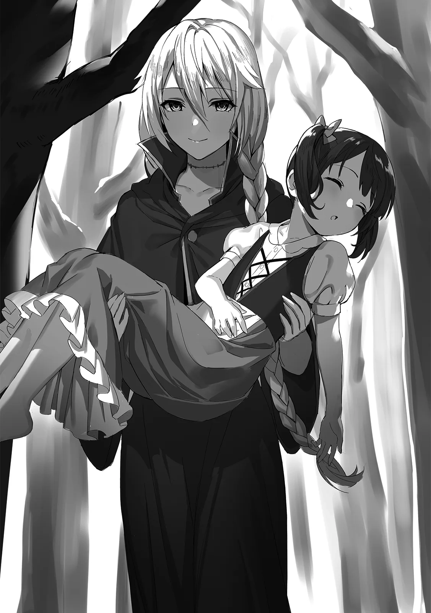

[TOC](../readme.md)&nbsp;&nbsp;&nbsp;&nbsp;&nbsp;&nbsp;[Prev](0009_Vol_2_Ch_9_Searching_the_Forest.md)&nbsp;&nbsp;&nbsp;&nbsp;&nbsp;&nbsp;[Next](0011_Vol_2_Ch_11_Rebellious_Phase.md)

# Chapter 10 – Reunion

After parting with Sheris and her group, Shatia dispelled her illusion
magic and resumed her search of the forest. She wasn’t sure if she would
encounter a fellow witch at this rate, but she operated on the logic
that if they could sense each other’s mana, the other party would
eventually come to her.

However, Shatia wore a troubled expression. Finding a suitable tree
stump, she sat down and rested her chin on her palm.

“Most likely, the demons’ objective is the capture of the witch… Those
beings crave immense sources of mana. And the humans, as usual, are on a
witch hunt… *Phew*, this is quite a difficult situation.”

She had noticed that the demons were carrying special tools under their
cloaks—magic items specifically designed for capture. She had seen right
through them. Thus, she suspected their goal was the collection of the
witch’s mana.

Given how much the surrounding forces were moving, it was certain that a
witch was present. Of course, there was the possibility of a
“witch-like” existence or a double imitating a witch, but based on the
mana she felt, Shatia was convinced it was truly one of her own.

The question was: why hadn’t they come to meet her?

If it were a fellow witch, they should have noticed her mana by now.
Even if they were far apart, there should be a faint resonance. Yet,
there was no sign of the other party approaching. The presence was
intermittent, as if they were hiding. Shatia couldn’t understand why,
and she bit her nail in irritation.

“Surely… they haven’t fallen, have they?”

Shatia voiced her most dreaded suspicion.

As she had considered when talking to Moffy, it was possible the witches
all harbored a deep resentment toward humanity. They had been killed
using cowardly means, in a manner no different from an execution. It was
only natural to hate… but Shatia hoped they wouldn’t resort to revenge.

If a witch were to attack humans now, witches would truly be recognized
as harmful existences. A situation like Emerald’s, where a few humans
showed understanding, would never happen again, and the already
dwindling race of witches would be driven into a corner. Shatia wanted
to avoid that at all costs. But what if the witch in the rumors truly
did harbor a grudge?

“…If that is the case, I must find my comrade before the knights or the
demons.”

She didn’t know if she would make it in time, but she had to meet her
fellow witch before the knights seeking subjugation and the demons
seeking capture. Through discussion, persuasion, or negotiation, she
might be able to quell the resentment toward humans. Though, fate would
sway heavily depending on who the individual was.

Shatia stood up from the stump and began to search for the traces of
mana once again. She felt a faint presence of a fellow witch. The fact
that it felt stronger than before meant they were nearby. Just as she
thought this, a nearby thicket rustled violently. Shatia instinctively
raised her arm, channeling mana into it so she could trigger a spell at
any moment. But the person who emerged from the bushes was Moffy, her
brown hair covered in leaves.

“Shatia, found you!!”

“…Moffy?”

Shatia blinked in genuine shock at Moffy’s sudden appearance. She
dispelled the mana she had gathered and let her arm drop weakly. While
Shatia stood there dazed, Moffy threw her arms around her with teary
eyes.

“Thank goodness, I was really worried! You didn’t come back for so long,
so I went to chief-san’s house. And, and then, he said he told you
stories about the witch… I thought maybe you went outside the village to
try and see her…”

Moffy spoke while tears rolled down her dirt-smudged cheeks.

It seemed that because Shatia hadn’t shown up to play, Moffy had pried
the details from the village chief and deduced that Shatia had gone out
to find the witch. Shatia let out a sigh of admiration; it was a rare
moment of quick thinking for Moffy. At the same time, she felt a wave of
guilt.

“I see… My apologies for making you worry.”

“You really did~! It was really hard getting here…”

Moffy suddenly looked back toward the path she had taken and spoke
anxiously, “Uh, I wonder if I know the way back~?”

Seeing this, Shatia shook her head in exasperation. If she hadn’t
stopped following the knights to meet the demons, she likely never would
have crossed paths with Moffy. She felt that this was a truly strange
miracle.

Her interest piqued from what she had just heard, Shatia asked Moffy,
“But how did you know I was looking for the witch?” The chief had told
her about the witch, but that alone shouldn’t have been enough
information to conclude that Shatia had gone to find her. She asked out
of pure curiosity.

“Eh? I mean, Shatia’s always talking about witches. I figured you must
really like them and really wanted to see one.”

“I-I see…”

Moffy turned around and tilted her head as if the answer was obvious.

It seemed that in Moffy’s eyes, Shatia was simply a girl who liked
witches. Indeed, looking back, she would often lend Moffy books about
witches or read them aloud to her.

*Dear me*, Shatia thought, tapping her forehead. If rumors spread that
she was a “witch fanatic,” there was no telling how the villagers would
look at her. Even if they were mostly gone, witches were still feared,
so she had to tread carefully. But Shatia chose to temporarily set aside
such thoughts and refocused on the situation at hand.

“…Huh?”

She determined that, as things were, she couldn’t continue her search
today and was about to follow Moffy home when Moffy suddenly came to
halt. She tilted her head in confusion, staring at the trees spread out
before her.

Not understanding why Moffy had stopped, Shatia crossed her arms and
asked, “What is it?”

“Hmm, hmmmm,” Moffy groaned, tilting her head from side to side like a
pendulum. “Um, Shatia… was the path I just came through really like
this? It feels like… there’s way more trees now.”

“……..!!”

The moment Moffy finished speaking, Shatia felt a terrifying surge of
mana that made her hair stand on end. She didn’t know why she hadn’t
sensed it until now, but she immediately reached for Moffy’s shoulder.

“Moffy! Get back!!”

She tried to pull Moffy to safety, but she was too late. Before she knew
it, the scenery distorted. What she thought were trees suddenly sprouted
human arms. One arm snatched Moffy and pulled her away, and she went
limp as if placed under a sleep spell.

Shatia clicked her tongue and fired a bolt of mana. If Moffy was stolen,
she would simply take her back. She used an attack meant to retrieve her
without causing harm. However, the tree with human arms swatted the mana
away with its other hand and unleashed a powerful pulse of mana.

“Ugh…!!”

The shockwave hit with the force of a gale. Shatia’s small body was
blown back, but she quickly used flight magic to land gracefully on the
ground. When she looked up, the scenery had changed entirely from
moments prior. She was now in a dark, damp part of the forest. Standing
before her was a short, robed girl holding Moffy. Shatia’s shoulders
trembled as she took in the girl’s appearance.

“Your illusion magic… has improved considerably… Emerald.”

Before Shatia stood Emerald, the Witch of Purity; a fellow witch she
knew well.

The beautiful face peeking out from the hood, the flowing golden hair,
the sparkling jewel-like blue eyes. It was undoubtedly the Emerald she
knew. But her expression and aura were different. The old Emerald was a
bright girl whose face suited a smile; this Emerald’s eyes, however,
were distorted by madness and malice, and she was wrapped in an aura of
total despair.

“That way of speaking… that mana. Is it you, Shatifahl?”

Emerald tilted her head in thought, staring at Shatia. Her movements
were mechanical, accompanied by an occasional, unpleasant creaking
sound. Finally, coming to the conclusion that the girl before her was
the Witch Shatifahl, Emerald’s lips twisted into a grin that appeared
both joyful yet sinister. Her smile should have been warm, but to Shatia
it looked heart-wrenchingly sad.

“Ahh… I’m so happy. I found you… I found a comrade. So you were alive,
Shatifahl.”

“Indeed… I, too, am glad to see you once more.”

Emerald’s smile was awkward, but she seemed truly glad to have found a
fellow witch, her eyes shimmering as if on the verge of tears. Her
shoulders shook with joy. Shatia, too, was genuinely happy as well,
letting a rare smile show. However, she did not let her guard down. The
aura she felt from Emerald was horribly warped. Furthermore, she was
still holding Moffy. Shatia felt a mounting sense of dread.

“Emerald… your body?”

Shatia’s eyes had caught a glimpse of Emerald’s frame as her robe
shifted. To her shock, Emerald was wearing nothing underneath. But what
was there wasn’t the white skin of a young girl. It looked like an
inorganic porcelain moulded into the shape of a human. Her appearance
was just like that of a doll, and Shatia found herself asking such a
thing without thinking.

“This? I used possession magic on myself on the verge of death… into a
doll’s body. I managed to survive that way, but I’m still not quite back
to my best.”

Emerald looked down shyly as she showed Shatia her arm. It was white as
bone, a lifeless, cold limb. The fingers clacked as they moved, sounding
hollow. It truly was the body of a doll. But Shatia had many more
questions.

“…You don’t mean.. Did you add your own flesh to that doll body?”

“Yes. Even calling it a doll—it was just something that I happened to
have lying around… Possession magic requires a vessel with a connection
to the user, you see. So, I added my face and my organs to it.”

Though hoping she was wrong, Shatia’s suspicion was confirmed by
Emerald’s shocking answer.

It seemed that while Emerald had successfully possessed the doll, she
had nearly died again immediately because she had no memory of or
connection to the object. In a desperate measure, she had dismantled her
own corpse and stuffed it into the doll.

Indeed, upon closer inspection, there were marks around her neck that
looked to be stitches. Perhaps the eerie sounds were because her bones
weren’t properly set. Shatia shuddered at the sheer gruesomeness of it.

“…You must have suffered much, Emerald.”

“…Yes.”

Shatia was moved to tears by Emerald’s horrific ordeal. The girl who had
cherished human connection and strived to make them understand witches
was gone. She had been betrayed and turned into some kind of doll-thing.
It was a fate far too tragic.

If she could, Shatia wanted to return her to her original body, but that
would likely be as difficult as a resurrection ritual. Shatia cursed
that cruel fate. Yet, there was still hope. As long as they had each
other, they could never be truly dead. Witches had always cherished
their own kind in that way.

“But it’s okay now! I finally found you, Shatifahl, so I’m not afraid of
anything anymore!! As long as our leader is here, I’ll follow you
anywhere!!”

Emerald spoke with conviction, placing a hand over her chest. She had
always believed in Shatia like that. Seeing that their friendship hadn’t
changed brought Shatia joy. *Ah, it’s alright after all. Emerald is
still the kind girl she used to be*, she convinced herself.

“Then, for now, could you let that girl go? She is a friend of mine.”

Shatia pointed to Moffy. If Moffy were injured, it would cause an uproar
in the village. Furthermore, she would have to lie to Moffy again about
what had happened. Shatia felt she needed to ensure her safety first.
But Emerald’s response was unexpected.

“…Eh? I can’t do that. This thing’s a human, isn’t it? One of those
hateful creatures that murdered us witches. We have to kill it.”

Shatia froze. For a moment, she couldn’t process what Emerald was
saying. To hear words about killing humans from the gentle Emerald who
had embraced human connection was simply unbelievable. But looking at
the sinister smile on her face, Shatia realized by intuition that
something that should never have happened had occurred.

“…Emerald?”

“That’s right, let’s start by burning down this girl’s village. Then
those knight people who are looking for me, ahh, and are there demons
too? It’s a bother, so let’s just kill them all at once!”

Emerald spoke as casually as if she were deciding on a dinner menu while
poking Moffy’s cheek. The situation was dire. Incredibly so. Shatia
broke into a cold sweat as her premonition came true. She stared
intently at Emerald’s face, observing her state.

“It’s okay! I can do anything as long as I’m with you, Shatifahl!!”

She was wearing a truly gentle smile. Though her body had died once
already, Emerald was still trying her best to smile. Yet, her inside was
completely black, overflowing with wicked intent. This was the form of a
completely fallen witch.

Shatia realized it then. *Ah, Emerald… you’ve already gone past the
point of no return.* Closing her eyes briefly, Shatia shook her head.

“Emerald.”

“Yes?”

When Shatia called her name, Emerald turned toward her without a hint of
suspicion. She had once been like an adorable little sister. With those
pure blue eyes untainted by anything, she had always dreamed of peace.
But the once-lovely eyes of that girl now looked hideously distorted.
Shatia suddenly swung her arm out.

“…Ugh!?”

A small bolt of mana was unleashed, striking Emerald’s shoulder. She let
out a groan and released Moffy, being blown back into the trees.

Shatia immediately caught Moffy, checking to see if she was unharmed.
She stared in the direction Emerald had flown and spoke sadly, “My
apologies, but I cannot allow that. I told you many times in the past:
you must not retaliate. Furthermore, this girl is a precious friend of
mine. I will not permit you to harm her.”

For once, Shatia’s voice was tinged with anger. But that anger wasn’t
directed at Emerald, but rather herself. Herself for not being able to
protect her comrades, herself for not being able to stop the
pure-hearted Emerald from falling. It was truly pathetic. But that was
why she had to stop her.

Her resolve hardened, Shatia decided to block Emerald’s ambitions. If
possible, she hoped the blow just now had knocked her unconscious. But
that wish went unfulfilled. With the sound of splintering wood, Emerald
rose from the fallen trees, her robe tattered and her doll body exposed.

“I see… So you’re taking the side of the humans, Shatifahl. But, but
even if it’s you… if you stand in my way… I’ll kill you!!”

Emerald’s eyes turned pitch black. Reflexively, Shatia closed her eyes
to avoid meeting her gaze, but a sudden, sharp impact surged through her
body. Opening her eyes, she saw that Emerald had fired a bolt of mana;
Shatia was caught in it and blown into the forest along with Moffy.

---
[TOC](../readme.md)&nbsp;&nbsp;&nbsp;&nbsp;&nbsp;&nbsp;[Prev](0009_Vol_2_Ch_9_Searching_the_Forest.md)&nbsp;&nbsp;&nbsp;&nbsp;&nbsp;&nbsp;[Next](0011_Vol_2_Ch_11_Rebellious_Phase.md)

