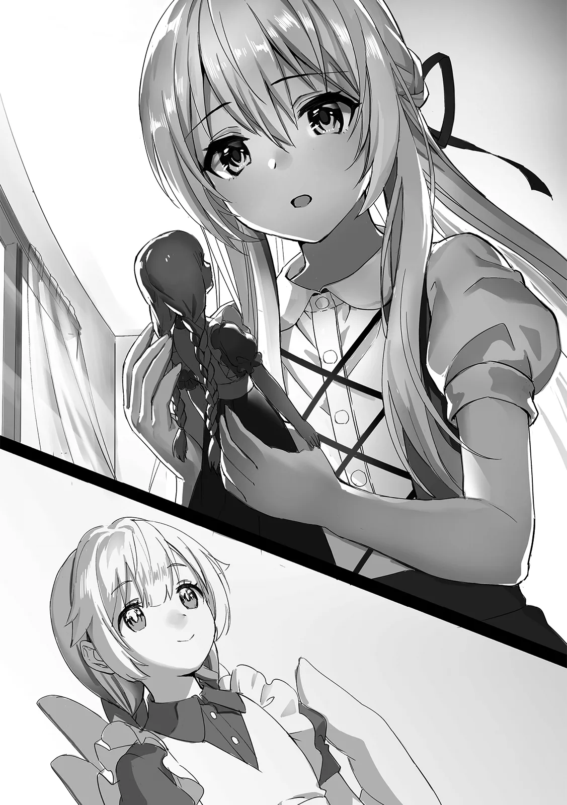

[TOC](../readme.md)&nbsp;&nbsp;&nbsp;&nbsp;&nbsp;&nbsp;[Prev](0014_Vol_2_Ch_14_Rest.md)&nbsp;&nbsp;&nbsp;&nbsp;&nbsp;&nbsp;[Next](0016_Vol_2_Ch_16_Farewell.md)

# Chapter 15 – An End and a New Beginning

A room where light did not reach, cloaked in darkness. In this chamber,
with curtains drawn tight and every window and door firmly shut, a man
sat upon a throne.

He was built with a rugged, powerful frame and possessed a terrifying,
ogre-like countenance. His pale skin and eyes that glowed a blood-red
crimson marked him clearly as a member of the demon race. Then, from out
of nowhere, as if crawling out from the shadows themselves, a woman
appeared at his side. She possessed similar red eyes, long blue hair
tied in a single ponytail that reached down to her waist, and wore a
black coat draped over her shoulders.

Tilting her head, she rested a hand on the throne where the man sat and
leaned in to speak, “Heard you ignored my warning and tried to capture
Emerald. The report just came in… sounds like it was a spectacular
failure.”

She spoke with a tone uncharacteristic of a woman, her word choice
carrying a certain abrasive edge. The man’s brow furrowed slightly but
otherwise said nothing—a minute reaction. Seeing only that, the woman
let out a dejected sigh and slumped her shoulders.

“That’s why I told you, didn’t I? Don’t look down on witches. We’ve got
mana comparable to yours. And the big boss has power even beyond your
own, got it? And Sheris, was it? No way some lowly commander of a single
squad could handle those guys.”

The woman stuck her tongue out and pointed a finger at the man in
mockery. It was a blatant provocation, but the man remained silent,
continuing to stare straight ahead with a furrowed brow as if lost in
thought. Finding no further reaction, the woman looked bored, but she
released her grip on the throne, straightened her posture, and turned
away.

“You lot are better than humans, but you still take things too lightly.
It’s only natural that witches are hated. After all, they have the power
to destroy an entire nation… That’s why the way you approach them is
what matters most.”

Though she said this, for some reason she made a circle with her
fingers, striking a pose as if begging for money. Observing the gesture,
the man remained silent as ever, resting his elbow on the armrest and
his chin on his hand. His expression seemed troubled, and he eventually
looked up at the woman.

“Can I truly trust you? Cloak, Witch of Inquiry…” The man finally asked
the question that had been weighing on him.

The woman called Cloak replied boldly with a beaming smile, “Yeah, you
bet. As long as you keep providing the funds I need for my research,
I’ll support you with everything I’ve got.”

Her name was Cloak, the Witch of Inquiry. She was one of the Seven
Witches, and one of those thought to have been buried by the Hero.
However, she had survived, just like Emerald—though by a different
means. And now, for a certain reason, she had formed a cooperative
relationship with this demon man.

“To start, that girl’s the weakest among the witches, y’know? She
specializes in healing, and her magic isn’t the offensive type. If
you’re struggling with even her, then you’ll never get your hands on the
power of the witches.”

Cloak turned on her heel, her long hair swaying as she spoke with a
mocking laugh.

This time, the man had ordered his subordinates to capture the witch
Emerald following an eyewitness report, all to obtain the power of the
witches. But the result was a failure. And to make matters worse, Cloak
had informed him that Emerald was the weakest of them all. It was enough
to cause him a measure of agitation.

“Just leave it to me. I’ll grant your wish eventually, O High and Mighty
Demon Lord¹.”

On her way out, Cloak merely spared him a glance, wearing a smirk. The
King of the Demons, the Demon Lord, felt a chill of fear at that smile.
It was a pressure so intense that even the leader of the demon race felt
dread. He felt a wave of unease, wondering if he had perhaps joined
hands with someone truly monstrous.

◇

After the battle with Emerald ended, Shatia placed the sleeping Sheris
and the others in a safe location and returned to the village with
Moffy. Moffy’s state aside, Shatia was naturally scolded by her mother;
having come home with her clothes in tatters yet again, and even injured
this time. As punishment, she was grounded for a period.

And so, Shatia stayed confined to her room, staring blankly out the
window. It seemed as if all strength had left her body. Moffy, who had
come to visit, looked at her with a surprised expression.

“Shatia? Are you okay?” She asked with concern.

“…Ah, I’m fine,” Shatia managed to at least lift her head and replied.
It appeared she wasn’t completely out of it. But she was clearly
different from the usual Shatia. She didn’t act with her usual dignity,
nor did she try to read books or show off her knowledge. Moffy’s worry
deepened.

“Oh yeah, I wonder what happened yesterday? I remember going into the
forest to look for Shatia… but I don’t remember anything after that!”

Hoping to change the subject, Moffy brought up yesterday’s incident. All
she remembered was entering the forest to chase after Shatia, whom she
thought had gone to look for the witch. It seemed she had forgotten her
encounter with Emerald, and she looked puzzled by her own hazy memories.

“You probably just dozed off again anyway. You’re such a sleepyhead,
after all.”

“Geez, there you go again! I don’t always look *that* sleepy, do I?”

Moffy puffed out her cheeks in mock anger, causing Shatia to chuckle
lightly. Because of the previous incident in the forest, Shatia had
formed a strong impression of Moffy being a sleepyhead. Since Moffy
herself had no memory of those events, she often denied it.

“But they couldn’t find the witch, and the knights even went home. I
guess it was a lie after all? That there was a witch,” Moffy voiced her
doubt while munching on a cookie. Shatia was also reluctantly nibbling
on a cookie that had been forced upon her, her jaw moving with an air of
detachment.

In the end, the knights had continued their search for the witch after
that, but they failed to find so much as a trace. For some reason, their
memories were fragmented, and they had no choice but to leave for the
time being. There was no sign of the rumored demons either, and the
ominous atmosphere had vanished as if a storm had passed. The villagers
were all left wondering about it.

What exactly had happened? The only one who knew the truth was currently
sitting with her head leaned against the window, her expression hollow
and lifeless. Her usual commanding presence had completely faded,
replaced by the aura of a quiet young girl.

She let out a solitary remark filled with regret, “It seems to have
worked… the memory manipulation…”

In a whisper so Moffy wouldn’t hear, Shatia manifested a small magic
circle in her palm. The runes within the circle moved in tiny increments
like the hands of a clock; something only Shatia could interpret.

After the battle with Emerald ended, Shatia had immediately set about
destroying the evidence. She didn’t need to worry about the demons. The
problem was the knights. Thus, Shatia had performed memory manipulation
magic. It wasn’t a magic she was particularly good at, and more
importantly, it was a dangerous magic that risked affecting the human
body, so she was reluctant to use it. However, she had no choice. To
minimize the burden, she decided to have the knights lose only a small
portion of their memories. After obscuring all the evidence, Shatia had
also performed memory manipulation on Moffy just in case before
returning to the village.

To have used forbidden magic so many times in a single day… *How
sinful*, Shatia thought, wearing a degrading, thin smile.
   
 
 
A few days later, Shatia headed to her tutor’s house for a specific
purpose. It was far too late for her to be “taught” magic, but there was
something else she wanted to know.

“A magic to create a human body? Now that is a very interesting topic.
But why do you ask such a thing?”

The tutor looked greatly surprised by Shatia’s inquiry. He closed the
book he had been reading, placed it on his desk, and sat so that he was
at the same eye level as Shatia.

“I am simply curious. I wish to know all magecraft, after all.”

“I see… However, that magic is a sacred art that even few court mages
would be knowledgeable about. For you to learn it, Shatia-chan, you
would at least have to go to the royal capital.”

Resting his chin on one hand, the tutor scratched his head thoughtfully.
It was indeed a magic that was not easily accessed, apparently unknown
even to him, a former court mage. For Shatia to learn it, she would have
to go all the way to the royal capital. It was a significant distance
from the village, and it would be a difficult journey.

“I don’t mind. I must know it, no matter what.”

“Hoh… for you to go that far.”

Seeing Shatia’s unwavering attitude, the tutor sensed there was some
underlying reason. However, since he himself was a former court mage now
living in a remote village, he didn’t pry. He stood up from his chair
and headed to a shelf, rummaging through its contents. Sheets of paper
danced and scattered into the air as he tossed aside stacks of
documents.

“…Of course, just going to the royal capital doesn’t mean you can learn
it immediately. While it might be possible for someone like you to
master it, ordinary civilians are forbidden from possessing special
magic. By the way, Shatia-chan, how old are you again?”

“I’ll be eight soon… what of it?”

The tutor warned her while still rummaging through the shelf. Shatia had
expected as much and simply watched his back in silence without
reaction. After asking the odd question about her age, he found an
envelope marked with a crest from among the countless stacks and pulled
it out carefully.

“Shatia-chan, are you interested in the magic academy in the royal
capital?” The tutor held the envelope between his fingers and asked the
question as he showed it to her.

In short, it turned out that for Shatia to learn the magic necessary to
create a human body, she would need to enroll in the magic academy in
the capital, achieve excellent grades, and gain recognition from the
court mages. It was an incredibly roundabout method. For Shatia, who had
already mastered high-level magic, life at the academy would be a
dreadfully tedious waste of time. However, she absolutely had to go. No
matter the means.

In any case, since she would need to consult with her mother, the tutor
handed Shatia the envelope containing the application forms and
important documents and sent her home, saying they would discuss it
further next time.

The tutor himself recognized Shatia’s talent and welcomed the idea of
her going to the capital. But the problem, of course, would be her
mother. It was doubtful whether Shatia’s overprotective mother would
allow her to go.
   
 
 
After returning home, Shatia went to her room and lay down on her bed.

“A school for magic, hm. What a nuisance… the way human society is
structured,” Shatia spoke wearily as she looked up at the ceiling.

To do anything, one first had to be recognized by those around them and
complete the necessary procedures. One could not simply have their way.
Because of that, she couldn’t immediately investigate what she wanted to
know most. Shatia raised her arm and clenched her fist in frustration.

“But I cannot afford to shrink back. I made a promise… that I would show
her a peaceful world,” Shatia murmured as she closed her eyes, thinking
of Emerald.

She had promised. That when she next woke up, the world would be at
peace. That was why Shatia had to make the necessary preparations. To
give her precious daughter a happy life once more, there was something
she absolutely had to do.

Shatia reached into her pocket and pulled something out. It was a doll
in the shape of a lovely girl. With golden hair and beautiful blue eyes,
the doll bore a striking resemblance to Emerald.

“Emerald…”

Shatia said her name as she gazed at the doll.

It was at that moment, when Emerald’s soul was about to vanish. Shatia
had managed at the very last second to make it possess something else.
Since it was an emergency measure and a spell cast solely to anchor the
soul, Emerald had not awakened upon possessing the small doll. However,
her soul remained inside, unharmed. That was why Shatia needed to learn
the magic necessary to create a human body—to return Emerald to her
original form so she could live her life with a pure heart once more.

Her new battle was about to begin. This time, in the central city of the
humans: the royal capital.

------------------------------------------------------------------------

TN:

¹It’s 魔王サマ, where sama is written in katakana rather than the usual
様

---
[TOC](../readme.md)&nbsp;&nbsp;&nbsp;&nbsp;&nbsp;&nbsp;[Prev](0014_Vol_2_Ch_14_Rest.md)&nbsp;&nbsp;&nbsp;&nbsp;&nbsp;&nbsp;[Next](0016_Vol_2_Ch_16_Farewell.md)

