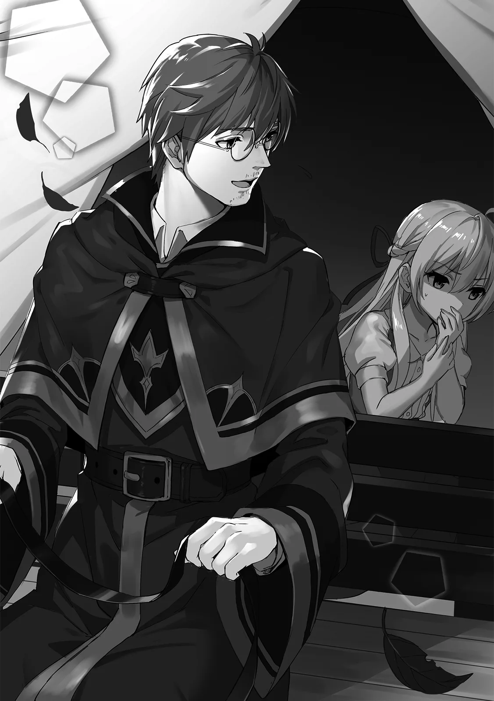

[TOC](../readme.md)&nbsp;&nbsp;&nbsp;&nbsp;&nbsp;&nbsp;[Prev](0016_Vol_2_Ch_16_Farewell.md)&nbsp;&nbsp;&nbsp;&nbsp;&nbsp;&nbsp;[Next](0018_Vol_3_Ch_18_Life_at_the_Magic_Academy.md)

# Chapter 17 – To the Royal Capital!

**Part 3: Royal Capital Magic Academy**

------------------------------------------------------------------------

Sage Vezal walked along a wind-swept cliff, his robe fluttering
violently. He pressed forward, stepping precisely along a ledge only a
few centimeters wide. His eyes held no hesitation or fear, only a
powerful will pushing him onward. Suddenly, a gust of wind erupted.
Vezal’s body swayed slightly as he clung to the cliff face. He looked up
at the heavens, his eyes widening as he beheld the cloud-shrouded sky.

“Once more… has history shifted?” He narrowed his eyes and muttered as
if perceiving an invisible truth.

He had felt it just now—the exact moment a great power stirred. Whether
it was a birth or an extinction, it was a monumental event regardless.
Such massive phenomena always influenced the world. What kind of
abnormality would this event bring? Vezal stroked his beard with a look
of unease.

“The world is indeed unsettled. Since the death of the witches, humans
have expanded their territories, and the demons have begun to move
actively… At this rate, the world will fall into ruin.”

His voice was laced with genuine dread. His arm, still stroking his
beard, was trembling, though he himself seemed not to notice.

Sages possess the ability to sense great phenomena, a trait that has
existed since ancient times. Long ago, such occurrences happened only a
few times a year, but lately, they were happening several times a month.
There were simply too many abnormalities.

“The loss of balance has caused people to be swallowed by conflict… They
do not realize it. They do not see that they are walking the path to
destruction.”

When people are consumed by something, they lose all understanding of
their own actions. Like the sensation of crossing a tightrope with
nerves focused entirely on the path, only to suddenly snap back to
reality halfway across.

The broiling conflict embodied this state of mind. They couldn’t realize
that the more they hurt others, the more they wounded themselves. When
they thrust a sword into another, they couldn’t feel the blade piercing
their own bodies. By the time they finally understood, it would be too
late.

“Eventually, the dragon will awaken… I only hope I can make it in time,”
Vezal muttered his concerns and looked up at the sky once more. It
remained covered in clouds, devoid of light, like rain could fall at any
moment. He had to hurry. Vezal pulled his hood low and began to move
again.

As foretold in prophecy; the resurrection of the witches. As destined by
fate; the awakening of the dragon… neither could be ignored. Thus, Sage
Vezal journeyed forward. To save the world.

◇

“Shatia-chan, the capital is in sight.”

Handling the reins of the carriage, Shatia’s tutor indicated toward the
city coming into view and informed Shatia, who was inside and looking
utterly listless. Her usually tidy hair had fallen in disarray, and she
wore an expression of exhaustion. There was no sign of her usual self.

In truth, after leaving the village, Shatia had fallen ill the moment
she boarded the carriage rented in a nearby town. She had been bested by
the carriage’s rocking movement. Currently, she was in a truly wretched
state, curled over and occasionally dry heaving.

Shatia slowly shifted her heavy head to look out the window. There lay a
huge city surrounded by walls. The symbol of humanity’s reign over the
continent stretched all the way to the horizon. In the center, a
structure appearing to be a castle was visible, likely the residence of
the human king. *Quite a spectacle*, Shatia thought idly.

“I had forgotten… that I am ill-suited for vehicles,” she brushed the
hair out of her face and spoke with regret. She was indeed poor with
transport. Back when she was a witch, she rarely had opportunities to
ride in such things, so the fact had slipped her mind entirely.

“Ahaha, well, it can’t be helped. Being tossed around in a carriage for
two days would make anyone feel unwell.” The tutor, still holding the
reins, pulled out a water skin and handed it to Shatia. Accepting it
with gratitude, she took a sip.

The carriage slowly descended the hill and approached a gate. The
section was built like a fortress, with sentries standing atop the
walls. Once within hailing distance, the tutor stood up and called out
to a sentry. The gate was opened immediately. Seeing their friendly
exchange, Shatia assumed they might be acquaintances.

And so, Shatia finally set foot in the royal capital. To be precise, she
was lying down in a carriage, but she had entered nonetheless. Outside,
a lively cityscape unfolded, with energetic children running about here
and there. Everyone wore bright expressions. There were people who
looked like merchants and others dressed as travelers. Shatia wanted to
observe them, but her poor physical condition limited her to merely
taking in the scenery while lying down.

Eventually, the carriage came to a stop in a quiet, secluded part of the
city. A massive mansion stood in that space. Shatia looked up at it and
let out a breath of admiration. Having spent all her time in the
village, she felt a slight sense of tension.

“Well, we’ve arrived. This is my villa. Whew, it’s been a looong time.”

“…It is quite large.”

“Well, I had plenty of money back then. There aren’t any servants, and
it’ll be a bit dusty, but please bear with it.”

The tutor spoke nostalgically while stretching his arms. To Shatia, who
would often forget to clean for a week when absorbed in reading, such a
space was actually more familiar and she found it calming. This was
where she would stay until her exam; the plan was to sleep here tonight
and take the exam tomorrow.

Inside, a spiral staircase could be seen leading to the second floor.
Suits of armor and various ornaments were displayed here and there, and
paintings hung upon the walls. Looking at them, Shatia realized anew
just how impressive a court mage truly was… though she failed to
understand the point of displaying such useless decorations.

As she walked around looking at the rooms, the tutor, who was spreading
out their luggage on a desk, called out to her, “The exam is tomorrow. I
can only accompany you part of the way, will that be alright?”

“Ahh, it is no problem. I have grasped the layout of the capital from
the map you gave me earlier,” Shatia replied. Having been told as much
prior to arriving, Shatia tapped her head with her finger. She had
already memorized the map of the capital she had seen in the carriage;
she was perfectly capable of going out alone. Thus, she felt confident.

“You’re free to use this mansion as you like. Ah, that’s right. Why
don’t you go take a look around the city after this?” The tutor
suggested.

“Umu,” Shatia rested her chin on her hand and quietly muttered to
herself, “…Indeed, this is an excellent opportunity to observe a human
city.”

While her primary goal was to learn all magic, it didn’t mean she was
entirely uninterested in human life. There were things to be gained by
observing the city, and she might even discover an interesting magic by
some chance. Either way, Shatia decided she couldn’t let this
opportunity pass.

Even if something were to arise, Shatia could easily resolve it. It was
because of this trust that the tutor felt comfortable sending Shatia
into the city alone.
   
 
 
Shatia felt no fear as she explored the city using the map in her mind.
First, she decided to scout the magic academy she was scheduled to visit
tomorrow. Enclosed by a fence, the academy stood as large as a castle.
At its peak, a massive magic-circle clock moved its hands, leaking
particles of mana as it ticked.

“Quite a flashy spell. Who exactly is chanting it? Is it perhaps a
permanent enchantment? Then, how is the mana being supplied…?”

Observing  the magical clock, Shatia sank into thought. Excited by a
magic she had never seen before, she immediately immersed herself in her
own world. However, she was soon pulled back to reality by the voices of
some nearby children. Shatia ceased her thinking and directed her
awareness toward them.

There, she saw a group of boys surrounding a small, frail-looking girl.
Judging by their uniforms, she deduced they were students of the
academy. Based on their stature, they seemed to be around the same age,
and Shatia pondered how to handle the situation.

“Laika really is pathetic~”

“How’d a failure like you even get into the academy?”

The boys were laughing mockingly as they surrounded the girl called
Laika. She appeared to possess a quiet demeanor, with wavy,
cream-colored hair that reached her shoulders and emerald-green eyes.
She was slender overall, with pale, thin limbs that looked as though
they might snap if gripped.

“….” The girl named Laika couldn’t even talk back; she clutched her own
arm as if to appear as small as possible and remained silent.

“Say something! Or should I show you how it’s done? How to use magic,”
one boy stepped forward as he made the offer, causing the others to
cackle. He raised his arm and opened his hand, and a ball of flame
appeared. It was a very small sphere, but it was still fire, so it was
dangerous nonetheless. The boy slowly moved it toward Laika. She
shivered in fear, frozen in place.

Left with no choice, Shatia decided to intervene in the bullying. She
wanted to avoid trouble since her exam was tomorrow, but she couldn’t
overlook such a scene. Following her conscience, Shatia walked up to
them, reached out toward the fire the boy was holding, and crushed it in
her bare hand.

“This is completely unacceptable. The construction of the formula is far
too sloppy. Because you omitted the incantation, the mana is unstable.
Such a dangerous thing is not meant to be brought near people.”

“…Eh!?”

The boys were stunned for two reasons. First, the sudden appearance of
Shatia, and second, the fact that the fireball had been crushed.

Shatia hadn’t extinguished it with water magic or neutralized it with a
similar fire spell. She had simply crushed the flame with her hand as if
it were nothing. From Shatia’s perspective, she had simply used her
overwhelming mana to negate his, but to the boys who didn’t know that,
it appeared unnatural. They backed away from Shatia warily.

“W-Who’re you?! Are you a friend of Laika’s…?!” One of the boys managed
to shout the question at Shatia. He seemed on guard, maintaining his
distance, though Shatia didn’t mind.

She stood in front of Laika and tilted her head in confusion, “No, I am
merely a passerby. I happened to witness a scene of bullying, so I
decided to offer a bit of input.”

The boy rebutted, “W-We aren’t bullying her! I was just teaching Laika
magic!”

“Hoh…” In response, Shatia tilted her head the other way. Her eyes were
somewhat cold, casting a rare gaze of contempt at the boy.

“To you lot, *that* is what it means to teach magic? Showing off
unstable magic at close range… If the mana had exploded by some chance,
it would have left a lifelong scar on this girl’s face. You call that
education?”

Shatia’s words were sharp. She sounded nothing like her usual self, her
voice laced with anger. The boys were unable to argue, they could only
grind their teeth in frustration and clench their fists.

Shatia’s anger stemmed from the boy’s reckless use of magic. Magic was a
special power, a dangerous ability that should only be used with proper
technique. That was why she hadn’t taught Moffy too deeply; she didn’t
want her to face danger… though she had eventually entrusted her with a
grimoire.

If the boy had accidentally increased the output this time, Laika’s face
would have been burned. If the mana had exploded, even on a small scale,
even the boys themselves wouldn’t have escaped unscathed. That was the
level of danger magic possessed.

“Guh… y-you just remember this!!”

In the end, the boys could say nothing. They grew uncomfortable and fled
the scene. Watching them leave with their parting threat, Shatia let out
a small sigh at how comical they were.

“My goodness, they could at least apologize. The youth of today have no
manners…”

Forgetting that she herself was a “youth,” Shatia let those words slip.
If possible, she would have liked to force them to apologize by shoving
their heads against the ground, but she let them go, thinking that would
cause too much trouble. Turning back to Laika, she saw the girl looking
at her while fidgeting with her fingers.

“…U-Um…Thank you for saving me… um…” Whether she was shy or if it was
just her natural personality, Laika looked down in embarrassment and
bowed to thank Shatia.

“I am Shatia. Do not pay it any mind. I simply happened to be passing
by,” Shatia said and gave her shoulder a light pat.

Laika’s shoulder trembled slightly, but she thanked her once more, her
expression appearing relieved. “U-Um, is Shatia…chan… also a student at
the academy?”

“No, not yet. It seems you are a student, Laika. Why were you being
bullied?” Shatia gave a brief denial to Laika’s question and returned
with one of her own. Since she had managed to meet a student, she
figured she might as well gather some information. Though Laika didn’t
notice, Shatia’s eyes were sparkling with a faint, curious light. 

Laika shrunk her shoulders slightly, as if a bit intimidated. Clearly
struggling to speak, she opened up bit by bit, “I, well… I’m not very
good at magic. Because of that, I can’t… get along with everyone…”

Apparently, despite being at a school for magic, Laika lacked talent,
making her a failure in her class and unable to fit in. And as seen just
now, she was subjected to “playtime” that was effectively bullying
whenever she was caught on the way home.

Since the magic academy conducted entry exams, one should at least be
able to use basic magic. For Laika to be bullied like this meant either
the academy’s level was incredibly high, or Laika was simply a poor fit.
Here, too, Shatia felt a distaste for the human tendency to overvalue
group conformity.

“Hahaha, that is quite the predicament. If one lacks aptitude for magic
at a school for magic, they would certainly be shunned.”

“Uuu… you didn’t have to be so blunt about it…”

Shatia saw no point in being somber, so she stated it plainly with a
laugh.

Bullying was absolutely wrong, but she felt there were parts of it that
were simply “the way things are.” In everything, there were things that
couldn’t be helped. Even as a witch, no matter how friendly she tried to
be with humans, she was eventually betrayed and killed. In this world,
there were walls that simply couldn’t be overcome. However, the issue
was what came after… how one dealt with that wall.

Emerald had tried to destroy the wall through revenge. That was the
method Shatia loathed most. However, she couldn’t deny it entirely.
There were parts of Emerald’s feelings she could understand. Ultimately,
the actions one takes depend on the individual.

Laika was in that pivotal moment now. Whether she would react against
the bullying or accept it and seek a new version of herself was up to
her. At least, that was how Shatia saw it.

“It cannot be helped. There are things in this world beyond our control.
What matters is what happens afterward. A person can only strive to
follow their own desires. Do you have one, Laika? Something you want to
do?”

“Something… I want to do…”

Shatia didn’t know if Laika had entered the academy of her own will, but
she was still here. Thus, Shatia guessed she had some kind of purpose.
Whether it was wanting to be a court mage or a sage in the future… Those
with a dream or goal to aim for don’t easily falter.

Shatia offered no further advice. In the first place, being lectured by
someone Laika had only just met would likely only be annoying. She would
offer minimal guidance and then respect the girl’s own will. That would
be enough, Shatia decided.

“Well then, I shall take my leave. Let us meet again soon, Laika,”
Shatia walked away with a wave of her hand.

“Eh… ah, yeah… uh, soon?”

Laika waved back, but Shatia’s final words caught her interest; she
tilted her head and repeated the words to herself.

---
[TOC](../readme.md)&nbsp;&nbsp;&nbsp;&nbsp;&nbsp;&nbsp;[Prev](0016_Vol_2_Ch_16_Farewell.md)&nbsp;&nbsp;&nbsp;&nbsp;&nbsp;&nbsp;[Next](0018_Vol_3_Ch_18_Life_at_the_Magic_Academy.md)

