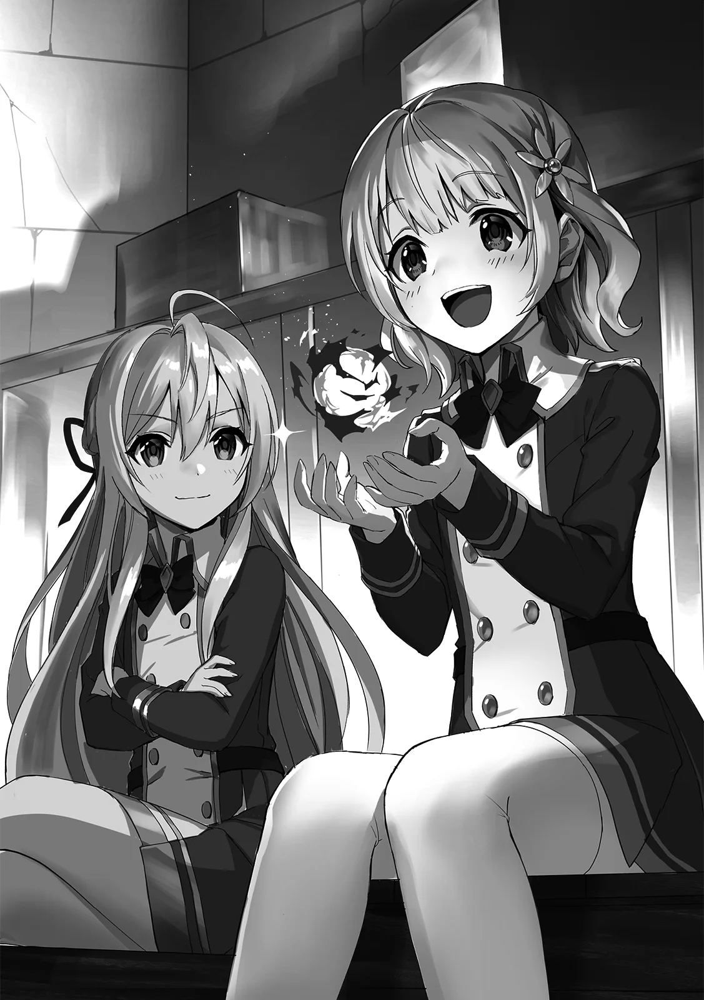

[TOC](../readme.md)&nbsp;&nbsp;&nbsp;&nbsp;&nbsp;&nbsp;[Prev](0018_Vol_3_Ch_18_Life_at_the_Magic_Academy.md)&nbsp;&nbsp;&nbsp;&nbsp;&nbsp;&nbsp;[Next](0020_Vol_3_Ch_20_Exam.md)

# Chapter 19 – Private Lessons

“Laika, we have better things to do, you can handle the cleaning by
yourself, can’t you?”

“Make sure it’s spotless! I won’t forgive you if you leave it a mess.”

As usual, in the classroom after school, the cleaning duties of the
other female classmates were dumped onto Laika. Typically, this was a
task done by a designated group, but the girls prioritized their
personal whims. Naturally, the timid girl was in no position to refuse.
She simply gripped her broom tight and nodded weakly.

Laika didn’t cry. It wasn’t that she wasn’t sad, rather, she had
resigned herself to the fact that this was just how things were. She
continued to sweep diligently, thinking the sunlight streaming through
the window was quite dazzling.

In a sense, it was an inevitability. At an academy for magic, those who
lack talent for magic are bullied. From the perspective of the elite,
the presence of someone like Laika was an eyesore. For the top-tier
students of the academy, a path to becoming a court mage is laid out
immediately upon graduation. Most students spend their days studying
with that goal in mind. In such an environment, irritation festers
easily when a failure like Laika is mixed in.

And Laika understood this. She felt both apologetic and regretful of her
own lack of power. Still without crying, she bit her lip firmly and
continued cleaning.
   
 
 
Once she finished, Laika didn’t head home but instead made her way to a
certain vacant room. Usually used as a storage space, people rarely
visited it. After confirming no one was watching, Laika gave a small
knock and entered.

“Hm? You’ve arrived. Then let us begin today’s lesson.”

Waiting there was the silver-haired girl, Shatia. She seemed to have
been reading a book while sitting gracefully atop a crate. Noticing
Laika’s arrival, she offered a small smile and closed the book.

“Sorry I’m late, Shatia-chan. The cleaning took longer than expected…”
Laika apologized for her lateness.

She cited the cleaning, but Shatia saw right through it. She let out an
exasperated sigh and looked at Laika with half-lidded eyes. “I assume it
was forced upon you again? You really should just leave them to it… You
truly are too good-natured for your own sake.”

Laika looked down in embarrassment and whispered one last “I’m sorry.”

“No matter. Let us start quickly…” Shatia cut the conversation short and
hopped down from the crate, beginning the lesson as she met Laika’s
eyes, “Today’s lesson was on the applications of fire magic, yes?” 

Laika’s secret. It was that she had been receiving tutoring from Shatia
since last week. On the day Shatia transferred in, she had abruptly
declared she would teach Laika magic. At first, Laika had been quite
bewildered, but Shatia’s teachings were very easy to understand. Laika
had even been shown magic she had never seen before. Now, they met like
this every day after school in the empty room.

“It is not that you are poor at magic, Laika. You simply do not know it.
If someone who knows nothing of fire is handed firewood and flint, they
wouldn’t know how to use them, correct? It is the same thing.”

Even when Laika struggled to understand, Shatia stayed by her side and
taught her gently. Sometimes she would demonstrate with actual spells,
and other times she would draw pictures to make it easier to grasp—she
used every method available to communicate. Every time, Laika felt
apologetic, but more than that, she felt a sense of joy.

To Laika, Shatia was her first friend. At the same time, she was a
mentor and the only person who treated her with kindness. That was why,
to be recognized by her first friend, Laika worked desperately hard.

“Now then, let us try a practical application today. Try using fire
magic, just as I taught you yesterday.”

“O-Okay…”

Following the instruction, Laika immediately thrust her arm forward and
channeled mana into her palm.

Fire magic is a fundamental art. Because it’s easy to handle and highly
versatile, it’s a spell every mage knows. Furthermore, there’s a
tendency to only be recognized as a full-fledged mage once one has
mastered fire magic, so first-year students are particularly focused on
perfecting it.

Laika closed her eyes and visualized fire intensely. That vision moulded
the essence residing in her body, transforming into mana and manifesting
as fire magic. There was no change yet. But Laika endured, desperately
continuing to pour her mana in. And then, *crackle*, a flickering spark
shed from her fingertips.

“…!”

Laika’s shoulders gave a small jolt. Just now, she had felt clearly that
something had happened. Keeping that sensation in mind, she continued to
channel mana. And finally, a small orb of fire emerged from Laika’s
palm.

“I-I did it… I did it, Shatia-chan!”

“Umu, not bad. Do not forget that sensation. Once you grasp the trick,
you should be able to handle other spells in the same manner.”

Laika was overjoyed, practically bouncing at having successfully used
magic for the first time. Shatia told her “Well done” to calm her down,
though that was mostly because she was feeling slightly anxious that the
fireball might spill over. Then, Shatia stared intently at the sphere in
her hands.

Her intuition wasn’t bad. In fact, to be able to create such a clean
fireball with only that much instruction was impressive. Shatia was now
certain that Laika simply hadn’t understood the fundamentals. She was a
girl who could succeed if she tried.
   
 
 
“Well then… let us leave it at that for today. We shall continue
tomorrow.”

“Uh-huh, I understand. Thank you, Shatia-chan.”

A short while later, Shatia ended the lesson and decided to head home
for the day. Telling Laika she had some tidying up to do, she sent her
friend ahead and walked quietly down the hallway alone. No one else
remained in the classrooms, and Shatia’s footsteps echoed throughout the
corridor.

Suddenly, shadows appeared ahead. It was several female students.

“Oh my, Shatia-chan? You were still at school this late~?”

One of the girls acted as if she had run into Shatia entirely by chance.
But Shatia saw through the lie. She had known for a while—sensing their
mana reactions—that they were lying in wait. That was why she had sent
Laika home first, making herself the target. She showed no sign of
panic, crossing her arms with a dignified air.

Shatia made up a casual lie, “Indeed, the cleaning took quite some time.
Do you have some business with me?”

“Not really, we just had some errands of our own~. But Shatia-san, were
you *really* cleaning~?” A different girl lashed out. Or rather, she
glared at Shatia while lacing her words with mockery, as if she had
already decided it was a lie. However, to Shatia, the girl’s glare
looked like nothing more than a child pretending to be an adult. It was
almost cute.

“Of course. Or is there some reason I would need to lie?” Shatia spread
her arms as she asked.

The girls continued to stare her down with displeased expressions.
Finally, the first girl stepped forward to speak, “We know, you know?
That Shatia-chan and Laika are up to something.” Finally getting to the
main point, the girls fired off their questions one after another.
“You’re doing something secret in that storage room, aren’t you? Just
tell us the truth.”

Shatia shook her head with a weary “good grief.” She could have simply
answered truthfully. She was doing nothing wrong. It wasn’t anything
that would get her in trouble with a teacher. But she knew that even if
she appealed to her own righteousness, they wouldn’t be satisfied. That
was why she pondered how to settle this peacefully.

“It is nothing in particular… We were just chatting a bit. Is that a
problem?”

In the end, Shatia chose a vague answer. There was no point in being
honest, and she felt no obligation to tell them the truth. They were
simply looking for a way to vent their pent-up stress; they weren’t
looking for a valid reason.

And upon hearing Shatia’s half-hearted response, the girls’ brows
furrowed in irritation, just as expected.

“Don’t get too ahead of yourself, okay? Just because you’re a transfer
student and a bit smart… If you didn’t have the backing of the
Extraordinary Genius Loreid, we could crush you whenever we wanted!” A
girl thrust a finger at Shatia and spat those words.

*What exactly do they intend to crush?* Shatia wondered, raising her
hands in a confused pose. “Kuku… I see, I see. ‘Crush’… is it?”

Shatia suddenly burst into laughter. Her shoulders shook as she pressed
a hand to her mouth to stifle it. Unable to understand why she was
laughing, combined with her mocking attitude, the girls grew even more
infuriated.

“What’s so funny!” One of the girls snapped back. Meanwhile, the
surrounding students grew unsettled and backed away, appearing a bit
frightened.

“No, it is nothing… I was just thinking how children who know nothing of
the world can be so pure, yet so foolish.”

Shatia allowed a tiny amount of mana to leak out. She wasn’t angry, per
se; it was a very natural, slight leakage. But that alone was enough for
the girls to feel an overwhelming pressure. Cold sweat poured from their
bodies as their knees buckled. They were enveloped in a terror unlike
anything they had ever felt, their teeth chattering.

“If I were so inclined, I could use magic to silence your mouths… but I
believe there is no meaning in that. Unless the person themselves grows,
they will never truly change,” Shatia spoke quietly.

The girls hadn’t the slightest idea what she meant, but they no longer
tried to argue. They simply crouched there, bowing their heads to Shatia
as if prostrating themselves.

Shatia slowly approached one of the girls. Terror closed in. She thought
her head might be lopped off. The pressure was so intense it invited
such gruesome imaginings. But once Shatia reached her side, the magical
pressure vanished instantly.

“Do not worry. In time, I shall turn Laika into a mage far superior to
all of you. If I do that, you will have no complaints, yes?”

“…!”

Shatia patted the girl on the shoulder and smiled. It was impossible to
tell what emotions were truly behind that expression, but the girl’s
eyes filled with tears. As Shatia walked past the girl and headed toward
the shoe lockers, she collapsed on the spot as if relieved to still be
alive. The other girls looked utterly exhausted as well.

---
[TOC](../readme.md)&nbsp;&nbsp;&nbsp;&nbsp;&nbsp;&nbsp;[Prev](0018_Vol_3_Ch_18_Life_at_the_Magic_Academy.md)&nbsp;&nbsp;&nbsp;&nbsp;&nbsp;&nbsp;[Next](0020_Vol_3_Ch_20_Exam.md)

