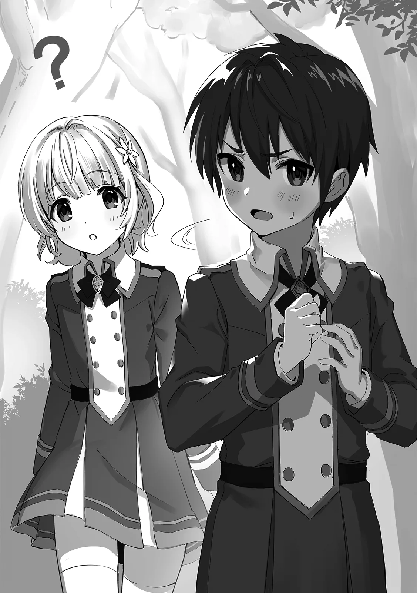

[TOC](../readme.md)&nbsp;&nbsp;&nbsp;&nbsp;&nbsp;&nbsp;[Prev](0020_Vol_3_Ch_20_Exam.md)&nbsp;&nbsp;&nbsp;&nbsp;&nbsp;&nbsp;[Next](0022_Vol_3_Ch_22_Turning_Point.md)

# Chapter 21 – Jungle Survival

Thirty minutes after the exam began, Laika was still navigating the
jungle while hiding behind rocks. Hoping to avoid any encounters with
other students, she didn’t even think about collecting extra bracelets,
simply aiming for self-preservation. However, along the way, she
stumbled into battles between students aiming for high scores and was
nearly spotted by those lying in ambush. Progress was slow, and
eventually, overcome with exhaustion, she slumped down in the shadow of
a large rock.

“Haah… haah… I can’t do it. So tired…”

Gasping for breath, Laika brushed the dirt from her cream-colored hair
and let out a small sigh. Her timid expression was weaker than ever. She
extended her thin arm and held her palm up toward the sky. It was such a
small, unreliable hand. Laika felt a deep sense of loneliness.

Looking back, she hadn’t utilized a single thing Shatia had taught her.
Even when she was attacked by that girl earlier, she had only released a
small burst of mana by reflex. If she had cast a proper spell then, she
had a good chance of winning. But Laika lacked the courage to follow
through. Biting her small lip, she pulled her legs in and hung her head.

At that moment, she heard the sound of approaching footsteps. Someone
was running. Before Laika could hide, a male student appeared through
the trees. He, too, was one of the students who frequently bullied her.

“Oh! It’s Laika. You still have your bracelet. Lucky me.” The boy’s eyes
widened in surprise when he saw she still possessed her bracelet,
whistling to himself, thinking how fortunate he was to have found her
first. He began to close in, step by step.

“…Eek!” Laika’s shoulders reflexively gave a start as she let out a
frightened cry. Her legs felt like lead again, and she stumbled
backward.

“Hey, if you don’t wanna get hurt, hand over the bracelet. I’m gonna be
the first one to reach the goal.”

He didn’t seem specifically intent on hurting her; he simply held out
his hand and demanded the bracelet. Recognizing there was no immediate
hostility, Laika’s shoulders dropped slightly in relief.

If she just gave him the bracelet here, she wouldn’t have to experience
any pain. Since he was obsessed with being first, he would likely let
her go. Laika considered handing it over, but as she reached for the
bracelet, she hesitated.

“I… I…!”

Seemingly controlled by some other will, she tried to pull her arm back.
Yet, in contrast, the arm wearing the bracelet seemed to lift itself up,
as if begging to be unburdened.

Why was she hesitating? If she just handed it over quickly, and
abandoned any thought of defiance, the danger would pass. It was the
surest way to avoid pain. Laika told herself this, but her instincts
rejected it. If she gave up the bracelet now, she truly would be a
loser. She would be wasting everything Shatia had taught her and become
an irredeemable failure.

“What are you doing? I said hand it over.”

Irritated by Laika’s hesitation, the boy stepped forward to snatch the
bracelet by force. But Laika swiped his hand away, resisting him.
Furious, the boy swung a rough fist at her. But suddenly, another
interloper burst onto the scene from the side.

“Gwah!!?”

The boy was sent flying by the sudden intruder, tumbling spectacularly
and crashing into the trees. Laika, clutching her arm in pain, looked up
to see who it was. It was Leo, his navy-blue hair a mess. He was
panting, baring his sharp teeth as he looked down at her.

“Laika! Are you okay!?”

“…Leo, kun!”

The worry in Leo’s voice was evident. At first, Laika feared she might
be bullied by him too, but seeing the situation, she let out a breath of
relief. Leo approached and checked to see if she was injured.

“*Tch*. Honestly, you really can’t do anything by yourself. That’s why
you’re always being bullied,” Leo scratched his hair. He didn’t seem
angry exactly, but he clearly had some feelings about Laika’s lack of
strength. 

“Nng… I-I’m sorry.” Laika couldn’t identify what those feelings were
exactly, but she apologized anyway and bowed her head.

“C’mon, get up. You still got your bracelet, right? Then we’re making a
break for the goal.”

Leo held out a hand. As Laika reached out to take it, Leo suddenly
turned red and pulled his hand back. He seemed to realize something and
grew flustered, scratching his head as if regretting his own action.
Laika tilted her head at the curious sequence of movements but managed
to stand up on her own.

For the time being, it seemed Leo wasn’t targeting her. Deciding this,
Laika chose to move with him. He was staying with her until the goal,
and she felt safe by his side. Her expression finally softened in
relief. But as if mocking that happiness, the boy who had been knocked
down earlier stood back up behind Leo.

“Leooo… why’re you taking the side of a failure?!” Calling Leo’s name in
a low voice, the boy twisted his neck in a crazed manner and swung his
arm to release a spell. A spear constructed of water emerged from a
magic circle and shot forward.

Leo managed to manifest a magic shield at the last second, but because
the attack was from such close range, the shield was pierced, and Leo
was blown back by the impact. Laika was caught in the wake and knocked
back as well.

“Guh… damn it! My first hit wasn’t enough. Laika, hide behind the
rock!!”

“O-Okay…!”

Avoiding the water spears piercing through the air, Leo grabbed Laika’s
hand and pulled her behind a rock. After telling her not to move, he
rolled up his sleeves and lunged out from behind the cover.
Simultaneously, he formed an orb of fire and hurled it at the boy like a
baseball.

“You think fire works against water?!”

But the boy didn’t flinch. He formed a film of water around himself,
nullifying the fireball. Leo clicked his tongue and immediately prepared
a follow-up, but before he could even throw it, it had already been
intercepted and extinguished by another water spear.

“*Tch*… damn it!”

“You might have the top grades in fire magic, but my specialty is water
magic. Too bad for you, you can’t win!”

The boy cackled with an eerie laugh and swung his arms again. This time,
spears of water erupted from the ground, one after another. Leo kicked
off the ground and jumped onto a rock to avoid them, but the spears
shattered the rock, sending Leo tumbling across the ground.

“Gugh, gah…!”

Although he hadn’t suffered a fatal wound, he was covered in scrapes
from the rock fragments. Leo coughed painfully and glared at the boy as
he scrambled to his feet. With the rock destroyed, Laika was now
exposed. Leo stood in front of her protectively.

“Ahahaha!” Seeing this, the boy let out a vulgar laugh, “What kinda whim
is this, you helping a failure?”

“Shut up… I’ve got my reasons,” Leo replied, his face contorted with
awkwardness. He stole a glance at Laika. Though Laika still didn’t
understand why he was helping her, so she just tilted her head in
confusion. There was no way he could admit he was doing this out of
stubbornness toward Shatia, so he scratched his head to calm his
irritation.

“Hmm… but it must be tough. You have to fight while protecting Laika,
but as long as I target her, you’ll just destroy yourself trying to save
her. I get two bracelets for the price of one… how lucky!”

With a murky smirk, the boy swung his arm down. A magic circle appeared
in mid-air, and a water spear emerged. Realizing what was happening, Leo
didn’t use fire; he tried to block it with a magic shield. The sound of
mana colliding echoed as the spear hit the shield with a roar. Leo swung
his arm desperately, knocking the spear aside along with his shield.

“Haa… haa…”

“Leo-kun…!”

He had blocked the attack, but he was clearly at his limit. Leo’s
shoulders slumped as he panted heavily. It seemed he had consumed a
significant amount of mana. Laika looked at him worriedly and tried to
approach, but realizing she couldn’t do anything even if she did, she
immediately pulled back her foot.

“Now, this is the end!!”

Sure of his victory, the boy’s smirk deepened as he thrust both arms
forward. A concentrated wave of water shot out. This time, Leo didn’t
use a shield; he countered with his best fire magic. Naturally, water
and fire were a poor match, and Leo’s flames were steadily pushed back.
He was holding on by sheer momentum, but it was clear he would break
soon.

“Guh! Nngghhh…!!”

Still, Leo dug his heels in and struggled. He was managing to keep the
balance at the limit through pure willpower, forcing back the
disadvantage of the elemental matchup. But eventually, his mana would
run out. When that time came, both he and Laika would be defeated and
lose their bracelets.

Laika watched the clash with a strange sense of detachment. *Why am I
just watching? Why am I not supporting Leo-kun?* Then her eyes snapped
open. Amidst the shockwaves reverberating around them, Laika stood up
and shouted, “Leo-kun!!”

*Just being protected isn’t enough. I have to help. I have to achieve
something with my own hands*. Half-unconsciously, she raised her arm.
She channeled mana into it, crafting a single spell. Then, swinging her
fist toward the ground, she activated the magic with an incantation.

“!? W-What is this…!!?”

Suddenly, the ground between Leo and the boy surged upward, and a wall
of earth burst forth. The earth wall blocked the fire and water, and
then shifted direction, lunging at the boy, swallowing him up, and
slamming him against the trees. Bound by the earth and pinned to a tree,
the boy let out a groan before slumping over unconscious.

“Haa… haa…” With all her strength gone, Laika collapsed on the ground,
breathing heavily.

Naturally, Leo was surprised. While panting, and with sweat pouring down
his face, he asked, “…L-Laika… did you do that earth wall?”

“…Y-Yeah. I think so.” Laika herself couldn’t quite process what she had
just done either. She could only nod weakly while staring at her
trembling hands.

“T-That was incredible!” Leo stood up slowly and placed a hand on
Laika’s shoulder as she knelt there. He continued with excitement, “You
could use magic that skillfully?! You… how did you… well, anyway, you
saved me, so it doesn’t matter…!”

Laika had braced herself to be scolded, but upon being showered with
praise, she blinked in surprise, her cheeks flushing red with
embarrassment.

“W-Well… anyway, let’s grab his bracelet and head for the goal. I’m out
of mana.”

“Y-You’re right… yeah.”

Leo suddenly became aware of how close he was to Laika and yanked his
hand away, turning his head bashfully. He walked over to the boy bound
by earth and removed the bracelet from his arm. After gripping it
tightly for a moment, he tossed it to Laika. Startled by the sudden
throw, Laika scrambled to catch it with both hands.

“Eh… are you sure?”

“Yeah. You did most of the work. You have the right to wear it.”

“Really?” Laika confirmed once again. She hadn’t expected to be given
the bracelet. Leo rubbed his nose and looked away bashfully as he
yielded the right to her. But Laika didn’t quite feel the same way. She
felt she had only landed a sneak attack at the end; if Leo hadn’t come,
she would have certainly lost her bracelet. She thought about giving it
back, but before she could, Leo patted her on the shoulder.

“Well, anyway… you’re surprisingly capable, Laika.”

He gave her a bright, genuine smile. Whether it was a compliment or just
a comment about the unexpectedness of it all, the words passed through
Laika like a gentle breeze. She felt as though something had finally
clicked into place.

Without a word, Laika simply nodded and fastened the bracelet to her
arm.

◇

“Well, I suppose this is enough…” Shatia muttered as she held her
seventh bracelet taken from a boy she had just defeated.

One more and she would be at her limit, but Shatia felt she could head
for the goal now. As a former witch, this combat-oriented game was far
too advantageous for her. She decided it was best not to cause any more
chaos among the students.

She proceeded slowly toward the goal. Occasionally she encountered a few
more students targeting her, but before her, they were little more than
scrap paper. She dominated the field and finally reached the end,
becoming the first to finish.

“Shatia, you are in first place. Seven bracelets… a commendable score.”

“Thank you, Professor Regis-dono.”

Professor Regis was waiting near the gate, his face as stern as ever.
Even as he praised her for being the first to finish, he remained
unwavering. It didn’t feel like much of a compliment, but Shatia bowed
and thanked him nonetheless before removing her bracelets.

She was told she could return to the classroom, but curious about the
final results, she decided to wait. Leaning against a pillar near the
exit, she waited with Professor Regis to see who would pass through the
gate next. To her surprise, the next ones to appear were Laika and Leo.

“Haa… haa… finally at the goal! How’s that? I’m first, right?”

“Leo, Laika, you two are tied for second. One bracelet and two… a
passing grade.”

“Eeehhhhh!!?”

Leo had reached the goal with a triumphant shout, but upon learning he
wasn’t first, he sank to his knees in exhaustion. Beside him, Laika was
moving her hands frantically, but noticing Shatia by the pillar, she
abandoned Leo and ran toward her.

“Shatia-chan!”

“Umu, Laika. A tie for second place is quite an achievement. And two
bracelets… you worked hard.”

Noticing that Laika had two bracelets, Shatia smiled with genuine joy
and patted her head. Laika’s face lit up with a happy smile.

In truth, Shatia was quite surprised. She had assumed that if Leo went
to help, Laika would manage to reach the goal, but she hadn’t predicted
she would actually acquire an extra bracelet. Delighted that her
expectations had been subverted in such a positive way, Shatia
acknowledged Laika’s growth.

A few minutes later, the rest of the students finally reached the goal.
Many, however, without bracelets. It seemed Shatia had been so dominant
that most of the class had fallen victim to her ruthlessness. She didn’t
think much of it, but Laika, holding her one extra bracelet, wore a
complicated expression.

“Now, the exam is over! Those who do not possess a single bracelet will
have a make-up exam at a later date. Be prepared!!”

With a final clap of his hands, Professor Regis dispelled the jungle he
had conjured in the venue and made his announcement to the losers. The
students turned pale and their shoulders slumped, as if they had been
dropped into the depths of despair.

Shatia merely watched with amusement before leaving with Laika and the
others.

---
[TOC](../readme.md)&nbsp;&nbsp;&nbsp;&nbsp;&nbsp;&nbsp;[Prev](0020_Vol_3_Ch_20_Exam.md)&nbsp;&nbsp;&nbsp;&nbsp;&nbsp;&nbsp;[Next](0022_Vol_3_Ch_22_Turning_Point.md)

