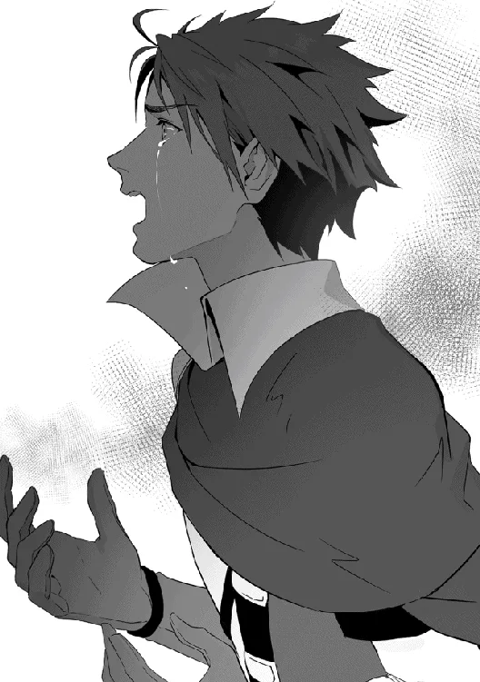

[TOC](../readme.md)&nbsp;&nbsp;&nbsp;&nbsp;&nbsp;&nbsp;[Prev](0035_Vol_4_Ch_33_Settling_Grief.md)&nbsp;&nbsp;&nbsp;&nbsp;&nbsp;&nbsp;[Next](0037_Vol_5_Ch_35_March_of_the_Lizardmen.md)

# Chapter 34: The Hero and the Twins

**Part 5: Atonement**

------------------------------------------------------------------------

A young man was walking through a wasteland. Aiming for the summit of
the hill that stretched out before him, he pressed forward with a steady
gait, though his legs occasionally faltered.

He had dull brown hair swept back, with only a few strands of his bangs
hanging down. His gaze was sharp, and for some reason, his eyes were
slightly red and swollen. His expression, too, was somewhat desolate.
Draped in a mud-stained mantle, he carried an aura about him as if he
had committed some great, unforgivable sin.

“Haah… haah…”

He must have been walking for a considerable distance, as his feet began
to drag and he eventually dropped to his knees. His shoulders heaved as
he gathered strength into his arms, steadying his breath in an attempt
to keep moving. A single bead of sweat rolled down his forehead. Wiping
it away with his arm, he took a deep breath, forced his body up, and
began to walk once more.

The path was treacherous, his footing constantly challenged by gravel
and pebbles. At times, he stumbled over protruding rocks, nearly
falling. Still, the young man didn’t stop. Even as his consciousness
grew hazy, he desperately forced his legs to trudge forward.

“Too slow! Hero, what’re you doing?! If you keep dawdling like that,
it’s gonna get dark!”

“S-Sister.. the Hero-san’s doing his best, you shouldn’t push him so
hard…”

Two girls descended from the top of the hill toward the young man.

One possessed fiery red hair tied in a side-tail on the left, her
upturned eyes giving her a strong-willed impression. The other had light
blue hair tied in a side-tail on the right; she had drooping eyes and a
reserved personality.

Both wore cute black-and-white dresses. The red-haired one hopped about,
calling the young man “Hero” while urging him to hurry. The other hid
behind her sister with a troubled expression.

“Don’t be so soft, Mimi! This guy hunted us witches for crimes we didn’t
commit! We didn’t do anything!!” The red-haired girl, Lili, scolded the
Hero with a harsh tone.

He couldn’t deny her words; he bit his lip, tormented by the truth.

He was the Hero, the champion who had subjugated every witch during the
Witch Hunt. After defeating all the witches, he had heard the words of
Shatifahl and vanished from the public eye. To confirm whether the
things he had believed in were truly right, he had decided to travel the
world while concealing his identity.

He had visited many places. Sometimes he visited the Demon Kingdom—the
enemy territory—other times the Fairy Forest, or the nations of various
other races. As a result, he learned that there was no absolute justice
in the world. Each race fought for their own version of justice, and
“evil” did not truly exist. Everyone was simply fighting to protect
their own country.

The Hero had been taught by those in the royal palace that anyone
opposing humanity was evil. He had been lied to, told that other races
were wicked beings who feasted on human flesh and sought to destroy the
world. And he was indoctrinated to believe that the most wicked of all
were the witches. He had been led to believe that if he subjugated them,
peace would come to the world. But reality was different.

Because the witches were gone, monsters that had previously been docile
began to run rampant. At times, they would awaken with enough power to
burn down an entire city, causing great disasters. Furthermore, with the
witches no longer a deterrent, the demons began to invade aggressively,
and a full-scale war was looming over the horizon.

Far from being at peace, the world was being drawn further into a vortex
of chaos. The ripples were spreading little by little, yet the humans
remained oblivious.

Therefore, to atone for the sins he had committed, the Hero was
traveling alongside the Witch Twins, Lili and Mimi.

“I’m sorry…” The Hero bowed his head in apology, a pained expression on
his face.

However, the elder sister, Lili, wouldn’t accept it. “Hmph! It’s too
late for apologies. At least we were only sealed. The others you killed…
we can never see them again,” she turned away with a sorrowful look,
marching ahead.

Left behind, younger sister, Mimi, looked back and forth between the
Hero and her sister with a troubled gaze. She then approached the
dejected Hero and spoke to him gently, “Um, please don’t let it get to
you, Hero-san… Sister and I have known for a very long time that witches
are feared by humans… So, please don’t be so sad. The ones at fault are
the people from the palace who deceived you.”

The younger twin, Mimi, encouraged the Hero with a gentle smile. The
Hero forced a smile back through an expression that looked ready to
break into tears, bowing his head in thanks. Looking a little
embarrassed, Mimi placed a hand over her mouth before hurrying after her
sister.

The Hero bit his lip so hard that blood began to flow.

No matter how much he regretted it, no matter how much he apologized, no
matter how much he atoned—as Lili said, they could never see their
fellow witches again. Unlike the twins, whom he had sealed with his
power, he had killed the others with his own hands. The reality was
suffocating. A surging sense of guilt; a sickening pain.

There was no escape. The Hero slowly straightened his body and began to
walk again.

“The next one’s the Phantasmal Bird of the Mist. Honestly, that thing
was so attached to Shatifahl and was so well-behaved back then… now it’s
a problem child and it’s destroyed multiple cities.”

“It can’t be helped… It’s a Divine Beast-level monster. Now that
Shatifahl’s gone, there’s no one left who can stop that child.”

Reaching the top of the hill, the three finally let out a sigh of relief
as they confirmed the Mist Mountains—their destination—was in sight.

The Hero’s journey of atonement. It was his task to maintain the natural
balance that had been preserved by the presence of the witches.

Until now, the Hero had journeyed by suppressing monsters that had gone
berserk after the disappearance of the witches or dealing with divine
beasts that had been released from their seals. This time, his task was
to deal with the Phantasmal Bird of the Mist, which had once been docile
and attached to the Witch of Wisdom, Shatifahl. The strength of a
monster categorized as a Divine Beast was, naturally, unfathomable.

“Come on, Hero. Let’s continue your journey of atonement,” Lili said as
she spun around to face the Hero, reaching out her hand. Mimi also gave
a small nod and glanced at him.

The Hero’s duty. His atonement to the witches. The Hero gave a firm nod
and softly gripped the hilt of the sword hanging at his waist. He would
devote his life to atoning for a sin that could never be forgiven…
forever, for all eternity.

No matter how much he begged for forgiveness, no matter how much he
tried to atone, the journey of redemption would never end.
   
 
 
In the deep darkness, the Hero recalled. Back when he was still an
official hero, traveling on the witch hunt with those he believed to be
his comrades. Such a loathsome era remained clear in his memory.

*—”Don’t screw with me! A mere human… killing* us *witches?! Like I’d
let myself be killed just for the sake of you humans’ convenience!!”*

Pierced by his blade, the blue-haired witch had screamed as she clutched
her chest and fell from the top of the tower.

He had thought she wouldn’t survive that wound regardless. Thinking so,
the Hero hadn’t delivered a finishing blow and had left that land.

Then, the darkness shifted. The next scene was another the Hero
remembered well. The Witch Twins—the very girls he was traveling with
now. One of the twins was glaring at the Hero with pure hatred.

*—”Hah? Sealing magic? Are you mocking us?! …Why’re we the only ones
being sealed! Just kill us! Just like you did when you hunted the other
witches!!”*

No matter that they were witches, he hadn’t had the courage to kill
children. Thus, the Hero used sealing magic to imprison the two girls.
He could report that they had been effectively subjugated without issue.
He told his comrades as much and left that land too.

Once more, the darkness shifted. The next scene was the one that had
shocked the Hero the most. A mansion sleeping in the depths of a thick
mist; there, the Hero had met the one who would reveal to him the truth.

*—”Realize this, Hero. Have you seen this world with your own eyes,
walked it with your own feet? Were the witches you’ve seen truly evil
existences? Were those you have cut down until now truly rebels? Are
your comrades, who are not here now, truly people worthy of your
trust?”*

Though she was on the verge of death, that woman told the Hero the
truth. She had spoken plainly of the things the Hero had been trying so
hard not to think about. In that moment, the Hero realized. He realized
that he had done something irreversible.

A never-ending atonement. A life where pain would be inflicted for all
eternity. Suddenly, the Hero felt an intense heat. A sharp pain as if he
were being burned alive from the inside. He tried to cry out in agony,
but his mouth wouldn’t move. The Hero suffered in an infinite pain from
which even death wouldn’t be granted.

“Ah, aaaaaaaaahhhhhhh!!”

The Hero woke up right then. His disheveled brown hair hung over his
eyes, drenched in sweat. Looking around, he saw they were inside the
Mist Mountains. Remembering he had been taking a rest, he wiped his
sweat and looked up. He suddenly noticed his hands were trembling. The
Hero gripped one hand with the other, his expression twisting.

“I’m sorry… I’m so sorry… I’m sorry…”

Apologies spilled naturally from his mouth. He didn’t know who they were
directed toward, but the Hero was convinced that he was an existence
that had to apologize. A lowly creature that had to apologize to
everyone. He hoped that by being so self-deprecating, the guilt within
him might fade even just a little.

Hearing a sound from ahead, the Hero looked up. There, on the other side
of the flickering campfire, was Lili, huddled close to her sister. She
narrowed her eyes as she looked down at the Hero with disdain.

“Having that dream again? The dream where you kill us…”

“…I’m sorry.”

When the Hero asked if he had woken them, Lili simply replied with a
“Not really” and turned her face away.

He didn’t know when it had started. After the Hero began this journey
and spent several nights on the road, he suddenly started having this
dream. At first, he just saw the faces of the witches. But gradually,
those images turned into gruesome, blood-stained forms, until finally,
they became the very scenes of murder recreated. Every night, the Hero
was driven by ceaseless pain, unable to get a proper night’s sleep.

“You really have a difficult personality. With nerves as thin as yours,
I’m surprised you ever managed to be a Hero,” Lili said this suddenly
while stroking the head of the sleeping Mimi.

The Hero’s expression turned complex. Lili’s words were always barbed,
intending to pierce the Hero’s heart. In fact, Lili did it
intentionally, and the Hero could offer no rebuttal.

“But that’s fine. You should just keep suffering like that. Tormented by
the sins you’ve committed…” she said with a satisfied smirk and closed
her eyes.

He really had woken her up after all. Yet, seeing that she didn’t
complain further, the Hero felt that he was pushing them too hard.

Back then, when the Hero had resolved to go on a journey of atonement,
it was all well and good to step out into the outside world, but he
hadn’t known what to do from there. Even if he wanted to beg for
forgiveness from the witches, he had already hunted them all. There was
no way and no means. Then, after much agonizing, he remembered that he
had left two alive, sealed instead. He knew that breaking the seal now
wouldn’t lead to forgiveness, but he felt he might find a path forward.
There, he set out on his journey.

And now, after being subjected to constant abuse from the elder twin,
Lili, the Hero had somehow ended up traveling with them.

Lili had told him. She said she would teach him how to atone for his
sins. To the Hero, those words were incredibly attractive. That was why
he followed her. No matter how many foul words were hurled at him, no
matter how much pain he felt, he believed that this was his salvation.

“Shatifahl… just as you said, I’ve seen various worlds with my own
eyes,” the Hero muttered softly. He wasn’t talking to anyone in
particular, just whispering into the void.

Just as the Witch of Wisdom had told him, the Hero traveled the world on
his own feet and pondered how the world worked. And he was made to
understand. Forced to face his own, no, humanity’s ignorance.

“I… I didn’t know anything about witches.”

He had been taught that witches were evil beings who threatened
humanity. Even small children were taught that in picture books.
Everyone thought that was what a witch was. But the Hero traveled the
world and realized that was wrong. A witch wasn’t something that could
be expressed so simply; they were complex existences who had known this
world since long before humans.

The Hero quietly closed his eyes. The faces of the witches flickered in
his mind. Tonight, too, sleep eluded him.

---
[TOC](../readme.md)&nbsp;&nbsp;&nbsp;&nbsp;&nbsp;&nbsp;[Prev](0035_Vol_4_Ch_33_Settling_Grief.md)&nbsp;&nbsp;&nbsp;&nbsp;&nbsp;&nbsp;[Next](0037_Vol_5_Ch_35_March_of_the_Lizardmen.md)

