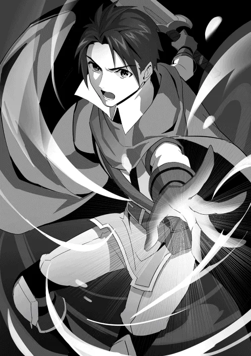

[TOC](../readme.md)&nbsp;&nbsp;&nbsp;&nbsp;&nbsp;&nbsp;[Prev](0040_Vol_5_Ch_38_Conversation.md)&nbsp;&nbsp;&nbsp;&nbsp;&nbsp;&nbsp;[Next](0042_Vol_5_Ch_40_Lament.md)

# Chapter 39: The Words of the Lizardman Chief

The Lizardmen marched forward with singular focus. To resurrect their
god, to make the world acknowledge their power, and to satisfy their own
desires—they moved their legs with desperate intensity.

They crossed rugged peaks and prepared numerous sacrifices; their
preparations were proceeding steadily. There was just one mountain left.
There, they would reach the site of the ritual. Upon arriving, they
would achieve their goal. At that thought, the Lizardmen’s steps grew
light, and the pace of their march quickened.

After several more steps, the Lizardmen felt a sense of unease. The
scenery was wrong. They were supposed to be walking toward a mountain.
If that were the case, the mountain should be right in front of them.
Yet, for some reason, a vast plain stretched out before their eyes. The
Lizardmen tilted their heads in confusion, and then they were lost for
words. For there, floating high above their heads, was the massive
mountain they were looking for.

“…Grua!?”

The Lizardman Chief, who led the tribe, let out a gasp and doubted his
own eyes. It was impossible for a mountain to float. It shouldn’t be
possible. But the sight before him insisted that it was reality. The
Lizardmen were flustered and bewildered by this overwhelming
supernatural phenomenon.

“The mountain is… floating? Could this magic be…?”

Also watching the scene, Mimi—who was bound in chains—noticed the
anomaly and sensed something. She knew of only one person capable of
causing such an impossible phenomenon. But that was out of the question.
That person no longer existed in this world. Then, who was causing the
phenomenon occurring before her eyes? Even Mimi could not reach an
answer, her mouth hanging open in daze.

“I have taken your destination. Now that you have lost your path, what
will you do next?”

A young girl’s voice echoed across the area.

When the Lizardmen searched for the source of the voice, they found a
girl floating in the sky, her beautiful silver hair fluttering in the
wind.

The Witch of Wisdom, Shatia. She sat elegantly in mid-air, looking down
on the Lizardmen. With the floating mountain at her back, she carried
herself as if she were the mastermind of it all.

“*Thunder.*“

Shatia raised one arm and swung it down with great force. Immediately
after, lightning struck near the Lizardmen. A thunderous roar resounded,
charring the ground black. The Lizardmen let out war cries, baring their
sharpened fangs as they recognized Shatia as an enemy.

Regardless, she continued to swing her arms, calling down multiple
strikes. Unable to resist the aerial bombardment, the Lizardmen chose to
scatter temporarily.

“Now. Hero, Lili,” Confirming that the Lizardmen had dispersed, Shatia
snapped her fingers as a signal. Immediately, the Hero and Lili leapt
out from between the trees, blowing away the Lizardmen guarding the
sacrifices and rescuing the demons.

“Sister!?”

“Hurry, get over here! Mimi!”

Mimi was completely bewildered, both by Lili’s sudden appearance and the
sight of the unknown girl making a mountain float. However, she was led
by her sister into the woods, and the other demons brought by the Hero
also escaped the Lizardman encirclement.

“Shatifahl!” The Hero stopped for a moment and called out Shatia’s name.

“I will buy time. Use it to take the demons to a safe place,” Shatia
replied. She released her flight magic, landed on the ground, and waved
her hand to urge them forward.

The Hero bit his lip apologetically and nodded with reluctance. He
instructed the demons to follow him and began to run. Lili and Mimi
followed behind him.
   
 
 
“…Now then.”

Confirming that everyone had evacuated, Shatia let out a small sigh. She
rolled her neck slightly and flexed her arms. Before long, the scattered
Lizardmen began to return, gathering to surround her.

“Gruaaaaaaaaaaah!!”

“Seeing so many gathered at once is quite a sight. Even for me, dealing
with all of you might be a bit of a chore,” Shatia said with a faint
smile as she looked at the gathered Lizardmen.

Though she maintained a composed attitude, it was a fact that even a
single Lizardman was strong. Together as a swarm, they exerted
tremendous power. It would be impossible for even Shatia to suppress
them all normally. Therefore, she employed a strategy.

“Well, I never intended to face you all fairly from the start.”

With a charming, sweet smile on her face, Shatia flicked her finger
downward. At that moment, a heavy, ominous sound echoed from above the
Lizardmen’s heads. Wondering what it was, they looked up to see the
mountain that had been floating until a moment ago now crashing toward
them.

As if the earth itself were convulsing, an impact sound far more
terrifying than a lightning strike roared through the area. Fortunately,
the Lizardmen who had fled quickly avoided being crushed by the natural
disaster, but many were still blown away by the resulting shockwave and
the cloud of dust.

In the midst of it all, Shatia alone had used flight magic to escape the
aftermath, leisurely observing the scene.

“I would rather not do something so violent… well, I suppose I shall
restore it all beautifully later.”

Since Shatia loved nature, she hadn’t wanted to use such magic, but this
time she had no choice but to exercise it. So, she compromised, deciding
she would restore the damaged trees and ground later.

“Gruaaaaahhhhh…!” As the dust settled, the Lizardmen who managed to
stand let out roars and faced Shatia. Every one of them was heightening
their fighting spirit to defeat this anomalous girl.

She turned her gaze back to them, “Hoh, quite a few of you left.”

Under that pressure, she let out a small breath, relaxed her shoulders,
and thrust one hand forward.

“Come.”

The moment she spoke, the Lizardmen lunged at Shatia all at once. Claws
gleaming and fangs bared, they attempted to overwhelm her with their raw
strength. Shatia intercepted all of it with a barrier, immediately
following up by firing spheres of light to blow the Lizardmen back.
However, the Lizardmen also used trees as footholds to attack from
above, trying to catch Shatia off guard. Shatia instantly pointed her
hand at those Lizardmen, releasing magical chains to bind them and slam
them into the ground.

“What is the matter? Is that all you have?”

Shatia gave a deliberate, mocking smirk. Even if the words didn’t
translate, the Lizardmen understood it was a provocation. With an
exceptionally loud roar, they leaped at her. Thick Lizardman arms swung
with the intent of crushing their enemy. She dodged by rotating backward
with flight magic and blew away an incoming tail swipe with a mana
pulse. Taking the impact, the Lizardman collapsed to the ground,
unconscious.

Unsurprisingly, seeing their comrades falling one after another, the
Lizardmen seemed to be struck by fear despite possessing overwhelming
numbers, and their attacks momentarily ceased. Even though Shatia was
the one surrounded, it looked as if she were the one on the hunt.

“…Hm?”

Shatia suddenly noticed an anomaly. A portion of the surrounding
Lizardmen parted, and from there, a single giant Lizardman emerged. He
was several times larger than the child-sized Shatia and boasted a
physique far more robust than the other Lizardmen. Shatia immediately
deduced that this was the Lizardman Chief. His body was covered in
numerous scars, and his scales were uniquely sharp. His build was closer
to that of a dragon, and his tail was twice as long as the others.

“Rrra…”

“The Lizardman Chief, I see… You have a magnificent form.”

Perhaps because he was the chief and possessed wisdom, he did not attack
Shatia immediately. He let out a low growl, staring at Shatia, sizing
her up.

“Human… for a… lower race… you use… quite interesting… techniques…”

“Hoh, so you understand speech. As expected of a chief, you are
intelligent.”

The Lizardman Chief vibrated his throat, speaking to Shatia in a low
voice. Though his words were interspersed with growls and difficult to
hear, they were perfectly understandable to Shatia. She lowered her arm,
landed on the ground, and listened.

“You have… likely realized by now… we intend to… awaken the dragon…”

Waving his arm and pointing toward the mountain, the Lizardman Chief
spoke of his goal. As Shatia had predicted, they intended to resurrect
the dragon, and she showed no reaction. She listened quietly to the
Chief’s words.

“But… we do not… intend to bow… to the dragon… we intend… to rule it…!”

“Hoh, so rather than saving your god, you intend to exploit it.”

Shatia placed a hand to her mouth with interest upon hearing the Chief’s
tale. It would be normal to resurrect a dragon to liberate one’s god,
but to rule it was a greedy proposition indeed. In the first place,
Lizardmen were beings created by the dragon. To think of utilizing their
own creator god was an act of extreme arrogance. Yet Shatia did not look
displeased; instead, her lips curled into an amused smile.

“True, we are… beings born of the dragon… but we are not its servants!
…We Dragonkin… will be, the rulers of the world…!” The Lizardman Chief
declared as he clenched his fist tightly and showed it to Shatia. Though
his words showed his lack of practice with the language, his will was
strong, and Shatia could sense a firm purpose. They truly intended to
surpass the existence of the dragon and stand at the apex of the world.

“A terrifyingly arrogant tale. To me, it looks like nothing more than
children working desperately to surpass their parent.”

“We are… not children! …Dragonkin!! …The sacred race!!”

This time, the Lizardman Chief bared his fangs and insisted. His voice
was laced with anger; he seemed to loathe being treated as a subordinate
of the dragon.

“Dragonkin… are the strongest race! …Higher than humans… higher than
demons… even higher than those witches!!”

“Oho… Higher than witches.”

The moment the Lizardman mentioned being better than witches, Shatia
narrowed her eyes. It wasn’t that she felt insulted at being looked down
upon. Rather, she was impressed by the depth of the Dragonkin’s
greed—that they did not fear witches as abhorrent, but treated them as
inferiors.

“Yes…! Before, when we… tried to invade… the fairy lands… they
interfered… but those witches… are gone now… it is our era!”

The witches and the dragonkin had once clashed in the past. At that
time, the dragonkin were suppressed and forced to retreat. Remembering
that time, Shatia let out a small, resigned “Ah.”

“You… how about it? You are strong… for a human… I could… specifically
make you… my subordinate…?”

The Lizardman Chief tilted his neck significantly and reached out a
large hand toward Shatia. However, Shatia looked down and fell silent.
Her face was hidden by her hair, making it impossible to read her
expression. Eventually, she slowly raised her head and gave her answer
to the Chief.

“I apologize… but I must decline,” she declared with a pure, refreshing
smile. Her eyes stared straight at the Lizardman Chief, filled with a
firm will that she had no intention of changing her answer.

“For you see, I am the Witch of Wisdom.”

The moment Shatia said this, she swept her hand. At that instant, the
surrounding shadows made a squelching sound and began to writhe,
creating a vortex around Shatia. The malevolence of it was like a
darkness inviting one to hell, and the Lizardmen felt an indescribable
terror.

Shatia simply smiled quietly. With a relaxed expression, she gently held
her hand over the darkness.

◇

The Hero, Lili, and Mimi were running through the forest with the
liberated demons. No matter how much commotion Shatia stirred, there was
no way all the Lizardmen would quietly let the sacrifices escape. In
fact, several were closing in, kicking off trees as the Hero’s group was
fleeing desperately.

Mimi questioned her sister while they were running, “Sister! That girl
from earlier…!”

Despite being pressed for time, Lili gave a brief explanation, knowing
how important it was for her sister, “Ugh, geez! It’s pretty much what
you’re imagining! That’s Shatifahl!!”

Mimi had predicted it to some extent, but hearing that the silver-haired
girl was Shatifahl from Lili confirmed her suspicions.

Lili then glanced back. As they had directed them, the demons were
following, and the Lizardmen were pursuing from behind. There were about
five of them. Compared to an army, the number was small, but for
them—who couldn’t use magic properly—and the half-baked Hero, Lili
judged it to be a difficult number to handle.

She pointed out, “Gimme a break… Hero! They’re catching up!”

“I know…!” The Hero replied that he was aware and quickened his pace. He
placed his hand on the sword at his waist, furrowing his brow in
thought. Then, making his decision, he drew his blade and stopped in his
tracks.

“Lili, I’m counting on you to take care of the demons!”

The Hero entrusted the task of guiding everyone safely to Lili, urged
the passing demons to hurry, and turned to face their pursuers. The
Lizardmen didn’t slow down, leaping at the Hero and lashing out with
their claws. He swung his sword to parry, forcing the first Lizardman to
pull back.

“Gruaaaaahhhhh!!”

“Haaah!!”

Immediately after, a second Lizardman leaped at the Hero, pinning him to
the ground. A mouth closed in, lined with sharp fangs opened wide to
devour him. However, the Hero managed to use the hilt of his sword to
strike the Lizardman’s face and, in that fleeting opening, kicked him
away and stood up.

“Guaaaarululu!!”

The moment he regained his posture, a third attacked from behind. The
Hero fought back with his sword, but a fourth Lizardman also joined the
fray, pushing him into a corner. He gradually retreated, managing to
swing his sword and block the Lizardmen’s attacks. Then, in desperation,
he channeled mana into his fingertips and released it.

“I command in the name of the Hero—O light, rend them asunder!”

The moment the incantation was spoken, countless rays of light burst
from the Hero’s fingertips. The Lizardmen were caught in the light and
blown away toward the forest, spinning violently. However, for some
reason, the Hero was also blown backward, falling on his rear. His arm
trembled and turned numb, and he inadvertently dropped his sword.

“Guh… ugh…!” He bit his lip in regret as he endured the pain traveling
through his arm.

As he had expected, his magic didn’t activate correctly. Magic was
manifested by the user’s mental image. However, the Hero couldn’t
properly manifest his despite the clear image in his mind. This was due
to harboring a subconscious guilt in his heart, resulting in a backlash.

“I knew it… it’s not working right.”

Confirming that the pain had subsided and his arm could move once more,
the Hero picked up his sword. Then, he turned his eyes to the last
remaining Lizardman. This one was different from the others; a slender
individual wearing a feathered hat. He gripped a spear in his hand,
exuding an aura clearly superior from that of the previous opponents.

“Rrrr…!”

“The feathered hat… the ‘Gale’ Lizardman Shatifahl mentioned.”

Since he had heard from Shatia that there was a Lizardman who controlled
the wind, the Hero immediately recognized the Lizardman before him as
that individual. The Gale Lizardman gripped his spear tightly, taking a
stance with a low growl. Simultaneously, the Hero took his stance with
his sword, and the two stared each other down in silence.

“Come… even if I die, I will not allow you past this point,” the Hero
declared firmly, his sword leveled. Though the words didn’t translate,
the Gale Lizardman understood from the Hero’s resolve that he had no
intention of letting him pass and let out a small growl in
acknowledgement.

The Lizardman moved his foot forward slightly. In response, the Hero
adjusted his footing and held his sword low, ready to respond to any
attack.

A faint sound of the rustling of the trees. The moment the wind stopped,
the Gale Lizardman leaped with great force and lunged at the Hero.

---
[TOC](../readme.md)&nbsp;&nbsp;&nbsp;&nbsp;&nbsp;&nbsp;[Prev](0040_Vol_5_Ch_38_Conversation.md)&nbsp;&nbsp;&nbsp;&nbsp;&nbsp;&nbsp;[Next](0042_Vol_5_Ch_40_Lament.md)

