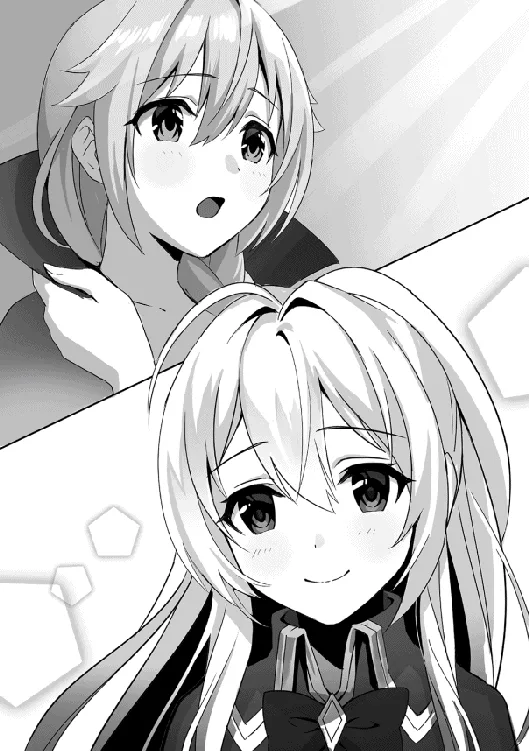

[TOC](../readme.md)&nbsp;&nbsp;&nbsp;&nbsp;&nbsp;&nbsp;[Prev](0042_Vol_5_Ch_40_Lament.md)&nbsp;&nbsp;&nbsp;&nbsp;&nbsp;&nbsp;[Next](0044_Vol_6_Ch_42_Return_to_the_Royal_Capital.md)

# Chapter 41: O Hero

The gale danced. Every time the spear was swung, a gust of wind erupted,
carving into the surroundings as it swept everything up in its path.

The Hero let out a short breath. Because of the swirling winds, he
couldn’t even manage to steady his breathing. However, he remained calm,
maintaining his composure as he quietly leveled his sword. Riding the
wind, the Gale Lizardman charged, swinging its spear downward. At the
moment of intersection, the Hero parried the blow with his blade and
thrust into a gap between the Lizardman’s scales.

“Rugua…!”

“…Hmph!”

A momentary clash—in that split second, an exchange of offense and
defense occurred. The Lizardman was wounded, and the Hero narrowly
escaped death. It was a dangerous gamble where a single mistake would
mean losing his head. For the Hero fighting in close quarters against a
Lizardman, each and every move had to be calculated precisely. The
tension of knowing he might be the one struck down next ate away at him.

“Gorua!!”

The Lizardman let out a roar. He bellowed loudly as if his wounds were
nothing, taking a threatening stance against the Hero. Thrusting his
spear, baring his fangs, mouth wide open as if ready to pounce at any
moment. The Hero never wavered, simply holding his sword in a relaxed
stance. For the current Hero, who could not use magic, this was all he
could do. Merely readying his sword, and if the enemy approached, cut
it. That was it. The Hero sharpened all his senses for that one move.

“GOAAAAAAAAAAAAAA!”

With a piercing roar, the Lizardman leaped. He was faster than before.
His spear extended straight, closing in right before the Hero’s eyes. At
the very last second, the Hero dodged, swinging his sword as he passed
by. This time, however, the Lizardman reacted; before the Hero could
finish his swing, he grabbed his arm, forcibly stopping his movement.
Gripped by the Lizardman’s staggering strength, the Hero let out a
groan. However, he immediately shifted his weight to deliver a kick,
staggering the Lizardman in return.

“Haah!”

He attempted to swing his sword down, but the Lizardman swung his tail,
slamming the Hero into the ground. Intense pain radiated through his
entire body, causing him to cough up blood. He thought he heard an
unsettling sound from around his stomach, but he ignored it, pushing
himself up and immediately putting distance between them. At that same
moment, the Lizardman’s spear pierced the spot where the Hero had been
lying just a second earlier, and the Hero’s face turned pale. Cold sweat
poured down his forehead.

“Haah… haah… This is tough…” Wiping the sweat with one hand, the Hero
spat out the blood pooling in his mouth.

As expected, this Lizardman wearing the feathered hat was different from
the others. He didn’t just fight with brute force; he handled his spear
skillfully, manipulated the wind, and attacked with confidence. A
dangerous opponent whose every movement was designed to take a life,
much like an assassin.

“Grrr…” The Lizardman suddenly let out a low growl while pointing his
spear at the Hero. His attitude seemed to be telling the Hero to just
admit defeat.

Seeing that, the Hero’s lips twitched involuntarily. He covered his
mouth with his hand to suppress it, “What…? Telling me to give up
already?”

*True… if I give up here, it might become easier…* He found himself
thinking such a thing in his heart.

He was currently severely injured. Furthermore, he was in a situation
where he couldn’t use his full power. If he had to fight while suffering
like this, wouldn’t he be happier if he just admitted defeat? He
pondered. But the moment that thought crossed his mind, for some reason,
the image of Lili’s angry face appeared in his head.

*Ah… but… that wouldn’t do, would it?*

Tightening his grip on his sword, the Hero changed his mind. He regained
his stance and faced the Lizardman. In his eyes, which had been weak
until a moment ago, there was no longer any hesitation.

“To tell the truth, I believe I’m someone who shouldn’t be allowed to
live… since I hunted innocent witches just to gain honor…” The Hero
suddenly started speaking with a self-deprecating smile. Naturally, the
Lizardman, who couldn’t understand the words, tilted his head, his
expression turning grim.

“But even so, if I die, it would be running away… I’d be turning my eyes
away from my sins, from my mistakes. A certain girl taught me that. She
told me I have to continue living while suffering…” The Hero said this
while placing a hand over his heart, a somewhat peaceful expression
appearing on his face.

Usually, his eyes were red and swollen and his expression lifeless, but
now he had a serene look, like a child falling into a peaceful sleep.
Even the Lizardman, who couldn’t understand the language, realized the
Hero was behaving strangely and lowered his spear, heightening his
vigilance.

The Hero gently lowered his arm. A powerful light was lit in his eyes.

“So, I’m sorry. I can’t just die here and take the easy way out.”

The Hero kicked off the ground and ran toward the Lizardman with
blinding speed. Reacting reflexively, the Lizardman also lunged,
thrusting his spear. The Hero’s body was pierced—or so it seemed, but it
only tore his clothes; the Hero had dodged by a hair’s breadth. As they
passed each other, the Hero swung his sword, slashing the Lizardman’s
body. A shriek could be heard alongside a spray of blood, and he dropped
his spear, standing frozen on the spot.

“…………!!!”

The Hero dropped to one knee, exhaling a long breath. Massive amounts of
sweat poured from his forehead, revealing his exhaustion. The Lizardman
was also breaking out in an unsettling sweat, his body convulsing.
Finally, as if he had no more to give, the Lizardman collapsed on the
spot, unable to stand again.

“Haah… haah…”

“You look exhausted.”

As the Hero struggled for breath, a familiar voice called out from in
front of him. Looking up, he saw Shatia holding out a hand. The Hero
wasn’t even surprised by her appearance; he simply thanked her, took her
hand, and stood up. Once she helped him to his feet, Shatia patted his
arm and hurried over to the fallen Lizardman. She checked his condition,
applied a simple healing spell, and then stepped away.

“Where are Lili and Mimi?” She asked.

The Hero answered, “They went ahead with the demons…” He then posed his
own question out of curiosity, “What happened to the Lizardman Chief?” 

Since Shatia had returned, he could guess the plan had been successfully
achieved. However, he was curious about what had happened to the
Lizardman Chief as a result. He received a simple response in return—

“It is over. All of it.” She didn’t intend to say any more, placing a
hand to her chin as if deep in thought before muttering ominously, “Hmm…
yes, perhaps this is… just as I thought.”

Shatia stared intently at the Hero’s body. Her eyes seemed to be looking
at him, yet at the same time looking somewhere else entirely, her
strange gaze making the Hero feel quite unsettled. Then, she gave a firm
nod and stepped toward him.

With a fearful look, the Hero asked, “D-Did something happen?”

Shatia then declared something unbelievable: “Yes. It is likely as I
suspected. Hero, with your assistance, we might be able to resurrect
Emerald.”

For some reason, her face held an odd certainty.

“What do you mean by that…?”

“For now, let us regroup with Lili and Mimi. We will need to make the
necessary preparations.”

He wanted to ask for details, but Shatia decided that meeting up with
the others was the first priority, and the Hero agreed that she was
right. The two of them passed by the unconscious Lizardman as they left.
   
 
 
By the time they met up with Lili and Mimi, the two had already finished
delivering the demons back to their original village. Shatia explained
the situation and moved to the cave she had been using as a dwelling.
There, she collected materials and began to draw a magic circle on the
ground outside.

“…So, is it true? That you can resurrect Emerald?” Lili asked while
watching Shatia move. She was sitting on a rock, swinging her legs back
and forth with a bored expression. 

Next to her, Mimi was staring at Shatia with an anxious look. Between
meeting Shatifahl, who was like a mother to her, and the worry over
whether the ritual would succeed, she seemed to be feeling very
conflicted.

“With high probability. Her soul is here. If we create a physical
vessel, we can easily bring her back. Though the method for that is
rather convoluted. If I recall correctly, the grimoire stated that the
body must be constructed with holy magic… At first, I interpreted this
to mean injecting a massive amount of mana, but actually, that is not
it. It refers to the magic of light,” Shatia answered, holding up one
finger.

Lili and Mimi didn’t quite understand, both tilting their heads in the
same direction. Shatia slowly shifted her gaze to the Hero. “In other
words, I mean you. Hero,” she said, pointing her finger at the Hero.

The Hero swallowed hard in nervousness, staring fixedly at her finger,
“My… power as a Hero.”

“Yes. Your mana, as one chosen to be a Hero, is special. This magic
exists specially for you to use. Regrettable as that may be.”

Mana possessed particular qualities. Just as witches could handle magic
meant only for witches, the type of mana for magic differed depending on
the race. Because of that, there were spells that couldn’t be used
depending on the circumstances. This time, it was a special magic that
only a Hero could use, and Shatia wore a frustrated expression because
of this restriction.

“But… I…” The Hero trailed off, looking down.

At that sight, Lili let out an exasperated sigh, and Shatia nodded,
finishing his sentence for him, “Indeed, you cannot use magic normally
because of your guilt…”

Because the Hero blamed himself, he couldn’t handle magic. Even if he
could, it would result in backlash. So in the end, he couldn’t handle
magic normally. If he tried to perform the ritual in such a state, there
was a danger he might summon something like the evil spirit from before.

However, Shatia’s eyes remained fixed straight on the Hero as she
continued, “But listen, Hero. If you truly feel guilt, your magic should
activate normally.”

“…Huh?” The Hero wore a blank, dim-witted expression.

Lili, who had been sitting and listening, also looked like she didn’t
follow. However, Mimi alone looked unsettled, as if she had sensed
something foreboding.

Shatia placed a hand to her mouth, wearing an intimidating smile as if
she were playing a prank. She spoke provocatively, “This ritual is a
magic to resurrect Emerald. If so, your heart should naturally desire to
save her. After all, you feel guilt. Or is your heart telling a lie?”

“That’s not—!!” The Hero tried to argue back, but the words got stuck
halfway, and he fell silent. He didn’t have the confidence to state it
for certain. Indeed, as Shatia said, if he truly felt guilty, he should
try to resurrect Emerald in order to beg for forgiveness. Trying to save
a witch meant trying to atone for his sins. If so, his heart shouldn’t
trigger any backlash as punishment.

“This is the moment of truth, Hero. If you cannot resurrect Emerald, it
means you have been lying. It means you were merely trying to escape
from your suffering by playing the role of a sinner.”

For some reason, the Hero felt as if Shatia’s words were coming out of
his own mouth. A strange sensation, as if he were being blamed by
himself. Perhaps what Shatia was saying was his true feelings. In order
to escape his sin, he was acting out the role of a person who suffers.
Maybe he was that kind of despicable person. He felt as if he were about
to collapse on the spot.

But at that moment, someone grabbed his hand.

“That’s wrong! The Hero-san is a kind-hearted person. Shatifahl, please
don’t bully the Hero-san too much.”

“…Mimi-chan.”

“Hmm?”

It was Mimi. At some point, she had moved from beside Lili toward the
Hero, and Lili seemed to be making some sort of fuss about the physical
contact between the two. But the Hero paid no mind to it, feeling the
warmth of Mimi’s hand through his arm.

“Oho… hmm, I see… Kuku, interesting,” Shatia was muttering something
while tilting her head, as if sizing something up. But the meaning was
known only to her, and in the end, she just nodded and said nothing.

Mimi pulled the Hero’s arm. Following the pull, the Hero looked down to
find Mimi’s face right beside him. Her round eyes looked directly at
him. They were quiet, kind eyes, as if conveying she understood
everything.

“Hero-san, I believe in you… because…”

Mimi seemed to want to say something, nervously toying with her fingers
as if embarrassed. But she cut off her words, only telling him for
certain that she believed in him. But that was enough. The Hero planted
his feet firmly on the ground that had felt unstable until a moment ago.
That’s right. He just had to do what he thought was right. Not to be
tossed around by his heart, but to follow it. The Hero made his
decision.

A clap rang out. Shatia had slapped the magic circle drawn on the ground
with one hand.

“In any case, Hero, you have no choice but to do it.”

“Yes… I won’t run away anymore.”

The Hero approached Shatia and sat down. He lowered his hand to the part
of the magic circle where Shatia was placing hers, and she pulled her
hand away. Then, the doll containing Emerald’s soul was placed there.
All that was left was to inject mana. Steeling his nerves inside his
body, the Hero poured all his strength into his palm.

A dazzling light was released, and the magic circle began to glow. A
shockwave erupted, the surrounding trees began to sway. Lili and Mimi
kept their distance, while Shatia watched the situation from right
beside the Hero. Though he was nearly blown away, the Hero clung to the
ground and continued to inject mana. Finally, a particularly brilliant
flash was released, and a thunderous roar echoed through the
surroundings.

When the light subsided, a blonde girl was lying face down on the magic
circle. She had skin as beautiful as a doll’s and features that were
perfectly arranged. She was a bit shorter than before, giving her a more
youthful appearance, but it was nevertheless the form of Emerald that
Shatia knew well.

“…Ngh… ah…”

The fallen Emerald woke up and raised her head, looking around with her
blue eyes. She didn’t seem to understand the situation, trying to say
something with a sluggish tongue.

“Where… is this…?”

Spotting the Hero, Emerald wore a bewildered expression. Lili and Mimi,
who had been hiding in the back, also peeked their heads out, looking
unsure of what to do. Among them, the one most troubled was the Hero. It
was good that the magic was a success, but when he finally found himself
facing Emerald, he no longer knew what to say.

In a situation where everyone was paralyzed, Shatia alone took a step
forward, draped a prepared cloth robe over the girl, and offered a
gentle smile.

“Welcome back, Emerald. Was your long sleep comfortable?”

“Shatifahl…?”

When Shatia spoke to her, Emerald seemed to recognize her at least. Her
eyes widened, her mouth opening and closing for a while, and after
looking around once more and finding the magic circle beneath her, she
nodded as if she understood. Then, she slowly raised her body and,
though unsteady, stood up and looked up at the sky with a hollow gaze.

“Ah… I see… I have been asleep for quite a long time, haven’t I…?”

Nearly faltering, Emerald regained her balance with Shatia’s help. Then,
she shifted her gaze toward the Hero standing before her. The Hero met
her gaze, his shoulders trembling, but he didn’t try to run away.

“It has been a long time since I last saw your face… though I never
wished to see it again,” Emerald said coldly, directing a sharp gaze at
the Hero.

It was only natural. To Emerald, the Hero was the very person who had
destroyed her world. Because of him, she had been betrayed by the
townspeople and cast into the depths of despair. It was a resentment
that ran especially deep precisely because the original Emerald had been
so pure.

“…I know that apologizing for what happened then won’t make you forgive
me. It’s only natural for you to resent me. So, whatever you do to me,
that is your right.”

The Hero understood this and was prepared for any punishment. He raised
his hands to signify that he would not resist. Mimi looked at the Hero
with concern.

“…Hah, what would killing you now change?”

“…..”

“…I, too, have committed many sins since then… Sins do not vanish so
easily… even if one were to die…” She said with a self-deprecating
smile, averting her eyes from the Hero.

She, too, had taken many human lives after falling into despair. Thieves
and bandits. All were beings seen as evil, but that didn’t change the
fact that she had taken lives. Emerald stared sadly at her own hands.

“Emerald!” Mimi could no longer stay quiet, finally jumping out and
speaking up in defense of the Hero, “The Hero-san helped to resurrect
you. The reason you could come back is…”

But Emerald already knew. She smiled nostalgically as she looked at Lili
and Mimi, “I know, Mimi. It has been a long time since I saw you twins’
faces too…”

Then, she shifted her gaze back to the Hero, this time directing not a
sharp gaze, but a lonely, hollow look, as if she had given up on
something.

“…I will not hate you. But I will not forgive you either… Looking at
your battered state now, I can tell what kind of life you have been
living since then.”

Emerald saw right through the life the Hero was currently leading. His
mana was a mess. His eyes were red and swollen, with dark circles under
them. Most of all, looking at that haggard face, the perceptive Emerald
knew immediately. That the Hero, too, had fallen into despair.

“So, by all means, please live while suffering,” she made her verdict
and turned away.

“…I’m truly sorry…!” The Hero bowed his head and apologized. His
expression couldn’t be seen, but perhaps he was crying. Looking at his
trembling, Shatia let out a small sigh and patted the Hero’s back. Lili
and Mimi also approached; Lili said something harsh as usual, while Mimi
offered kind words.
   
 
 
After that, they explained the current situation to Emerald, with Mimi
once again emphasizing what the Hero was doing now. Then, after changing
her clothes and putting on her usual black robe, Emerald turned to
Shatia.

“So, what is Shatifahl doing now?”

“Well, I am currently pursuing the mastery of magic. It seems Lili and
Mimi will be going along with the Hero’s journey, so we shall be parting
ways here.”

The Hero intended to continue his journey of atonement as before, and it
seemed Lili and Mimi intended to accompany him. That meant Shatia would
be parting with them once again. Her goal was to discover the mysteries
of magic. That was her current goal after obtaining a second life.

“For now, I suppose I shall return to the royal capital. There is much
for me to do.”

Now that she had resolved her business with the demon kingdom and
Emerald had been resurrected, she intended to return to the royal
capital for a while to resume her initial goal. There was also the
matter of Loreid, who was still under her spell, and the capital was
most convenient for pursuing her interests.

Standing beside Shatia with her hands clasped behind her back, Emerald
mumbled awkwardly, “In that case… would you allow me to accompany you as
well?”

“Hoh?” At the unexpected proposal, Shatia asked while placing a finger
to her lips with interest, “There are many humans in the capital. Are
you sure?”

Emerald had been betrayed by humans. While she no longer felt the desire
for revenge against the Hero, surely her wounded heart had not yet
completely healed. Would she be alright going to a place with many
people in that state? Shatia looked at Emerald as if testing her.

“Of course, I still feel resentment… These feelings won’t vanish so
easily… but I don’t think I can stay like this either… and…” Emerald
muttered, trailing off.

She was likely thinking about various things in her own way. It would be
difficult to trust humans again, but she also knew that if she let
herself be consumed by revenge like before, only destruction would
await. That was why she felt she couldn’t stay the way she was and
concluded that she had to take some kind of action.

She continued while staring back at Shatia with her blue eyes and a
child-like expression, “I want to be by Shatifahl’s side again… Is that
not allowed?”

It was a look reminiscent of when she was still pure.

With a slightly lonely look, Shatia smiled and accepted, “Ah, of course,
I do not mind.”

If Emerald wished for it, she would accept. This time, she would watch
over her carefully so that she wouldn’t stray from her path. Making that
resolve in her heart, Shatia turned her mind back to the Hero and the
others preparing for their journey.

> ## Translator Note
>
> Falling for the guy who cut down your whole family tsk tsk

---
[TOC](../readme.md)&nbsp;&nbsp;&nbsp;&nbsp;&nbsp;&nbsp;[Prev](0042_Vol_5_Ch_40_Lament.md)&nbsp;&nbsp;&nbsp;&nbsp;&nbsp;&nbsp;[Next](0044_Vol_6_Ch_42_Return_to_the_Royal_Capital.md)

