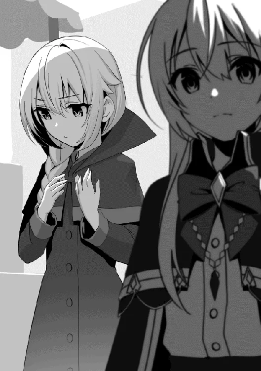

[TOC](../readme.md)&nbsp;&nbsp;&nbsp;&nbsp;&nbsp;&nbsp;[Prev](0043_Vol_5_Ch_41_O_Hero.md)&nbsp;&nbsp;&nbsp;&nbsp;&nbsp;&nbsp;[Next](0045_Vol_6_Ch_43_Nostalgic_Mansion.md)

# Chapter 42: Return to the Royal Capital

**Part 6: Holy Knight Bloody Battle**

------------------------------------------------------------------------

Curses.

There are many varieties depending on the object, ranging from the
Cursed Eyes held by Emerald, the Witch of Purity, to hexes of negativity
cast upon an individual. All are potent; some serve only to torment the
afflicted, while others are dangerous enough to cause harm to everyone
in the vicinity. Among them, the Curse of the Reaper possesses an effect
so abominable it is often referred to as the most terrifying of all—a
curse that only truly activates upon the moment of death.

It was said that one who is favored by the Grim Reaper cannot meet a
normal end. It was said that they are forbidden from dying and must
continue to die forever. It was said that the subject would transform
into a monstrous shape.

While these tales were whispered as legends, their true nature remained
uncertain. Yet, it certainly existed. Within the darkness that humanity
had forgotten.

\*\*\*

In a back alley of the royal capital, a young girl was walking, her
hands held by two men. The situation was hardly a welcoming one, and the
girl’s demeanor was somewhat distant. The men were poorly dressed and
appeared unrelated to the girl; they had unkempt beards, and their hair
was matted with mud as if it hadn’t been washed in ages. They had the
appearance of typical thugs.

“Say, Uncles. If I follow you like you said, will you really give me
sweets?” The girl asked innocently.

One of the men replied with a twisted, ugly smirk, “Yeah, I’ll give ’em
to you. So don’t make a fuss, don’t raise your voice, and be a good
girl, okay?”

The young girl, who did not yet know the difference between good and
evil, could only interpret it as a kind smile; she beamed happily at the
prospect of receiving treats. In contrast, the men’s wicked grins
deepened.

The girl was led further and further into the depths of the dark
passage. Perhaps she finally realized something was wrong, or perhaps
she felt anxious about being brought to an unfamiliar place; her steps
slowed, causing the men to stop and look back.

Fiddling with her fingers fearfully, the girl spoke up timidly, “Um,
aren’t we there yet? I have to go home soon…”

One of the men laughed as he answered, “Heheh… Y’thought we’d just let
you leave, girlie?”

“Eh?”

Suddenly, a knife was in his hand, and the girl’s expression froze
instantly. Even a child could tell this was an abnormal situation. She
turned and began to run back the way she came as if propelled by a
spring. However, there was no way a child’s physical ability could
outrun two adults. She was caught in an instant and pinned to the
ground. The knife flickered right before her eyes. Beyond it, the man
laughed, revealing his filthy teeth.

“Noooooo!!” The girl could do nothing but scream as the knife was
pressed toward her. Because her limbs were being held down by the other
man, she couldn’t even resist. She wept, shaking her head as a final act
of defiance. But the men only laughed at her desperate struggle and
continued their cruelty.

One spoke while licking his lips, deliberately bringing his face close
to terrify the girl, “Y’know, kids like you sell for a good price. So
c’mon, do me a favor; hurting that pretty little face’ll ruin your
value. Stop movin’ around so much.”

At that moment, a shadow leapt from the roof of a building. It landed in
the back alley with a heavy thud, causing the two men to cry out in
surprise and spin around. Before they could even grasp what was
happening, they were sent flying, embedded into the wall. With teeth
knocked out and limbs bent in unnatural directions, the men let out
groans before sliding off the wall and collapsing.

“Vile rats…! What greedy and hideous souls you have.”

It was a black monster. A giant humanoid shape covered in a mass of
flesh resembling tentacles. A pair of glowing red eyes were visible
through the gaps of flesh, glaring at the men. The voice was alien, as
if multiple voices were layered atop one another. The girl on the ground
felt a terror so profound she was on the verge of fainting; she sat with
her mouth agape, unable to move.

“G-Ggh… W-who’re you… Y-you monster…”

“Monster? …You call *me* a monster?! You dare say that *I* am a
monster!! You mere rats!!”

The creature let out a roar, glaring at the man who was trying his best
to crawl away. Its expression was hidden by the tentacles, but fangs
gleamed through the gaps, and a voice as turbulent as hellfire erupted
from what appeared to be a mouth.

The monster approached. Its footsteps sounded like the roar of a beast,
and every time it moved a leg covered in black tentacles, the ground
shook. The man let out a wordless scream of pure terror, crawling across
the dirt in a desperate attempt to escape. But he was caught in an
instant; the monster grabbed the man’s head in a crushing grip and
brought its face close. A lingering scent like a stagnant marsh drifted
from it. As the monster opened its mouth, a stench like death itself
rose from within.

“Listen well. I am the hunter who hunts you rats. I shall devour every
last one of you. There is no tomorrow for beings like you. Be entombed
in eternal darkness!”

With that, the monster lifted the man by his head with one hand and
swung its arm, hurling him against the wall. A wet splat of flesh
hitting stone echoed along with the sound of the wall cracking. The man
let out a small groan and then fell limp, moving no more.

None could move. Not the unconscious man, not the man paralyzed by fear,
not the girl who couldn’t even find her voice amidst the confusion. They
could only bow their heads in silence before the monster.

The monster’s shoulders heaved as it snorted. Letting out a roar like a
wild beast, it kicked off the ground and vanished into the shadows of
the city.

◇

The Knights of the Holy Order—knights serving directly under the royal
family. They constantly patrolled to protect the palace and the city.
Recently, however, they had been plagued by a certain concern: reports
of a monstrous figure being sighted frequently within the city walls.

Every time he heard these reports, Kousal, the Captain of the Holy
Order, let out a deep sigh.

In the briefing room in the Holy Order headquarters, he scratched his
head while organizing the gathered documents on the desk. His fine
silver hair swayed, and a shadow fell across his stern face. He was a
man in his thirties with a goatee and a muscular physique befitting a
knight, clad in formal armor.

“Five cases this week… I’d like to do something about this sooner rather
than later.”

“Indeed. Anxiety is growing among the citizens. It is time we took
action.”

When Kousal spoke weakly while leaning his elbows on the desk, his
subordinate standing nearby continued the thought.

The cases were severe enough to make them pull their hair out. They were
all linked by the common details found in the documents scattered across
the desk. Kousal shifted his gaze to the papers, his wolf-like eyes
glaring at the text.

“A monster appearing in the royal capital… ? This isn’t a fairy tale.
What on earth is going on.”

Kousal picked up a single sheet of paper and let out another sigh.

The report stated that a monster was currently appearing in the capital.
At first glance, one might assume “monster” referred to a magical beast,
but that was not the case. Currently, someone who could only be
described as an unidentified monster was on the prowl. Their motive was
unknown, and witnesses were few. Yet, it certainly existed, roaming the
streets night after night.

“Fortunately, the current damage is limited to a few injured city thugs.
However, if those fangs turn toward innocent civilians… it’ll be a
nightmare.”

“Especially since those thugs belong to a syndicate that controls the
underworld. This monster… surely it didn’t do this on purpose?”

Kousal nodded in agreement.

So far, the monster’s toll was limited to the destruction of a few
buildings and several injured thugs. But those thugs were the problem.
They were under the umbrella of an organization with overwhelming
dominance in the underworld; even if they were just low-level grunts,
the organization would view an attack on their members as mud smeared on
their face and would inevitably seek revenge. Kousal couldn’t tell if
this was intentional, but he shuddered at the thought of the massive
conflict that was likely brewing.

“In any case, a monster that terrifies the people must be captured or
exterminated. Summon the rest of the knights. We’re going on a monster
hunt,” Kousal gathered the documents and handed them all to his
subordinate, issuing the order. The subordinate nodded without a word
and left the room.

Left alone in the briefing room, Kousal remained in his chair, his face
grim as he clenched his fist tightly.

◇

“Um, Shatifahl? Is it just me, or has my height definitely gotten a bit
shorter? Even my chest feels a bit…”

“It cannot be helped. The materials used for the ritual were gathered in
a great hurry… It is impossible to perfectly recreate your previous
body. Also, call me Shatia while we are here.”

Two girls were walking along a busy street in the royal capital. One was
a lovely girl with beautiful silver hair tied in a ponytail, wearing an
old, worn robe that didn’t seem to suit her—looking every bit the mage.
The other was slightly taller than the silver-haired girl, with golden
hair tied in twin tails and beautiful features as refined as a doll’s,
complimented by clear blue eyes. They were Shatia and Emerald.

“The capital seems quite noisy after being away for so long. I wonder if
something has happened?”

Shatia tilted her head as she observed the state of the capital she
hadn’t seen in a while. The expressions of the people were not bright.
They were talking in low, hushed tones, and the usual liveliness was
absent.

Emerald leaned in and whispered, “I heard the people speaking rumors
earlier. Something about a monster appearing.”

“Hoh, a monster…” Acquiring this new information, a smile played across
Shatia’s lips, one fueled by curiosity. She flexed the hand that had
once been rendered immobile due to the ancient golem and crossed her
arms. “While I was away, things seem to have become quite interesting…
kuku.”

Once again, Shatia had returned to the royal capital. The Hero had
successfully resurrected Emerald, and thanks to Emerald’s healing magic,
Shatia’s arm was fully functional again, marking her complete recovery.
She had returned after fulfilling all her objectives. Originally, she
came back to deal with the troublesome matters regarding the academy,
but Shatia found herself intrigued by the commotion in the city and
focused her attention there.

“You have a rather wicked look on your face, Shatia.”

“Hm. Is that so? I must be careful, then.”

When her curiosity was piqued, Shatia tended to get fully absorbed,
sometimes smiling with unconscious delight. When Emerald pointed this
out, Shatia didn’t act embarrassed but simply placed a hand to her
mouth.

“In any case, I must settle the troublesome matters first. Let us go,
Emerald.”

“Yes.”

Regardless of her interests, Shatia couldn’t truly make any moves until
she dealt with Loreid and the academy situation. She and Emerald began
to walk again, disappearing into the city bustle.

---
[TOC](../readme.md)&nbsp;&nbsp;&nbsp;&nbsp;&nbsp;&nbsp;[Prev](0043_Vol_5_Ch_41_O_Hero.md)&nbsp;&nbsp;&nbsp;&nbsp;&nbsp;&nbsp;[Next](0045_Vol_6_Ch_43_Nostalgic_Mansion.md)

