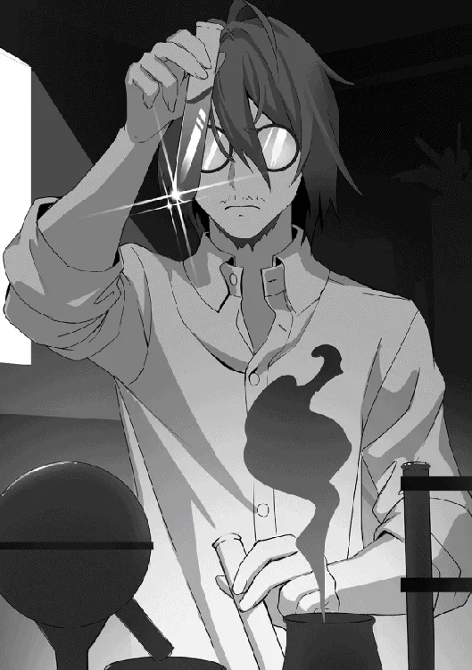

[TOC](../readme.md)&nbsp;&nbsp;&nbsp;&nbsp;&nbsp;&nbsp;[Prev](0044_Vol_6_Ch_42_Return_to_the_Royal_Capital.md)&nbsp;&nbsp;&nbsp;&nbsp;&nbsp;&nbsp;[Next](0046_Vol_6_Ch_44_Monstrous_Creature.md)

# Chapter 43: Nostalgic Mansion

First things first, Shatia headed to her teacher’s mansion. No matter
what she decided to do, she could not act without going through Loreid.
In the royal capital, a city of humans, she was nothing more than an
ordinary person. Even if she could manipulate things with magic to an
extent, there were limits. The most efficient way was to have someone
with a certain degree of power close at hand, and Loreid fit all those
criteria.

With her good memory, Shatia headed toward the mansion with Emerald
without getting lost. Catching sight of familiar markets and landmarks
along the way, her expression softened slightly. She briefly recalled
her classmate Laika and found herself thinking about wanting to see her.
*How unlike me*, Shatia thought, returning to her usual expression as
she continued walking.

After walking for a while, Loreid’s familiar mansion soon came into
view. There were no signs of people coming or going, and because it
stood in a relatively isolated area, it exuded an atmosphere like a
ghost house. Beside Shatia, Emerald flinched, almost looking a little
scared. Shatia paid no mind however. She passed through the gate,
knocked, and entered the mansion.

Heading toward the room she knew belonged to Loreid, she found him
there, hunched over a spellbook and muttering something. His hair was
messy and unkempt, and his beard had grown out a bit, as if he had spent
days in that state. He seemed to have been utterly absorbed in his
research. Shatia told Emerald to wait in front of the door and stepped
into the room, ensuring her footsteps were audible.

“Hmm? A guest? Sorry, but I’m busy with research right now…”

Hearing the footsteps, Loreid stopped and turned toward the door. Since
his memories had been manipulated, he failed to recognize Shatia when he
saw her. To the current Loreid, Shatia was merely a girl with a
mysterious atmosphere whom he had never met. However, as if something
were nagging at him, he stared into Shatia’s eyes and tilted his head.

Shatia smiled slightly at the familiar sight of her teacher. Then, she
raised her hand and swept it aside, dispelling the manipulation magic
she had previously cast.

“Good work on your duties, teacher.”

“…!! Shati, a… Shatia-chan…? Huh, but why?”

As Shatia spoke those words, Loreid’s eyes widened, and he let out a
weak whisper as if he couldn’t believe it. His arms trembled; he was
confused by the contradictions in his own memories. Shatia raised her
arm to calm him down and signaled Loreid to stop.

“Why until now… I should have taken you to the academy… Why did this
happen…”

Unsurprisingly, Loreid was bewildered. Shatia had anticipated this
situation, however, so she was not particularly surprised and just
accepted the scene.

Memory manipulation magic exerts a strong compulsive force on the
subject’s brain. Because it forces the subject to think a certain way,
when the magic is dispelled, they notice the incongruities and their
brain becomes confused. It subsides as soon as they understand the
situation, but since it places a significant burden on them, that was
another reason why Shatia disliked such magic.

“I apologize for placing such a forced magic on you. I will explain to
some extent, so please listen for now.”

In any case, calming down was the first priority. Shatia calmed the
bewildered Loreid and decided to sit in a chair and explain. Naturally,
she did not tell him she was a witch. She vaguely told him that after
defeating the golem, she wanted to go to the fairy lake by herself,
which is why she did what she did.

“I see… Well, I’d sensed before that you could use various magics. But I
didn’t think it went this far,” Loreid looked somewhat unconvinced, but
since he knew Shatia’s personality to some extent, he didn’t press her.

“You do not seem very surprised?” Shatia herself was surprised by how
much calmer Loreid was than she expected. She thought he would be more
bewildered or question her more; in fact, that would have been the
normal reaction. 

Loreid smiled, held up one finger, and threw Shatia’s own words back at
her, “I am a former court mage, after all. I’ve met wizards with all
sorts of talents before.”

It seemed being a former court mage wasn’t just for show.

After completely regaining his composure, Loreid patted his thighs and
asked, “So… what do you plan to do now, Shatia-chan? Are you going back
to the academy?”

Shatia was taken aback for a moment but remembered her original purpose,
switched her thinking, and turned back to face Loreid.

“No, I apologize, but I have no intention of returning to the academy. I
have already achieved my purpose there.”

“I thought as much. Then, what do you plan to do from here on out?”

Loreid had expected Shatia’s answer to some extent. There was no need
for Shatia, someone who could even handle memory manipulation magic, to
go to the magic academy. She had said she had obtained body creation
magic through an alternative route. In that case, her goal had already
been achieved. That’s why Loreid’s interest lay in her next goal. What
would Shatia do next? He was genuinely curious about what the girl with
mysterious abilities was seeking.

Shatia put her hand to her mouth and smiled slightly. Then, looking
directly at him with those clear eyes, she opened her mouth, “I wish to
know about the monster rumored to reside in this city. The monster in
question.”

Shatia’s current goal was to uncover the identity of the monster that
was causing a stir. She was someone who liked animals and magical
beasts. Naturally, the monster, which was neither, was an object of
endless interest. However, there was simply too little information. All
she found out through Emerald was a few witness reports, and she
couldn’t derive an answer from that alone. Therefore, she wanted to
know; she wanted more knowledge.

Loreid’s expression changed slightly. He narrowed his eyes as if
hesitant and scratched his cheek.

“Ah, that monster. The rumors have reached even my ears, even though
I’ve been practically cooped up here. It seems to be a very formidable
enemy; I heard the Holy Knights are going to start moving in earnest
soon.”

Even Loreid, who had been completely immersed in his research, had heard
talk of the monster and had a small amount of information. Shatia tilted
her head at the words “Holy Knights” that Loreid had mentioned, so she
asked,

“What are the Holy Knights?”

Loreid explained simply, “They’re a knight order directly under the
royal palace. They protect the city and have the authority to command
the army. Each of them is powerful—knights that even mages would have a
hard time with.”

As he spoke, he waved his hand dismissively, and a different attitude
than usual could be glimpsed. It was an attitude as if he found the Holy
Knights annoying. Shatia was curious, but she didn’t press further. What
she needed now was information about the monster and things related to
it. Anything else didn’t matter.

Now interested in these Holy Knights as well, Shatia muttered while
fiddling with her hair, “Hmm… quite interesting. I would certainly like
to meet these Holy Knights.”

Seeing Shatia’s unchanging personality, Loreid simply shook his head and
smiled, “You’re the same as always. Well, that’s about all I know. The
details of the monster are still unknown. The Holy Knights are currently
tracking it.”

In the end, she couldn’t get detailed information about the monster, but
for Shatia, it piqued her curiosity, and she wanted to know even more.

“By the way, Shatia-chan. If you’re going to chase the monster, you’ll
probably be in the royal capital for a while, right? While you’re here,
you can use this mansion like before.”

Shatia showed a rare expression of surprise at the unexpected offer,
“…Is that all right? I won’t even be attending the academy anymore.
There is no need for you to be so considerate, teacher.”

Loreid had been kind to her since the time they lived in the village,
but no matter how she looked at it, there was no need for him to go so
far for her this time. His offering to help felt a little suspicious.

“Don’t say such lonely things. I’m your guardian, after all… besides,”
he paused briefly, then continued with a faint smile, “Besides, I want
to see your growth. You, who have already reached the peak as a human—I
want to see how far you can go…”

Those eyes were pure. Clear eyes with no hint of darkness. Loreid truly
seemed to want to witness Shatia’s growth. And he already recognized
that Shatia was a person of great ability. That’s why he wanted to see
her evolve further.

“I see, that would be helpful. Then I shall take you up on your offer…”
While thinking that Loreid was quite the eccentric, Shatia was grateful
for his spirit nevertheless. Then, she shifted her gaze slightly,
looking at Emerald who was by the door, “and also…”

“The girl by the door too, right? I know. I won’t ask about the
circumstances, but if she’s Shatia-chan’s friend, I’ll gladly welcome
her,” Loreid finished Shatia’s sentence before she could get the words
out.

Shatia was surprised that he had noticed and looked up at Loreid’s face.
He didn’t say anything unnecessary and just laughed. Shatia let out a
small sigh and scratched her hair, thinking she was no match for him.

Loreid said he would take care of the academy matters. Since Shatia was
already being treated like a hero, there was a certain amount of
flexibility. If he prepared a plausible reason, it would be easy to make
an excuse. Loreid also said he would be in touch with the village;
Shatia bowed her head in gratitude for everything.
   
 
 
After settling future plans, Shatia decided to go back out into the city
to gather information. She met back up with Emerald, who was waiting in
front of the door. For some reason, the girl had a somewhat dissatisfied
look on her face.

With an unfriendly tone, she commented, “Is it okay? To trust what that
man said…”

“He is my teacher, a person worthy of trust.”

To Shatia, who knew Loreid’s character, those worries were unnecessary,
but more than anything, she noticed that Emerald harbored distrust of
humans. As expected, the trauma of being betrayed in the past remained;
she wasn’t so easily trusting anymore. *What to do about this*, Shatia
thought, gently putting her hand to her mouth.

“Do not worry, Emerald. There is nothing for you to be anxious about.
Even if there were, I would protect you,” she comforted, patting the
shoulder of the downcast Emerald.

Then, Emerald puffed out her cheeks slightly and glared at Shatia,
“I-I’m not a child anymore. I’m fine even without being protected.”

“Kuku, so stubborn… I see, right, right. You are not a child anymore.”

Shatia found the talking-back Emerald adorable and thought again that,
to her, a child would always be a child no matter how much time passed.
She suddenly compared her own appearance with Emerald’s. Herself in the
form of a child, and Emerald, whose height had shrunk a little from her
original form. Rather than parent and child, the two of them currently
looked more like sisters

With some mixed feelings, Shatia moved forward, left the entrance, and
opened the door. Once outside, she immediately presented her goal, “…For
now, information gathering. We shall ask around about the monster, the
Holy Knights, and all else.”

The academy issue had been dealt with. Now she could finally get to work
on what she was curious about. There was Laika, and many other things,
but first, she would investigate the rumoured monster.

Having made her decision, Shatia walked forward with determination, with
Emerald following quietly from behind.

---
[TOC](../readme.md)&nbsp;&nbsp;&nbsp;&nbsp;&nbsp;&nbsp;[Prev](0044_Vol_6_Ch_42_Return_to_the_Royal_Capital.md)&nbsp;&nbsp;&nbsp;&nbsp;&nbsp;&nbsp;[Next](0046_Vol_6_Ch_44_Monstrous_Creature.md)

