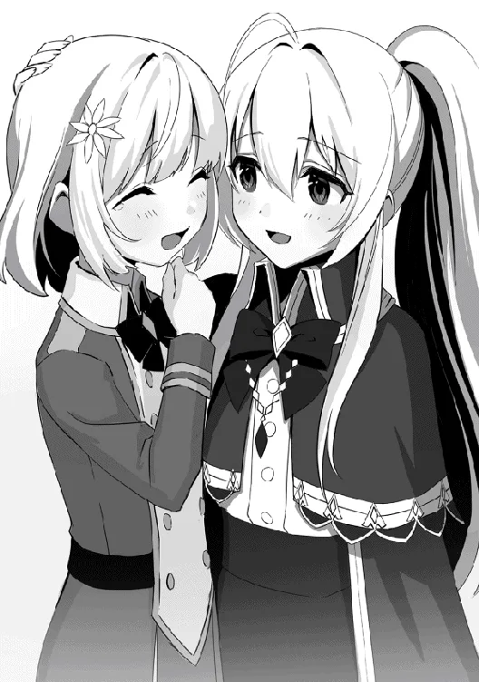

[TOC](../readme.md)&nbsp;&nbsp;&nbsp;&nbsp;&nbsp;&nbsp;[Prev](0045_Vol_6_Ch_43_Nostalgic_Mansion.md)&nbsp;&nbsp;&nbsp;&nbsp;&nbsp;&nbsp;[Next](0047_Vol_6_Ch_45_Witch_and_Monster.md)

# Chapter 44: Monstrous Creature

While the sun shone with an almost irritating brilliance, Kousal, the
captain of the Holy Knights, was scouting the city with several of his
comrades, all formidable warriors. The city’s inhabitants peered out
from their windows, wondering what was happening. Kousal’s expression
was grim. His face looked as though he were heading into a full-scale
war. In truth, that wasn’t far from the mark. Although the scale was
different, they were about to embark on a monster hunt.

While wiping the sweat beading on his forehead, Kousal groused, “Was
there truly a sighting around here?”

One of his subordinates answered confidently, “Yes, Captain. I have our
men spread out and searching now. We’ll surround it and beat it to a
pulp in no time.”

A few hours ago, there was a report of a grotesque monster-like figure
spotted on the outskirts of the city. Though they weren’t sure if it was
true, several subordinates had been sent to investigate, however, they
had not returned even after a significant amount of time had passed.
Deciding that there was a high possibility an actual monster had
appeared, Kousal immediately organized a subjugation unit. Now, they
were fanning out across the sighting area, attempting to corner the
beast.

“Its corpse will be carried out shortly. Look at our numbers. No matter
how much of a monster it is, it can’t win against these odds,” the
subordinate spoke while crossing his arms.

Kousal doubted whether things would really go that smoothly. Certainly,
they might win if they committed the entire knight order, but the enemy
was still an unknown entity. Its purpose and exact appearance remained
unclear. It was dangerous to challenge such an opponent with a direct
head-on assault, and Kousal believed they should focus on scouting
first. However, he couldn’t simply ignore his motivated subordinates. He
warned them not to push themselves too hard, but he wondered how it
would turn out. Clenching his fist, Kousal prayed that his worries were
merely overthinking.

At that moment, a roar like an explosion echoed from a short distance
away. Not knowing what had happened, Kousal looked around. The knights
waiting nearby lowered their stances, terrified by the sheer volume of
the sound. The explosive noises grew louder and eventually drew closer.
In the next instant, a monster wrapped in black tentacle-like appendages
burst out from a nearby house. It landed on the ground, sending wooden
splinters flying, and slammed something it was holding into the dirt. It
was a Holy Knight.

“…!!”

The monster shouted in a strange, multi-layered voice, “I will not
permit anyone to block my path… no matter if they are knights who preach
justice…!!”

Looking closely, the house the monster had emerged from had a hole
through it as if it had been pierced, and several knights lay fallen on
the other side. They were the knights who had been out scouting. The
monster had realized it was being closed in on and had instead mowed
down everyone to reach this spot. Recognizing this instantly, Kousal
drew the sword at his waist. Understanding just how anomalous the enemy
before him was, he raised his guard even further.

But the subordinate beside him was different. With a roar of anger, he
lunged at the monster and swung his sword down, “You monster!!”

However, the descending sword was easily caught by the monster. Despite
the knight’s strong grip, the monster’s arm was not wounded at all;
instead, the monster lifted the sword—and the man along with it—and
slammed him violently into the ground. With a single blow, the man’s
eyes rolled back as he lost consciousness, rendered unable to fight. 

The monster spat out an irritated breath and tossed the sword aside,
“How foolish. Do you really think… you can bury me with such a thing?!”

Everyone was paralyzed with fear. The knights were terrified by the
sheer brutality and found themselves unable to stand against it. Amidst
them, only Kousal took a step forward while gripping his sword tight.
Noticing this, the monster rolled its eyeballs visible through the gaps
in its tentacles and shifted its gaze toward him.

It warned while pointing a thick arm, its muscles swollen and hardened
like lead, “Step any further… and I will deem you an enemy. If you do
not wish to die, stay away from me…”

Kousal widened his eyes in surprise. He hadn’t expected it to be capable
of communicating. He stopped where he was and held his sword low.
Keeping his guard at its peak, he maintained a stance that would allow
him to attack at any time. If they could exchange words, things would be
faster.

Kousal spoke to the monster while signaling to the subordinates behind
him, “Well now, what should I do? …Personally, I’d like to avoid
fighting a freak like you. But you’re making the people far too anxious…
Just what is your purpose?”

“My wish is the eradication of evil. That is all… to destroy all
wickedness and purge the rot from this world.”

“How wonderful…”

While Kousal exchanged words with the monster, the knights regained
their fighting spirit upon seeing their captain stand his ground. They
moved to cut off the monster’s retreat, surrounding it and drawing their
swords while hiding in the shadows. They made no sound, and the cold
ring of drawing blades was masked by the crumbling of wood. Everyone was
in position. Even if they couldn’t win with pure numbers, what about an
ambush? It wasn’t something to be praised as a knight, but everyone
instinctively understood that this monster had to be crushed here.

Kousal moved to give the signal, but—

“Did you think such petty tricks would finish me!!? You fools!!!”

The monster roared. It had noticed everything. It swung its fist back
wide and struck the ground. The force was so immense that the road
collapsed and stone fragments scattered everywhere. The knights were
blown away by the shock, screaming as fragments pierced them. Nothing,
absolutely nothing was working.

Feeling the despair sink in, Kousal nevertheless readied his blade and
stood to face the monster as it lunged at him.

◇

Shatia and Emerald were in the city gathering information on the monster
and the knight order. That said, since the knights were famous, asking
the ordinary citizens yielded immediate answers, and one could even head
directly to headquarters if they wished for details. Crucially, however,
information on the monster was difficult to come by. Its appearance was
unknown, and sightings were incredibly rare.

Deciding that they had no choice but to gather as much information as
possible on foot, Shatia and Emerald split up for a time. Currently,
Shatia was walking aimlessly through the streets of the capital, looking
at the familiar scenery.

“This area has not changed much… Well, not that much time has passed, so
I suppose that is only natural.”

Shatia was walking on a road near the magic academy. In the distance,
the giant academy was visible. Since not much time had passed, there
were no major changes to its exterior. She glanced around and let out a
small hum.

*If I recall, this was the area where I first met Laika…*

Shatia suddenly recalled Laika, who she had attended the academy with.
Though it was for a short period, Laika was a student to whom she had
personally taught magic and passed on techniques. While Shatia wasn’t
particularly sentimental, she found herself wondering what the girl was
doing now.

“Shatia-chan…?”

“…!”

Suddenly, she was called from behind by a familiar voice. When Shatia
turned around, there stood Laika in her academy uniform.

Shatia whispered the girl’s name, “Laika…”

Laika nodded, rejoicing at their reunion, “I knew it… it really is
Shatia-chan! You’ve come back?!”

To Laika, Shatia was a benefactor who had earnestly taught magic to her
when she was a failure; it was a relationship more precious than just
friendship.

Seeing Laika run toward her, Shatia responded and offered a gentle
smile, “It has been a while, Laika. I am surprised to see you.”

Laika fired off rapidly, “I’m really surprised too! When did you get
back? Your hand is okay now, right? Then when are you coming back to the
academy…”

“Ah, about that…” Shatia intended to answer as bluntly as usual, but she
suddenly stopped and thought.

She already knew that she was never going back. She had already obtained
the information she originally wanted, and she knew there was nothing
left to learn there. In that case, there was no need to go back. Shatia
only needed to say that to Laika. However, for some reason, she couldn’t
say it.

For a moment, Shatia stared at Laika in silence, finally opening her
mouth with a complex expression, “Actually… I am with a relative now.
Things are a bit hectic, and I do not know when I will be able to return
to the academy.”

She spun a convenient lie instead.

“Eh?! What do you mean? Then I won’t be able to study with Shatia-chan
anymore…?” Laika fell into an expression of deep disappointment and
sadness. She had clearly been looking forward to Shatia’s return, so the
letdown of learning she wouldn’t be coming back was immense.

Shatia scratched her cheek apologetically, “My apologies. I, too, feel
lonely at the thought of not being able to see you, Laika.”

“But… since you’re back, you’ll be in the city for a while, right? Then
we can see each other when I’m not at the academy, right?” Laika clung
to the slightest hope.

Certainly, while she was in the royal capital, she could meet Laika when
the academy wasn’t in session. However, that was only for as long as
Shatia remained in the city. It was dangerous for an existence like a
witch to remain in one place for too long. Eventually, Shatia would have
to leave once her business here was done.

“Yes… that is right. We can meet anytime.”

But she couldn’t bring herself to say that. She told yet another lie,
which this time made Laika happy. They couldn’t study together at the
academy, but they could still meet as long as she was in the city. Even
if it was only for a short time, and even though she knew a parting
would come eventually, Shatia couldn’t bring herself to reject Laika’s
hope.

She suddenly thought of a similar exchange she had once had with another
witch. But she didn’t dwell on that memory from the now distant past.

Laika let out a sigh of relief, “I’m so glad. I wanted to learn so many
more things from Shatia-chan. Besides, I’ve been studying quite a lot on
my own! You have to see my magic next time!”

“Yes, of course. I shall observe it closely,” since Shatia had no reason
to refuse when it came to magic, she agreed with a hint of happiness
   
 
 
“Then, Shatia-chan, see you later!”

“Indeed. I am glad we could talk, Laika.”

After chatting for a while, the two parted as it was time for Laika to
head home. Laika looked happy until the very end, and Shatia smiled
back. As she watched Laika wave and walk away, Shatia’s gaze followed
her with a trace of loneliness.

“…I really am glad I could see you.”

The words that spilled out were quiet. Shatia’s current expression was
devoid of emotion, impossible to read. It wasn’t happy, nor was it
sad—it was simply cold.

*What would her reaction be if she knew I was a witch?* Shatia found
herself wondering. She had truly thought she would never see her again.
She hadn’t intended to. A witch must not leave footprints behind. To
have friends or comrades was out of the question; such things were the
ultimate shackles. Yet, in her heart, Shatia wished. She wished that one
day, everyone would understand the existence of witches. Someone in the
next generation.

With those thoughts, Shatia left the area and headed toward the meeting
point with Emerald. Joining up, the two exchanged the information they
had gathered as they moved.

Shatia complained, “Hmm… information is not coming easily. Especially
regarding the monster in question.”

“Well, that’s why the knights are chasing it. There isn’t much
information going around in the first place,” Emerald added.

Though they were discussing important matters, their appearance led to
no sense of tension. To onlookers, they appeared to be nothing more than
beautiful sisters walking together.

Just as Shatia was considering if it would be faster to simply search
for the monster herself, a roar suddenly echoed from afar. The direction
was the edge of the city. It was quite a distance away.

“…That was.”

“An explosion, perhaps…?”

Shatia and Emerald turned their gazes. Though faint, they could see what
looked like destroyed houses. The city was stirring, with people
wondering what had happened. The two stepped back to avoid being
swallowed by the crowd and climbed to higher ground to confirm where the
roar had come from.

“Emerald, you can get there faster. Go.”

“Eh… but…”

“I will follow immediately. Confirm what has happened and do what you
think is right… now, go.”

Emerald tried to reply, but her words were cut short by Shatia’s
forceful tone. It seemed Shatia, who was skilled at sensing magical
presence, had noticed something. Deciding to follow her lead, Emerald
merely nodded and sprinted away. After confirming she had left, Shatia
sighed quietly and searched the surrounding mana.

“I feel two strange signatures… One is where the explosion was… but what
is this other one? This is…”

The mana Shatia felt: one was from the site of the roar. Though just a
guess, the ominous mana likely belonged to the monster. It was pure and
unadulterated, filled with a desire for combat that made the term
“beast” appropriate. Then, what of the other one? She didn’t know the
source. But the mana she felt for certain emitted something anomalous,
and it piqued her interest.

“Is there a mastermind hiding somewhere? …For example, someone
controlling it…”

To begin with, the existence of the “monster” itself was strange. It
wasn’t exactly a magical beast, and its race was unknown. Would such a
creature destroy the city without a purpose? If there were an existence
controlling it, wouldn’t that make more sense? Shatia formed this
hypothesis and decided she wanted to investigate the source of this mana
first.

Turning her back on the noisy crowd, she walked toward a deserted path
and began to act toward her goal.

◇

Parried, pushed, blown away, Kousal spat out the blood pooling in his
mouth. The sword that should have been forged for slashing meant nothing
against the grotesque monster. The monster and its fist loomed right
before him; he raised his sword at the last second to block the direct
hit, but the impact sent him flying. His back slammed into the hard
ground as he rolled, and when his momentum finally stopped and he stood
up, he could feel the pain throughout his entire body.

“Haah… haah…!”

“Impressive. You are different from the hypocrites who only speak of
justice… you are a warrior with certain skill and a strong will. But
that sword… it cannot reach me!”

The monster offered praise to Kousal, the last knight standing. All
around were destroyed houses and knights who had fallen in tatters. Even
his armor was dented and destroyed, and his sword was so worn it would
break with one more blow. Wiping the blood from his mouth, Kousal kept
his consciousness sharp and pointed his sword at the monster.

“Is that so… it’s my job, you see. I have to defeat you, no matter
what.”

“Hmph… a troublesome fate. Very well, then I shall personally grant you
your end.”

Kousal could not run. He had the responsibility of protecting dozens of
subordinates and the people of the city; even if his life were to end,
he had to fulfill that responsibility. Because it was his job. The
mission he had received from the King. Therefore, he could not run.
Without flinching before the approaching monster, he raised his sword.

“Haaaaaa!!”

Whether it was anger or a means to deceive his fear, Kousal let out a
war cry and swung his sword down. But in the next instant, the monster
vanished. A tremendous bloodlust flew at him from behind. Instantly,
Kousal shifted his axis, turned around, and swung from that posture.
With a metallic ring, the monster caught the blade. And his sword
finally snapped. Before he could be pinned, Kousal let go of the hilt,
backed away, and grabbed a sword from the hand of an unconscious
subordinate.

“It’s useless! Give up, and sink into the depths!!”

“Guh…!”

But by the time he realized it, the monster was already right in front
of him. He couldn’t react. He felt a sharp pain in his abdomen, and in
the next moment, his vision was pointed at the sky. A few seconds later,
he belatedly realized he had been punched into the air, and soon after
he met the ground with a dull *thud*. Unable to breathe, coughing up
blood, he somehow managed to exhale and maintain consciousness. But his
legs would no longer move. He was at the limit of his physical strength.

“Gah… ha… ha…”

“This is the end. You fought well. Rest now.”

The monster approached slowly. Dizzied and finding it difficult to even
remain conscious, Kousal could only stare silently. When it reached him,
the monster ruthlessly raised its fist. Just as it was about to swing
down without hesitation… a massive clump of mana suddenly flew toward
the monster. At the last second, the monster leapt to avoid it; the
clump of mana struck the ground, creating a giant crater.

The monster shouted in anger, “Who are you!! What fool dares to obstruct
my path?!”

A voice with a bell-like tone, out of place in this setting, could be
heard, “You dodged that…?! It seems the rumors of you being an
incredible monster are true.”

As his consciousness faded to black, Kousal looked up and saw a girl as
beautiful as a doll with golden hair standing there. *Impossible. Such a
small child…* with that thought, Kousal finally passed out.

The monster cried angrily, “What? What are you!! I show no mercy even to
women or children who get in my way…!!”

But without flinching, the golden-haired beauty, Emerald, spoke, “Thank
you for the warning. But there is no need to worry… for I am not such a
fragile existence…”

The two faced off; the monster increased its vigilance toward the
anomalous existence that had appeared. Emerald also felt wary of the
monster’s bizarre form she had finally laid eyes upon, and for a beat,
neither moved.

The battle between witch and monster began.

---
[TOC](../readme.md)&nbsp;&nbsp;&nbsp;&nbsp;&nbsp;&nbsp;[Prev](0045_Vol_6_Ch_43_Nostalgic_Mansion.md)&nbsp;&nbsp;&nbsp;&nbsp;&nbsp;&nbsp;[Next](0047_Vol_6_Ch_45_Witch_and_Monster.md)

