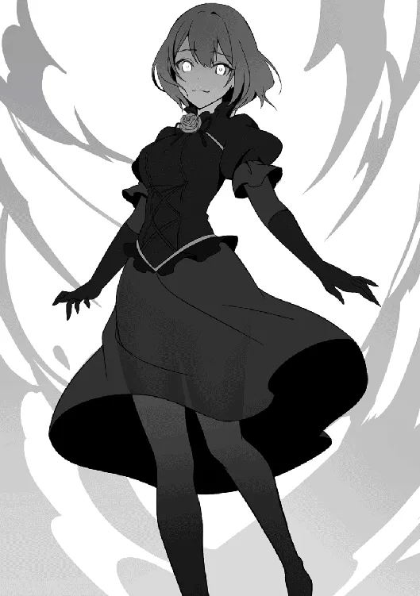
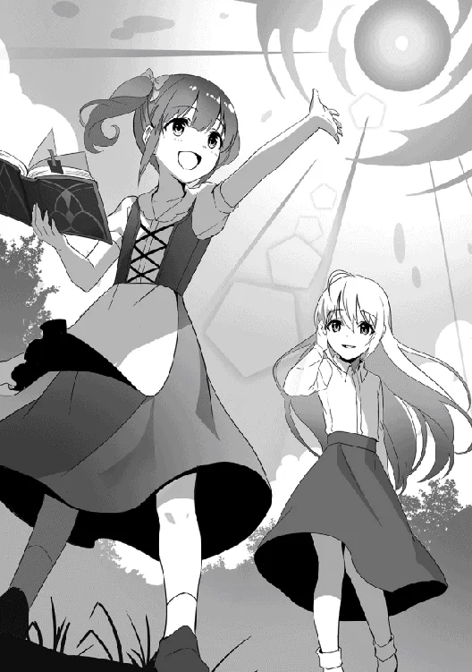

[TOC](../readme.md)&nbsp;&nbsp;&nbsp;&nbsp;&nbsp;&nbsp;[Prev](0050_Vol_6_Ch_48_Final_Battle.md)&nbsp;&nbsp;&nbsp;&nbsp;&nbsp;&nbsp;[Next](0052_Vol_6_Ch_50_The_Witches_Gathering.md)

# Chapter 49: The Witch Slayer

Emerald concentrated every nerve in her body as she poured mana into the
magic circle. Breaking a curse required immense focus and a massive
amount of mana. A single failure would make it impossible to perform the
ritual again. Thus, Emerald bit her lip and began the incantation, sweat
dripping steadily from her forehead.

“I am the Witch Emerald. I am the one who unravels the Curse of Death
placed upon thee. All essence, obey me…”

As she began the chant, the magic circle started to glow, and light
began to envelop the monster. The essence materialized into particles of
light, floating softly through the air. The real challenge began now.
Emerald braced herself and continued.

“Free yourself from your shackled power. Vanish, thou binding spell of
the abyss. All of thine essence is now in my hands…!”

The light surrounding the monster turned into threads, connecting to
Emerald’s hands. She grabbed the light and gripped it firmly. This was
the crucial step in breaking the curse. She poured strength into her
arms for the final verse.

“I am the Witch Emerald! Release, O Curse of Death!”

The moment she spoke, Emerald yanked the threads of light with all her
might, activating the ritual. The light enveloping the monster
condensed, swallowing its body. The sight was painful, as if something
were being crushed, and a groan escaped the monster. But in the next
instant, the light shattered with a sound like breaking glass. The
monster’s obsidian scales peeled away, and as the light faded, the
person beneath was revealed.

“Ugh… kh… I… am…?”

“T-That… Could you be…?”

Emerald was speechless at the sight before her. It was nothing like what
she had imagined; she was completely lost for words at the unexpected
turn of events. Immediately afterward, a violent roar echoed from atop
the church roof.

◇

“Ah! Ha! Ha! Ha! Ha!”

“Nimble brat…! You won’t escape!”

On the roof, a girl shrouded in black mist was running around while
laughing loudly. Shatia pursued her, floating in the air with flight
magic and firing orbs of mana. However, the Mist Girl evaded them with
incredible physical ability without even using magic; she kicked off the
tower wall, soared through the sky, and slashed at Shatia with a blade
of mist.

“Ahaha!!”

“Hah—!!”

With a sharp metallic ring, the mist blade scattered. Gripped in
Shatia’s hand was a shining silver dagger—a magic sword she had
manifested from mana. The Mist Girl landed on the roof, clutching her
shoulder which had been sliced open at some point, and retreated back
into the mist to put distance between them.

Shatia tossed the silver dagger aside, aimed both open palms at the Mist
Girl, and gathered a massive amount of mana. With a roar, a giant mana
blast was unleashed, tearing through the roof as it surged toward the
girl.

“You cannot avoid this!”

There was no escape. At this rate, the Mist Girl would be struck
directly by the mass of mana and fall. However, the girl’s body—which
should have been blown away—vanished into black mist and dissipated. It
was a mere decoy. Shatia’s expression shifted in realization and she
whipped around. The true girl, shrouded in mist, was closing in behind
her.

“Khahaha!!”

“Hmph… as always, you are skilled at deception…” Blocking the lunging
black mist with her left arm, Shatia landed on the roof, muttering with
annoyance.

Her left arm was completely ruined by that last hit. That mist, imbued
with a curse, was something that must never be touched with bare skin.
However, Shatia had deliberately sacrificed her left arm to protect the
rest of her body. In the worst-case scenario, she could simply cut the
arm off; that was her thought process. Whether she knew this or not, the
Mist Girl also landed on the roof, cackling with her face painted in
black. But at that moment, a section of the roof blew outward, and a
girl emerged from within. She was a beautiful girl with long purple
hair, wearing a tattered black dress.

“Ah, you have finally awakened. Vestalis.”

“Did you know it was me from the beginning? …Mother…”

Shatia showed no great surprise at the sight of her, merely giving a
casual greeting and a wave.

The girl’s name was Vestalis. She was the one once feared as the Undying
Witch. It was she who had been transformed into the black monster by the
Curse of the Reaper, wandering without her memories until now.

“In a way. There were several points I did not understand, but now I am
finally satisfied,” Shatia spoke sadly as she patted the head of the
approaching Vestalis. Vestalis also wore a pained expression, and the
two of them slowly turned their gaze toward the Mist Girl.

“There is no longer a need to hide… Will you not show yourself,
Fantaretta?”

The girl in the black mist suddenly slumped her shoulders, hanging her
head like a broken doll. Then she began to cackle, releasing the mist
that enveloped her body. Like a tornado, the black mist swirled away,
and in the center stood a girl with tan skin and black clothing. Her
hair was short with a single strand poking up from the top, and she had
an energetic look with sharp, beast-like eyes and a mouth perpetually
curled into a smirk. The girl looked down at Shatia and the others with
an evil grin.

“Oh my my my? Busted, huh? I went to all the trouble of turnin’
Vestalis-chi¹ into a cool monster toy~. That’s so mean, mom—

Fantaretta, the Witch of Ruin. She spoke without a shred of guilt,
cackling all the while. As a governor of curses, she had used the Curse
of the Reaper to transform her comrade, Vestalis, into a monster. Yet
she viewed even that as nothing more than a pastime.

Shatia let out a small sigh.

“Why? Why would you do such a thing…?

She finally asked the greatest question: why Fantaretta would betray her
fellow witches.

“Ahahaha. Didn’t I tell ya that hundreds of years ago?” Fantaretta put
her hands behind her head and began to speak as if it were of no
consequence, “Humans are such stupid creatures, y’know, mom? Give ’em a
little poke and they show their true colors immediately. I just told
them where the witches were hiding, and they immediately sent a Hero to
go kill ’em.”

Fantaretta snapped her fingers and pointed at Vestalis. She then folded
all but one finger and made a slicing motion across her throat.

“I knew you did not think well of humans… but why did you go as far as
betraying your own kind?”

“C’mon, mom, you all were trying to protect the humans. Even the other
witches ended up following what you said and didn’t lay a finger on ’em…
So, y’know? You were in the way. You, mom.”

Fantaretta pointed directly at Shatia and declared it boldly. She didn’t
try to hide it at all; her words were laced with murderous intent. She
was truly planning to kill Shatia, her mother figure.

“So I carried out the plan, guided the Hero, and had you all offed. Of
course, I pretended to be killed too, y’know? And just as I thought,
Cloak-chi grew to hate humans, and even Emerald-chi tried to get revenge
on ’em… It all went exactly according to my plan.”

Fantaretta chuckled softly. Standing beside Shatia, Vestalis was
completely speechless, her hand pressed to her mouth. *Did you turn me
into a monster for such a reason?* she wanted to ask. But the shock was
so great she couldn’t even move her lips.

“But! You’re always the one gettin’ in the way, mom… and here I thought
I’d done it perfectly. And yet you came back with that reincarnation
magic… So persistent,” Fantaretta spoke in a low voice, clenching her
fists and glaring at Shatia with immense resentment. She truly hated
her. She hated the fact that her plan had been interfered with.

All the witches Shatia had encountered so far still held some affection
for her as their mother figure. Even if they were enemies, they
respected her. But Fantaretta was different. She recognized Shatia
purely as an obstacle.

“Ah… I see… So that is how it is, after all,” Shatia muttered sadly, as
if having realized something.

“…Mother?”

“Vestalis, stand back…”

Vestalis sensed the strangeness and called out, but Shatia only gave the
warning. Knowing it was best to listen to Shatia at times like this,
Vestalis stepped back as told. Shatia took a step forward, approaching
Fantaretta without hesitation.

“…?”

“Fantaretta, allow me to tell you the truth.”

Immediately after Shatia spoke, she swung her arm upward, whipping up a
tremendous gale. Fantaretta couldn’t react to the sudden attack and was
caught in the wind, launched high into the sky. Shatia flew up after her
using flight magic.

Kicking off the church tower, Fantaretta regained her trajectory,
enveloping herself in mist to evade further upward. Shatia was closing
in right behind her; she stopped in mid-air, and Fantaretta did the
same.

“The truth… exactly what’re you planning to tell me?”

Noticing Shatia’s unusual demeanor, Fantaretta lost some of her
composure. She focused her mana to ensure she could retreat at any
moment while starting the conversation. Shatia crossed her arms and
spoke with a calm atmosphere.

“The reason there are only seven witches… it is because I myself
destroyed the Witch Clan.”

Fantaretta doubted her own ears at this sudden revelation. It was a
statement so far removed from her image of the woman before her that she
was stunned. While Fantaretta stood dazed, blinking her eyes, Shatia
continued without pause.

“Once, our clan held the duty of observing and overseeing the world. But
a certain group of witches rebelled, believing they were the ones who
should rule it all, and began to exercise their power… much like you are
doing now.”

Shatia recounted the events of the past with a sad expression. It was
exactly like the phenomenon occurring with the witches in the current
world. Fantaretta felt a bad premonition and instinctively put distance
between herself and Shatia.

“I was tasked by the head of the clan to execute the traitors. It was my
duty to correct those who committed errors and protect the balance of
the world…”

Fantaretta’s mind couldn’t keep up with the truths being revealed one
after another. Their witch clan was destroyed by Shatia, their mother
figure? Then what was she doing right now? Was she not simply repeating
the past? Such questions filled her head. And to the confused girl,
Shatia delivered a further tragedy.

“What do you think happened then? Even the head of the clan was consumed
by the ideology of the traitors, and the entire clan began to claim that
they should be the rulers…”

“…Kh, what did you do?”

Fantaretta finally found her voice and asked, even while wishing she
didn’t have to hear the answer. She couldn’t help it. What she had been
seeking all this time was right in front of her. Of course she would try
to know. And Shatia gave a gentle yet cruel smile.

“I killed them. Every last one. I fulfilled my duty. That is how I was
raised, after all.”

Shatia said it as if it were nothing, in a voice devoid of emotion, much
like Fantaretta’s had been earlier. Her clear eyes seemed to look
elsewhere—looking at Fantaretta, yet looking through her to the clouds
beyond.

“Then, I took six infants who knew nothing and went out into the world.
So that they could live as new witches, without ever knowing the truth.”

“Those… were us…”

Fantaretta shook her head as if unable to believe the truth she had been
told. But Shatia’s cold eyes insisted that this was reality. There was
no escape. This was fact. Shatia pointed a finger at Fantaretta.

“But Fantaretta, you were on *that* side, weren’t you?”

Along with those cold words, a gust of wind struck Fantaretta. It was
the same bloodlust Shatia had once directed at the traitorous witches.
It was now bearing down on Fantaretta.

“Gwah…!”

“I have killed many of my own kind with these hands. To maintain the
balance of the world, and to ensure that no single witch gains too much
power… Traitors such as yourself must be killed. That is my duty.”

There was no light in Shatia’s eyes. She simply swept her arm like a
cold machine, releasing a pulse of mana. Blown away, Fantaretta spun in
the air while descending, quickly righting herself to prepare a
counterattack. But Shatia, who should have been right in front of her,
had vanished, and before she knew it, she was behind her.

“Do you know why I mastered the magic called Lullaby…?”

“Aguh… hah… ah!”

Fantaretta was struck by a mass of mana with a dull crunch and blown
away again. But she could hear Shatia’s voice right by her ear,
revealing her close proximity. Shatia asked the question as if it were
of no consequence, devoid of any emotion.

“It was for the purpose of completely killing a witch.”

A witch’s body has an intimate connection to essence. That was why they
could hold a massive amount of mana and why they age so slowly. By
integrating with mana, they sublimate their unique bodies into
higher-dimensional existences. Therefore, conversely, if that mana—that
essence itself—is directly erased, the body collapses and life
completely ends. Lullaby was a magic for assassination, created
specifically to completely kill a witch.

“Agah… gaaaaah…!?”

Countless lights scattered. Shatia’s lonely song played as light
enveloped Fantaretta’s body. As light faded from her eyes, her body
began to disintegrate into particles of light. Still conscious,
Fantaretta writhed and twisted in agony.

“AAAAAAAH!! …Even if you defeat me, it’s useless…! Eventually, everyone
will realize. That we witches are the ones who rule the world…!
Eventually, everyone will betray you!!”

Even as her body collapsed, Fantaretta made her plea. Destroying her
wouldn’t solve everything. Just as her small meddling had made the
witches hate humans, they would revolt again over some trivial thing.
Even hearing those words, Shatia gazed at Fantaretta with lonely eyes.

“In that case… I will simply repeat it again. As much as needed.”

Shatia gave her final answer, and at the same time, Fantaretta’s body
vanished completely. Casting a sidelong glance at the remaining
particles of light, Shatia turned her back as if to run away.
   
 
 
Thus, the incident came to a close. The monster that had terrorized the
city was officially recorded as having been subjugated by the Knight
Order, and because Shatia had defeated the mastermind, Fantaretta, the
truth was suppressed. Normally, Shatia would have been questioned about
the fierce battle above the church, but thanks to Kousal stepping in,
she escaped without trouble.

Everything was over. Something precious had been lost, yet the world
continued to tick away.

“What will you do now, Mother?”

“Should we head back to the mansion for now? Loreid-san might be
worried.”

“Who knows… for now, let us just take it slow.”

Three girls walked down the road. One was a doll-like child with
beautiful golden hair in twin-tails. Another was a beautiful girl with
long purple hair. The last was a girl with long silver hair and clear
eyes. They walked toward no particular destination.

Witches continue to live. While committing errors, they strive to
survive, even as they are corrected by the existence that sets things
right.
   
 
 
In a lush green meadow, a girl sat beneath a tree. She had chestnut hair
tied in twin-tails, round eyes, and an adorable face like that of a
small animal. She was reading a difficult-looking book, humming and
nodding as she turned the pages.

Another girl, with a different atmosphere, approached her. She wore a
robe and had beautiful silver hair flowing down. Noticing her approach,
the chestnut-haired girl jumped up and ran toward her.

“You’re back! Shatia!”

When the chestnut-haired girl called out, the silver-haired girl,
Shatia, gave a slight nod. Returning to her nostalgic village, her
atmosphere had softened; perhaps because she had met her childhood
friend after so long, her expression relaxed.

“Yes… I have returned, Moffy,” Shatia replied while undoing her heavy
robe.

The voice of her childhood friend, heard after so long, hadn’t changed;
she still had that unchildlike way of speaking. But Moffy smiled as if
relieved by it.

“Was the royal capital good? Were there lots of people? Did you learn
magic? How was it, Shatia?” Moffy immediately asked everything she was
curious about. She wanted to know everything about what Shatia had
done. 

Though bewildered by Moffy’s usual barrage of questions, Shatia answered
each one thoroughly, “Yes, that is correct. I went to the royal capital,
and many other places. I met some nostalgic people, and I saw some
interesting magic…”

She followed up, “What of yourself? How are your magic studies going?
Did you use the grimoire properly?”

“Of course! I can use a little magic now! Look, Shatia!” Moffy answered
confidently and moved a short distance away to show off the magic she
had just learned. It was still crude and somewhat insufficient to be
called a proper spell, but it was clear that Moffy had worked quite
seriously on it.

Seeing it, Shatia felt happy as if it were her own success; she
approached Moffy and began to guide her on what to watch out for. Moffy
just smiled happily.

“Ehehe! Keep teaching me magic, okay, Shatia!” She spoke with a pure,
unadulterated smile.

“Yes, of course,” Shatia smiled back, feeling encouraged even though her
eyes remained somewhat lonely.

Thus, one story came to a close. The former witch, reincarnated as a
village girl, returned to her home village and spent her time in peace.
Praying that this tranquility would last as long as possible, she
continued studying magic alongside her childhood friend.

------------------------------------------------------------------------

TN:

¹-chi – An honorific used to refer to someone in a cutesy way like an
idol

---
[TOC](../readme.md)&nbsp;&nbsp;&nbsp;&nbsp;&nbsp;&nbsp;[Prev](0050_Vol_6_Ch_48_Final_Battle.md)&nbsp;&nbsp;&nbsp;&nbsp;&nbsp;&nbsp;[Next](0052_Vol_6_Ch_50_The_Witches_Gathering.md)

